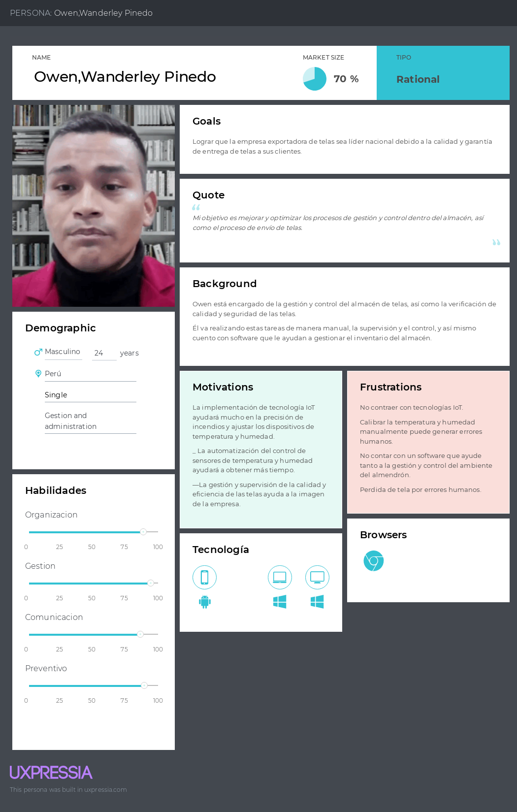
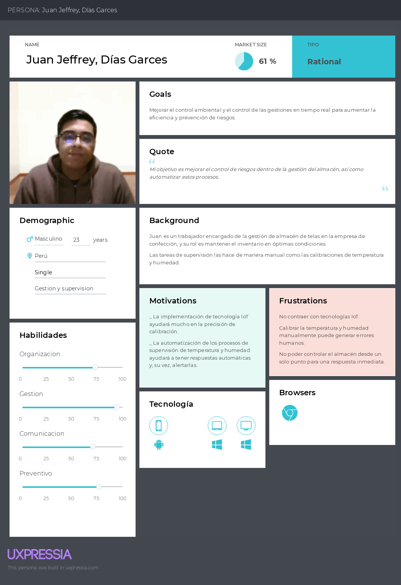
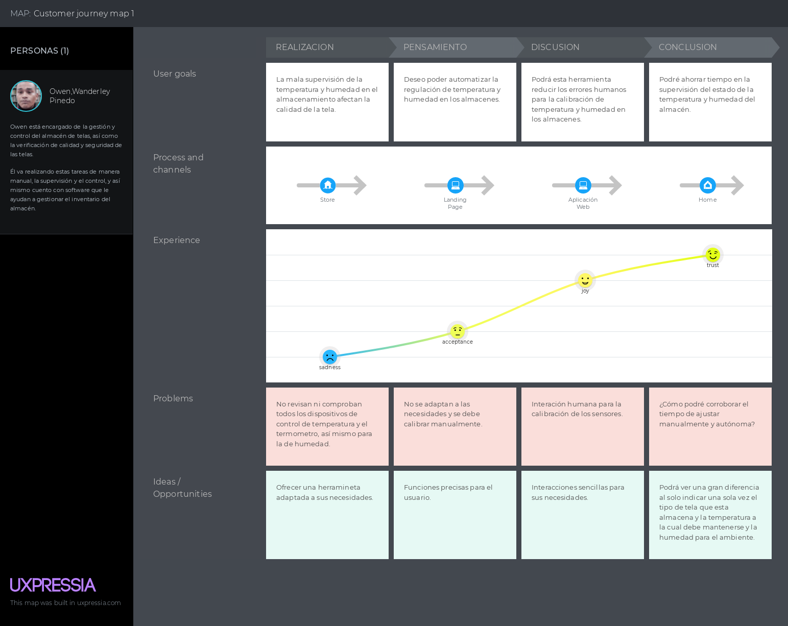
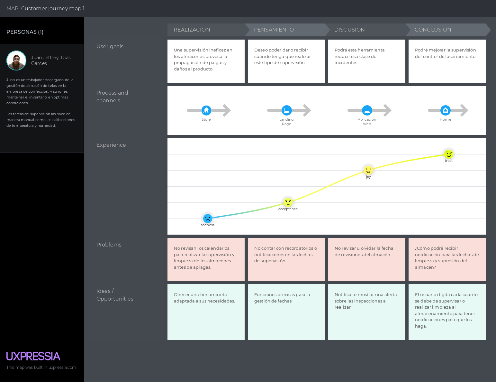

# 
Universidad Peruana de Ciencias Aplicadas

## 
Aplicaciones Web WS53

  

## 
Informe del TB1

<h4 style="text-align: center;"> Ingeniería de Software </h4>
<h4 style="text-align: center;"> Ciclo 2024-01 </h4>
<h4 style="text-align: center;"> Docente: Angel Augusto Velasquez Nuñez </h4>
<h4 style="text-align: center;"> Startup: WeaveGuard</h4>
<h4 style="text-align: center;"> Producto: TelaSecure</h4>

## Integrantes

|           Nombre            | Código de alumno |
| :-------------------------: | :--------------: |
|   Diego Rolin Acuña Tomas   |    U202221436    |
| Diego Ivan Cabrera Buitron  |    U20211B293    |
| John Telesforo Arevalo Meza |    U202117377    |
|    Godofredo Quispe Tipo    |    U202120772    |
|  Valentino Sandoval Paiva   |    U20211A962    |

## 
Agosto 2024

## Registro de versiones del informe

| Versión | Fecha    | Autor | Descripción de la modificación |
| ------- | -------- | ----- | ------------------------------ |
| 1       | 16/08/24 |Diego Cabrera| Creación del documento en formato Markdown |
| 1       | 27/08/24 |Diego Cabrera| Realización del capítulo I y el capítulo IV |
| 1       | 27/08/24 |Diego Acuña  | Realización del capítulo I, capítulo II y capítulo V |
| 1       | 28/08/24 |John Arevalo | Realización del capítulo II, capítulo III y capítulo IV |
| 1       | 29/08/24 |Godofredo Quispe | Realización del capítulo I y capítulo II |
| 1       | 30/08/24 |Valentino Sandoval | Realización del capítulo III, capítulo IV y capítulo V |

## Project Report Collaboration Insights

URL de la organización del proyecto: [https://github.com/si730-2402-ws53-WebApplications/documentation-WebApplications]

**TB1**
|Integrante|Tareas Asignadas|
|-|-|
|Diego Rolin Acuña Tomas|Landing Page, Service & Applications Implementation|
|Diego Ivan Cabrera Buitron|_Lean UX Hypothesis. _Estrategias y tácticas frente a competidores. _Software Object-Oriented Design|
|John Telesforo Arevalo Meza|_Landing Pade UI Design. _Web Aplication UX/UI Design. _Style Guidelines|  
|Godofredo Quispe Tipo| _Lean UX Canvas. _Segmentos Objetivos|
|Valentino Sandoval Paiva| _Software Configuration Management. _Information Architecture. _Impact Mapping|

**TB1 Github**

## Contenido

1. [Capítulo I: Introducción](#1.) 
   1.1. [**_Startup Profile_**](#1.1.)  
   1.1.1. [Descripción del startup](#1.1.1.) 
   1.1.2.[Perfiles de los integrantes del equipo](#1.1.2.) 
   1.2. [**_Solution Profile_**](#1.2.) 
   1.2.1. [Antecedentes y Problemática](#1.2.1.) 
   1.2.2. [Lean UX Process](#1.2.2.) 
   1.2.2.1. [Lean UX Problem Statements](#1.2.2.1.) 
   1.2.2.2. [Lean UX Assumptions](#1.2.2.2.) 
   1.2.2.3. [Lean UX Hypothesis Statements](#1.2.2.3.) 
   1.2.2.4. [Lean UX Canvas](#1.2.2.4.) 
   1.3. [**_Segmentos objetivo_**](#1.3.)  
1. [**Capítulo II: Requirements Elicitation & Analysis**](#2.) 
   2.1. [**_Competidores_**](#2.1.) 
   2.1.1. [Análisis competitivo](#2.1.1.) 
   2.1.2. [Estrategias y tácticas frente a competidores](#2.1.2.) 
   2.2. [**_Entrevistas_**](#2.2.) 
   2.2.1. [Diseño de entrevistas](#2.2.1.) 
   2.2.2. [Registro de entrevistas](#2.2.2.) 
   2.2.3. [Análisis de entrevistas](#2.2.3.) 
   2.3. [**_Needfinding_**](#2.3.) 
   2.3.1. [User Personas](#2.3.1.) 
   2.3.2. [User Task Matrix](#2.3.2.) 
   2.3.3. [User Journey Mapping](#2.3.3.) 
   2.3.4. [Empathy Mapping](#2.3.4.) 
   2.3.5. [As-is Scenario Mapping](#2.3.5.) 
   2.4. [**_Ubiquitous Language_**](#2.4.)  
1. [**Capítulo III: Requirements Specification**](#3.) 
   3.1. [**_To-Be Scenario Mapping_**](#3.1.) 
   3.2. [**_User Stories_**](#3.2.) 
   3.3. [**_Impact Mapping_**](#3.3.) 
   3.4. [**_Product Backlog_**](#3.4.)  
1. [**Capítulo IV: Product Design.**](#4.) 
   4.1. [**_Style Guidelines_**](#4.1.) 
   4.1.1. [General Style Guidelines](#4.1.1.) 
   4.1.2. [Web Style Guidelines](#4.1.2.) 
   4.2. [**_Information Architecture_**](#4.2.) 
   4.2.1. [Organization Systems](#4.2.1.) 
   4.2.2. [Labeling Systems](#4.2.2.) 
   4.2.3. [SEO Tags and Meta Tags](#4.2.3.) 
   4.2.4. [Searching Systems](#4.2.4.) 
   4.2.5. [Navigation Systems](#4.2.5.) 
   4.3. [**_Landing Page UI Design_**](#4.3.) 
   4.3.1. [Landing Page Wireframe](#4.3.1.) 
   4.3.2. [Landing Page Mock-up](#4.3.2.) 
   4.4. [**_Web Applications UX/UI Design_**](#4.4.) 
   4.4.1. [Web Applications Wireframes](#4.4.1.) 
   4.4.2. [Web Applications Wireflow Diagrams](#4.4.2.) 
   4.4.3. [Web Applications Mock-ups](#4.4.3.) 
   4.4.4. [Web Applications User Flow Diagrams](#4.4.4.) 
   4.5. [**_Web Applications Prototyping_**](#4.5.) 
   4.6. [**_Domain-Driven Software Architecture_**](#4.6.) 
   4.6.1. [Software Architecture Context Diagram](#4.6.1.) 
   4.6.2. [Software Architecture Container Diagrams](#4.6.2.) 
   4.6.3. [Software Architecture Components Diagrams](#4.6.3.) 
   4.7. [**_Software Object-Oriented Design_**](#4.7.) 
   4.7.1. [Class Diagrams](#4.7.1.) 
   4.7.2. [Class Dictionary](#4.7.2.) 
   4.8. [**_Database Design_**](#4.8.) 
   4.8.1. [Database Diagram](#4.8.1.)  
1. [**Capítulo V: Product Implementation, Validation & Deployment**](#5.) 
   5.1. [**_Software Configuration Management_**](#5.1.) 
   5.1.1. [Software Development Environment Configuration](#5.1.1.) 
   5.1.2. [Source Code Management](#5.1.2.) 
   5.1.3. [Source Code Style Guide & Conventions](#5.1.3.) 
   5.1.4. [Software Deployment Configuration](#5.1.4.) 
   5.2. [**_Landing Page, Services & Applications Implementation_**](#5.2.) 
   5.2.1. [Sprint 1](#5.2.1.) 
   5.2.1.1. [Sprint Planning 1](#5.2.1.1.) 
   5.2.1.2. [Sprint Backlog 1](#5.2.1.2.) 
   5.2.1.3. [Development Evidence for Sprint Review](#5.2.1.3.) 
   5.2.1.4. [Testing Suite Evidence for Sprint Review](#5.2.1.4.) 
   5.2.1.5. [Execution Evidence for Sprint Review](#5.2.1.5.) 
   5.2.1.6. [Services Documentation Evidence for Sprint Review](#5.2.1.6.) 
   5.2.1.7. [Software Deployment Evidence for Sprint Review](#5.2.1.7.) 
   5.2.1.8. [Team Collaboration Insights during Sprint](#5.2.1.8.) 
   5.3. [**_Validation Interviews_**](#5.3.) 
   5.3.1.[Diseño de Entrevistas](#5.3.1.) 
   5.3.2.[Registro de Entrevistas](#5.3.2.) 
   5.3.3.[Evaluaciones según Heurísticas](#5.3.3.) 
   5.4. [**_Video About-the-Product_**](#5.4.)  
1. [**Conclusiones**](#6.) 
1. [**Bibliografía**](#7.) 
1. [**Anexos**](#8.) 

## Students Outcomes

**Student Outcome ABET 5**

Trabaja efectivamente en un equipo cuyos miembros juntos proporcionan liderazgo; crea un entorno colaborativo e inclusivo y establece metas, planifica tareas y cumple objetivos

| Criterio específico                                                                                      | Acciones realizadas                                                                                                                                                                   | Conclusiones |
| -------------------------------------------------------------------------------------------------------- | ------------------------------------------------------------------------------------------------------------------------------------------------------------------------------------- | ------------ |
| **5.c.1 Trabaja en equipo para proporcionar liderazgo en forma conjunta**                                | **Diego Rolin Acuña Tomas**  TB1: Desarrollando el documento, me pareció más importante comprender el problema que nuestro proyecto soluciona. Investigando para el Solution Profile investigue en páginas confiables las consecuencias de este problema y como no permitir sus causas, esto me ayudo a ser una persona activa en las decisiones sobre la investigación de nuestros posibles clientes. En conjunto decidimos cuales serian nuestro Segmento Objetivo y cuales serian los User Story que nuestros clientes realmente valorarían.  **Diego Ivan Cabrera Buitron**  TB1: Al realizar la sección de Estrategias y tácticas frente a competidores pude liderar a mi equipo para coordinar cuáles serían nuestras mejores opciones, también se decidió la estructura de nuestro Diagrama de clases y el Diagrama de Base de Datos.  **John Telesforo Arevalo Meza**  TB1: Al trabajar en la landing page, lideré junto a mi equipo la coordinación de las mejores opciones de diseño y contenido. Así como a separar las diferentes partes de esta. Colaboramos en la elaboración de los wireframes y mockups tanto de la landing page como de la aplicación web, siempre teniendo en cuenta las ideas de los demas.  **Godofredo Quispe Tipo**  TB1: La colaboración con los miembros del equipo fue clave no solo para completar mis propias tareas, sino también para asegurar el progreso general del equipo. Coordiné los puntos críticos en los que era necesario trabajar en conjunto, revisando los avances y comunicando oportunamente cualquier ajuste o mejora que debiera implementarse. Esta coordinación permitió optimizar el flujo de trabajo y mantener la calidad en cada etapa del proyecto. Para facilitar la comunicación, utilizamos dos canales principales: un chat grupal y llamadas por Discord. Estos medios resultaron esenciales para mantener una comunicación fluida y en tiempo real, permitiendo que todos los miembros estuvieran al tanto de los avances y que las decisiones se tomaran de manera rápida y eficiente. La combinación de estos canales aseguró una gestión dinámica de las tareas y permitió resolver problemas de forma ágil, favoreciendo así el cumplimiento de los objetivos.  **Valentino Sandoval Paiva**  TB1: Durante la fase de definición de estrategias, trabajé estrechamente con mi equipo para identificar y priorizar nuestras mejores opciones. Utilizamos herramientas como Lean UX Assumptions para validar hipótesis, User Task Matrix para optimizar tareas del usuario, y Empathy Mapping para entender su perspectiva. También aplicamos Impact Mapping para alinear nuestras decisiones con los objetivos del proyecto y Organization Systems para organizar nuestras estrategias de manera efectiva. | Para la presente TB1 se realizó de manera acertada la realización de los capítulos I, II, III, IV y V; cada integrante aportó de manera cooperativa y coordinada con los demás, demostrando el trabajo conjunto. |
| **5.c.2 Crea un entorno colaborativo e inclusivo, establece metas, planifica tareas y cumple objetivos** | **Diego Rolin Acuña Tomas**  TB1:   **Diego Ivan Cabrera Buitron**  TB1: Al realizar el diagrama de Base de Datos y el Diagrama de Clases se coordinó con el equipo mediante llamadas grupales por Google Meet, de esta manera cada miembro apoyó en la realización  **John Telesforo Arevalo Meza**  TB1: Durante la creación de los wireframes y mockups de la landing page y de la aplicación web, se estuvo  un entorno inclusivo a través de reuniones grupales por Google Meet y Discord. Con el as-is y to-be mapping, establecimos metas claras y realistas, asu vez,  planificamos las tareas necesarias y se contribuyó activamente para alcanzar los objetivos definidos.  **Godofredo Quispe Tipo**  TB1: A lo largo del proyecto, mantuve una actitud proactiva, tomando la iniciativa en la coordinación de tareas clave y promoviendo la colaboración dentro del equipo. Siempre estuve dispuesto a escuchar las ideas y opiniones de mis compañeros, lo que fomentó un ambiente abierto y enriquecedor. Ante las críticas constructivas, me encargué de analizarlas cuidadosamente y proponer soluciones viables, lo que permitió mejorar continuamente el proyecto. Para garantizar la cooperación y participación efectiva de todos, promoví una integración fluida, revisando avances, ajustando tareas cuando fue necesario, y asegurando una comunicación constante mediante el uso de canales como el chat grupal y las llamadas por Discord.  **Valentino Sandoval Paiva**  TB1: Al crear un entorno colaborativo e inclusivo, organizamos sesiones de trabajo grupales a través de Google Meet para el desarrollo del cada apartado del proyecto. Establecimos metas claras y planificamos las tareas utilizando herramientas como Lean UX Assumptions, User Task Matrix y Empathy Mapping para garantizar que cada miembro pudiera contribuir efectivamente. Implementamos Impact Mapping y Organization Systems para asegurar que nuestras decisiones y esfuerzos se alinearan con los objetivos del proyecto y se cumplieran de manera efectiva. | Para la presente TB1 se realizaron varias sesiones colaborativas para la coordinación de las tareas asignadas y realizarlas de manera idónea. |

<h2>Capítulo I: Introducción</h2>

<h3> 1.1 Startup Profile</h3>

<h4> 1.1.1. Descripción del startup</h4>

 
WeaveGuard es una Startup innovadora creada por estudiantes de la Facultad de Ingeniería de la Universidad Privada de Ciencias Aplicadas (UPC). Las empresas en el sector textil y confecciones enfrentan desafíos a la hora de cuidar y mantener la calidad de las telas en sus almacenes, destacando la falta de un Software gestión de inventario. Creamos nuestra Empresa emergente con el objetivo de solucionar estos problemas, el producto que desarrollamos ayudara a mantener informados a los encargados de supervisar el inventario si el ambiente es indicado para guardar la tela, al mismo tiempo fomentara una cultura de responsabilidad. La aplicación integrara tecnologías avanzadas, como inteligencias artificiales, para ayudar en la ubicación de las telas y características del ambiente, y bases de datos para tener un historial de importaciones y exportaciones.
  
Misión: Nuestra misión es elevar la calidad, rentabilidad y confianza de las empresas en el sector textil y confecciones dando una herramienta que facilite tener un seguimiento de la temperatura, fechas de fumigación y ubicación del producto, fomentando la importancia de la responsabilidad. Apuntamos a ser más que solo un proveedor de software, queremos ser un aliado para alcanzar el éxito y confianza con los clientes.
  
Vision: Como vision, apuntamos a ser la empresa mas conocida y confiable en el desarrollo de software de gestion de inventario, pretendemos personalizar y desarrollar varias versiones para muchos tipos de almacenes. Tendremos una base de datos con informacion sobre el cuidado y mantenimiento de muchos productos diferentes, pero siempre teniendo principal objetivo el cuidado de las telas.

<h4> 1.1.2. Perfiles de los integrantes del equipo</h4>

| Integrante                                                                                                                                                                                                                             | Descripción                                                                                                                                                                                                                                                                                                                                                                                                                                                                                                                                                                                                                                                                                                                                                                                                                                                                                                                                                                                                                                                                                                           |
| -------------------------------------------------------------------------------------------------------------------------------------------------------------------------------------------------------------------------------------- | --------------------------------------------------------------------------------------------------------------------------------------------------------------------------------------------------------------------------------------------------------------------------------------------------------------------------------------------------------------------------------------------------------------------------------------------------------------------------------------------------------------------------------------------------------------------------------------------------------------------------------------------------------------------------------------------------------------------------------------------------------------------------------------------------------------------------------------------------------------------------------------------------------------------------------------------------------------------------------------------------------------------------------------------------------------------------------------------------------------------- |
|                                                                                                                                                                                                         | **Diego Ivan Cabrera Buitron**   Mi nombre es **Diego Cabrera**, estoy cursando la carrera de Ingeniería de Software, me considero una persona responsable y perseverante. Al culminar mi carrera quiero especializarme en el sector de la ciberseguridad                                                                                                                                                                                                                                                                                                                                                                                                                                                                                                                                                                                                                                                                                                                                                                                                                                                          |
|  | **Diego Rolin Acuña Tomas**   Soy Diego Rolin Acuña Tomas, tengo 22 años y estoy cursando la carrera de Ingeniería de Software en la Universidad Peruana de Ciencias Aplicadas. Desde una temprana edad me han fascinado las computadoras y como se mostraban en las películas los expertos en informática. Hoy en día entiendo la importancia de mi disciplina en el mundo y quisiera ser parte de las ventajas que pueden proveer los conocimientos en el campo de la informática y la ciencia de la computación. He llevado cursos para aprender lenguajes como Python, C++ y MATLAB, aprendiendo patrones de algoritmo para mi vida profesional. También conozco los tipos de base de datos, aprendí SQL server para las bases de datos relacional y mongo DB para bases de datos no relaciones. Quiero seguir mejorando mis habilidades y especializarme en DataScience y Gestión de proyectos.                                                                                                                                                                                                               |
|                                        | **Godofredo Quispe Tipo**   Mi nombre es Godofredo y actualmente me encuentro cursando la carrera de Ingeniería de Software, un campo que me apasiona profundamente. Mi interés por las nuevas tecnologías es constante, y estoy siempre al tanto de las últimas innovaciones que están redefiniendo el panorama tecnológico. Me considero un entusiasta de la programación, área en la que he adquirido un dominio en diversos lenguajes, tales como Python, C++ y Assembler, lo que me ha permitido abordar una amplia gama de proyectos y desafíos técnicos.  Además, poseo un profundo conocimiento en el ámbito de la comunicación de redes, lo que me ha permitido comprender los complejos mecanismos detrás de la interconexión de sistemas y dispositivos. Mi formación en ciencia de datos, con un enfoque en Python, ha sido un pilar fundamental en mi desarrollo profesional, permitiéndome trabajar con grandes volúmenes de datos y obtener valiosos insights. Asimismo, cuento con experiencia en el manejo de Matlab, una herramienta clave en diversos proyectos de análisis y simulación. |
|                                                                                                                                                                                                                                   | **Valentino Sandoval Paiva**   Soy Valentino Sandoval, tengo 20 años y soy estudiante de la carrera de Ingeniería de Software, cursando el 4to ciclo. Siempre he estado interesado en la tecnología, el software y hardware de las computadoras. Además, me gustan mucho los videojuegos, esto me llevo a decidirme a estudiar esta carrera.                                                                                                                                                                                                                                                                                                                                                                                                                                                                                                                                                                                                                                                                                                                                                                       |
|       | **John Arévalo Meza**   Soy John Arévalo y estoy cursando la carrera de Ingeniería de Software, me considero una persona responsable y perseverante. Tengo conocimiento en lenguajes de programación como python y c++, y bases de datos como SQLServer y MongoDB.                                                                                                                                                                                                                                                                                                                                                                                                                                                                                                                                                                                                                                                                                                                                                                                                                                                 |

<h3> 1.2. Solution Profile</h3>

<h4> 1.2.1. Antecedentes y Problemática</h4>

Desde tiempos antiguos, la importancia de la ropa involucra aspectos sociales, cultirales y económicos. En la actualidad se ha convertido en un fenómeno más complejo pues se ha vuelto una expresión personal y social, señala la clase social, y la visibilidad aumento con las redes sociales. Las empresas de la industria Textil son conscientes de la importancia en el cuidado de sus telas para ser relevantes en el mercado, pues las empresas de la industria de la Moda y Confección crean sus productos en tiempos específicos y en grandes cantidades. Sin embargo, es evidente que muchos no pueden gestionar sus inventarios sin tener pedidas por la destrucción de la integridad de sus telas.

##### What?

- ¿Que problema se resuelve?
  Las empresas en el rubro textil tienen que mantener controlados los almacenes donde guardan su mercancía, pues un nivel más alto de humedad, existencia de insectos como polillas o la temperatura puede dañar la integridad de las telas. Esto significaría menos ingresos y baja confianza con los clientes, cosas que una empresa respetable no puede permitir. En otras palabras, necesitan una herramienta que permita monitorear en tiempo real las características del lugar donde se almacenaran las telas.

- ¿Que relacion tiene el problema con los clientes?
  Las empresas que distribuyan la tela desearan tener una solución a este problema para los supervisores del inventario y para la alta dirección, pues las consecuencias del cuidado inadecuado afectan la económica de la empresa y su reputación. Se convertirán en un mal producto y nadie lo comprara.

##### When?

- ¿Cuándo ocurre el problema?
  El ambiente óptimo para depositar las telas en el almacén debe ser constante, pues en una empresa no todos los productos se venden hasta no dejar sin existencia, generalmente el almacén contiene un producto. En otras palabras, si no quieres que tu producto guardado se malogre y no preparas el ambiente para la siguiente adquisición de tela, debes tomar precauciones de manera constante para que no ocurra el problema.

- ¿Cuándo el producto sera util?
  Nuestro software de gestión de inventario de telas, le permitirá mantenerse informado de todas las condiciones actuales del almacén, pues si algo no está dentro del rango aceptable como la humedad, temperatura o luz solar se le enviara notificación, junto con las herramientas necesarias para la gestión de inventarios pues está diseñada para almacenes que guarden la tela.

##### Where?

- ¿Dónde se encuentra el cliente al usar el producto?
  El cliente puede estar en cualquier lugar mientras tenga un dispositivo electrónico y acceso a internet.

##### Who?

- ¿Quienes son los afectados por el problema?
  Los afectados son todos los miembros de una organización o empresa que distribuye telas, pues el problema causa daños a la integridad de las telas y al ser este un mal producto no será fácil vender ni ganar la confianza de los posibles clientes, esto causará un daño económico que puede terminar con despidos o cierre.

- ¿Quienes utilizaran nuestro producto?
  Los que estarán más interesados son los empleados encargados del almacén e inventario, también otro tipo de personal encargada de la calidad y transporte, entre otros estarán interesados en un programa que confirme el cuidado óptimo de las telas.

##### Why?

- ¿Por qué hay que hacerlo?
  Estamos comprometidos a solucionar los problemas que otros softwares sobre gestión de inventario no pueden solucionar porque no se especializan en el producto guardado, se enfocan en tener una lista de inventario con sus facturas, olvidando que un inventario necesita tener las condiciones adecuadas si no quiere que se malogre el producto guardado. Nuestra empresa lo solucionara con un equipo comprometido.

- ¿Por qué los clientes elegiran nuestro producto?
  Conocerán los beneficios de una herramienta especializada, le ayudaremos no solo en la gestión de inventario sino también en el correcto mantenimiento del espacio para almacenar telas. Este problema escala con la cantidad y la diferencia será más notoria al compararnos con otros softwares.

##### How?

- ¿Cómo nos descubren nuestros clientes?

Nuestros clientes pueden conocer nuestra plataforma a través de una amplia variedad de estrategias publicitarias principalmente en línea, como anuncios en redes sociales, banners en sitios web y campañas de email. Además, la recomendación boca a boca por parte de clientes anteriores o actuales.

- ¿Cómo pueden los clientes acceder a nuestro contenido?

El acceso a la plataforma sera sencillo y flexible. Los clientes podrán conectarse a través de cualquier dispositivo, ya sea un teléfono inteligente, tablet, laptop o computadora de escritorio. Además, las funcionalidades serán las mismas desde todos los dispositivos.

- ¿Qué factores llevan a los clientes a elegirnos?

Los clientes se sentirán atraídos hacia nuestra plataforma debido a que combinamos la gestión tradicional de inventarios con la innovación de almacenes inteligentes. Los clientes podran tener acceso y control en tiempo real a factores críticos como la temperatura, humedad y otros parámetros, a través de sensores y controladores que serán instalados estratégicamente. Nuestra plataforma facilita el monitereo de las telas, lo que evita la contratación de personal adicional, lo que a su vez, puede ayudar a ahorrar recursos a nuestros clientes y así destinar estos a otras áreas, mejorando la calidad del producto final y costos operativos.

##### How much?

Durante el 2024 el sector textil peruano ha experimentado cierto crecimiento, debido en gran parte al invierno, sin embargo no estan surgiendo nuevos puestos de trabajo en el mismo, y es que, según una encuesta realizada por la SNI (Sociedad Nacional de Industrias), en el sector de textil y confecciones el 40% de los empresarios encuestados manifestó haber operado en el II trimestre 2024 a un nivel mayor al alcanzado en el mismo periodo del año anterior; mientras el 33% señaló haber producido a un nivel similar. A pesar de ello, en el corto plazo los empresarios de este sector se mantienen cautos para contratar más personal.

<h4> 1.2.2. Lean UX Process</h4>

<h5> 1.2.2.1. Lean UX Problem Statements</h5>

Hemos identificado que, tanto las empresas de confección como los distribuidores de telas, enfrentan dificultades a la hora de monitorear de manera continua aspectos claves relacionados al almacenamiento de sus telas, como la temperatura y la humedad. La falta de siguimiento puede derivar en la degradación del material, ocasionando pérdidas económicas, y en última instancia, una mala experiencia de cara al usuario final. Actualmente, si bien existen almacenes automáticos que ayudan a la gestión del inventario, no ofrecen una solución que integre esto, sumado al control en tiempo real de los factores mencionados inicialmente, lo que dificulta y desfavorece la preservación de la calidad de las telas.

<h5> 1.2.2.2. Lean UX Assumptions</h5>

1.	Creo que los distribuidores de telas y las empresas de confección necesitan una solución más eficiente para gestionar el inventario de textiles y mantener la calidad del material en condiciones óptimas.

2. Estas necesidades se pueden resolver con una plataforma web integral que permita la gestión en tiempo real de inventarios textiles, el control de condiciones ambientales críticas, y la detección temprana de problemas como plagas.

3. Mis clientes iniciales serán distribuidores de telas y empresas de confección que buscan optimizar su logística, reducir pérdidas y mejorar la calidad del producto.

4. El valor que un cliente quiere de mi servicio es una solución que les permita tener un control preciso sobre su inventario, así como herramientas para prevenir el deterioro del material y mantener estándares de calidad.

5. El cliente también puede obtener estos beneficios adicionales mediante integraciones con sistemas de gestión de pedidos y de producción, permitiendo una coordinación más fluida entre el inventario y la cadena de suministro.

6. Voy a adquirir la mayoría de mis clientes a través de estrategias de marketing digital dirigidas a la industria textil y a través de asociaciones con proveedores de telas y empresas de confección.
7. Haré dinero a través de un modelo de suscripción mensual o anual, ofreciendo diferentes niveles de funcionalidad según las necesidades del cliente y el tamaño de su inventario.
8. Mi competencia principal en el mercado serán sistemas de gestión de inventarios genéricos y soluciones específicas para la industria textil que no abordan de manera integral el control de condiciones ambientales y plagas.
9. Los venceremos debido a nuestra especialización en el sector textil, la integración de funciones avanzadas para el control de calidad y el enfoque en la prevención de problemas específicos del manejo de textiles.
10. Mi mayor riesgo de producto es la resistencia a adoptar nuevas tecnologías por parte de los usuarios, especialmente si ya tienen sistemas en funcionamiento que perciben como adecuados. Para mitigar este riesgo, ofreceremos una fase de prueba gratuita y capacitación personalizada para facilitar la transición.

BUSSINES OUTCOMES

1. Optimización de la Gestión de Inventarios:

• Impacto: Mejora significativa en la eficiencia operativa al proporcionar una visión clara y en tiempo real del inventario textil. Esto reduce el tiempo dedicado a la administración manual y facilita una toma de decisiones más ágil y precisa.

• Beneficio Clave: Minimiza errores y retrasos en el manejo de existencias, lo que optimiza la logística y reduce costos operativos asociados con la gestión ineficiente del inventario.

2. Reducción de Pérdidas y Deterioro de Material:

• Impacto: Disminuye las pérdidas y el deterioro de los textiles mediante el monitoreo constante de condiciones ambientales críticas (como temperatura y humedad) y la detección temprana de plagas.

• Beneficio Clave: Protege la calidad del material y evita gastos adicionales relacionados con la reposición de textiles dañados, asegurando así la conservación óptima del inventario y la satisfacción del cliente.

User Outcomes:

¿Quién es el usuario?

• Los usuarios son distribuidores de telas y empresas de confección

¿Dónde encaja nuestra empresa en su trabajo o vida?

• Nuestra empresa se posiciona como un socio estratégico para la gestión y conservación de inventarios textiles, ofreciendo una plataforma integral que facilita la administración eficiente de recursos, asegurando su calidad y minimizando pérdidas.

¿Qué problemas tiene nuestra empresa?

• Nos enfrentamos a la falta de soluciones especializadas que integren el control de condiciones ambientales, la gestión de inventarios y la prevención de problemas como plagas, lo que complica la administración eficiente y la protección del inventario textil.

¿Cuándo y cómo es nuestra empresa?

• Nuestra empresa está en una etapa de desarrollo inicial, ofreciendo una solución innovadora y adaptativa para el manejo integral de inventarios textiles, con características específicas que abordan las necesidades únicas del sector textil.

¿Qué características son importantes?

• Las características importantes incluyen un sistema de monitoreo en tiempo real de condiciones ambientales (temperatura y humedad), herramientas de gestión de inventarios, alertas para la detección de plagas, y un interfaz intuitiva que facilita la administración y el seguimiento del material.

¿Cómo debe verse nuestra empresa y comportarse?

• Nuestra empresa debe proyectar confianza y especialización en el sector textil, actuando como un aliado proactivo que mejora la gestión y conservación del inventario. Debe ser percibida como una solución accesible y orientada al cliente, con un enfoque en la innovación continua y el soporte personalizado para garantizar la satisfacción y el éxito de nuestros usuarios.

<h5> 1.2.2.3. Lean UX Hypothesis Statements.</h5>

- **Hypothesis Statement 01:**

  **Creemos que** proporcionar una plataforma web de gestión de inventarios textiles con monitoreo en tiempo real y control de condiciones ambientales ayudará a los distribuidores de telas a mantener la calidad de sus productos y reducir las pérdidas por deterioro.

  **Sabremos que** hemos tenido éxito

  **Cuando** observemos una reducción significativa en las pérdidas de material debido a condiciones ambientales adversas y un aumento en la satisfacción de los usuarios con la plataforma, medido por un incremento en el uso continuo de las funcionalidades de monitoreo.

- **Hypothesis Statement 02:**

  **Creemos que** implementar un sistema de detección y alerta temprana de plagas dentro de la plataforma web permitirá a las empresas de confección proteger su inventario de manera más efectiva, mejorando la calidad del producto final.

  **Sabremos que** hemos tenido éxito

  **Cuando** veamos una disminución en los informes de pérdidas de inventario causadas por plagas y un aumento en los comentarios positivos sobre la calidad del producto preservado, así como una mayor retención de clientes.

- **Hypothesis Statement 03:**

  **Creemos que** ofrecer una interfaz intuitiva y herramientas de análisis detallado dentro de la plataforma permitirá a los usuarios optimizar la logística y la administración de sus recursos, mejorando la eficiencia operativa.

  **Sabremos que** hemos tenido éxito

  **Cuando** se vea una mejora en los tiempos de respuesta en la gestión de inventarios y una reducción en los errores operativos, reflejado en un aumento en la productividad reportada por los usuarios.

- **Hypothesis Statement 04:**

  **Creemos que** adaptando la plataforma a las necesidades específicas del manejo de textiles, y ofreciendo funciones especializadas, aumentará la adopción por parte de empresas del rubro textil.

  **Sabremos que** hemos tenido éxito

  **Cuando** observemos un aumento en el número de empresas de confección que adoptan la plataforma, junto con un incremento

<h5> 1.2.2.4. Lean UX Canvas</h5>

| Lean UX Canvas                                                                            |                                                                                                                                                                                                                                                                                                                                                                                                                                                                                                                                                                                                                                                                                                                                                                                                                                                                                         |
| ----------------------------------------------------------------------------------------- | --------------------------------------------------------------------------------------------------------------------------------------------------------------------------------------------------------------------------------------------------------------------------------------------------------------------------------------------------------------------------------------------------------------------------------------------------------------------------------------------------------------------------------------------------------------------------------------------------------------------------------------------------------------------------------------------------------------------------------------------------------------------------------------------------------------------------------------------------------------------------------------- |
| **Business Problem**                                                                      | El problema que enfrentan los usuarios es la falta de un control automatizado sobre la temperatura y la humedad, así como la dificultad para realizar un seguimiento eficiente de los cambios en el almacén y la gestión del stock. Actualmente, se ven obligados a realizar estas tareas manualmente, revisando medidores y utilizando hojas de cálculo para el seguimiento del inventario. Esta situación no solo representa una pérdida de tiempo, sino que también incrementa la probabilidad de cometer errores y dificulta la toma de decisiones rápidas e informadas, lo que puede resultar en pérdidas económicas significativas.                                                                                                                                                                                                                                               |
| **Business Outcomes**                                                                     | <ul><li>Aumentar la eficiencia y satisfaccion del usuario en el control y gestion del almacen.</li><li>Mejorar la retención de usuarios y la lealtad a la plataforma.</li><li>Establecer normas para instalar sensores y controladores de temperatura y humedad.</li></ul>                                                                                                                                                                                                                                                                                                                                                                                                                                                                                                                                                                                                              |
| **Users and Customers**                                                                   | <ul><li>Usuarios: Personas que quieren administra y gestionar su almacen de telas.</li><li>Clientes: Persona que trabaja en una Empresa Textilera.</li></ul>                                                                                                                                                                                                                                                                                                                                                                                                                                                                                                                                                                                                                                                                                                   |
| **User Benefits**                                                                         | <ul><li>Mejorar el control de la temperatura y la humedad en el almacén, así como realizar un seguimiento eficiente de las existencias para optimizarlas de acuerdo con los materiales almacenados.</li><li>Aumento de la confianza en la plataforma gracias a un mejor control de la temperatura y la humedad dentro del almacén, junto con una gestión eficiente del stock.</li><li>Aumentar la satisfacción al poder monitorear y ajustar los niveles de temperatura y humedad del almacén desde una computadora, además de mejorar el control del inventario de stock..</li></ul>                                                                                                                                                                                                                                                                                                   |
| **Solution Ideas**                                                                        | <ul><li>Un sistema centralizado que muestre el estado actual del ambiente del almacén y permita ajustes instantáneos.</li><li> Notificaciones para alertar a los usuarios sobre condiciones fuera de rango o cambios en el inventario.</li><li>Funciones que registren las entradas y salidas de materiales, actualizando el inventario en tiempo real.</li><li>Generación de reportes sobre el estado del almacén y del inventario para ayudar en la toma de decisiones</li><li>Recordatorios y sugerencias para el mantenimiento de equipos de control ambiental, basados en su uso y condiciones.</li></ul>                                                                                                                                                                                                                                                                          |
| **Hypotheses**                                                                            | <ul><li>Creemos que al mejorar la capacidad de los usuarios para controlar el ambiente del almacén y gestionar el inventario desde cualquier lugar con acceso a internet, aumentará su satisfacción y eficiencia. Podrán realizar ajustes en tiempo real según las necesidades específicas de los materiales almacenados, y gestionar el stock de manera intuitiva, simplificando así los procesos y optimizando el funcionamiento del almacén.</li><li>Creemos que aumentar la fidelidad de los clientes y mejorar la retención de usuarios es posible si se les proporcionan herramientas que les permitan gestionar eficientemente el stock y controlar los sensores de temperatura y humedad en sus almacenes. Estas funcionalidades clave facilitan el control preciso del entorno y optimizan la gestión del inventario, lo que impulsa el uso continuo de la solución.</li></ul> |
| **What's the most important thing we need to learn first?**                               | <ul><li>Conocer la arquitectura del software de la solución, considerando las capas y componentes que la conforman (Base de Datos, Backend, Frontend, Landing Page).</li><li>Conocer las herramientas necesarias para aprovechar el uso de entrevistas y estudios de usuario.</li><li>Conocer las nociones y herramientas necesarias para el desarrollo de los diferentes servicios de la aplicación.</li></ul>                                                                                                                                                                                                                                                                                                                                                                                                                                                                         |
| **What's the least amount of work we need to do to learn tne next most important thing?** | <ul><li>Realizar el diseño de una Landing Page sencilla, eficiente y cómoda para que el usuario pueda conocer nuestra propuesta.</li><li>Recopilar información sobre el estudio del mercado objetivo a través de las entrevistas de usuario.</li><li>Realizar el diseño de prototipos y diagramas para expresar de manera gráfica los procesos y funcionalidades que tendrá nuestra aplicación.</li></ul>                                                                                                                                                                                                                                                                                                                                                                                                                                                                               |

<h3> 1.3. Segmento objetivo</h3>

    <h3>Descripción de cada segmento objetivo</h3>
        
<strong>Distribuidor de tela</strong>

    
Este segmento objetivo de nuestra plataforma está dirigido a distribuidores de tela en Perú que se dedican a la gestión y distribución de sus telas. Su principal enfoque radica en preservar la calidad y el buen estado de las telas, con el objetivo de ofrecer un producto de buena calidad y asegurar la satisfacción de quienes adquieren sus productos. 

    
<strong>Empresas de confeccion textil</strong>

    
El segmento objetivo de nuestra plataforma está dirigido a empresas de confección textil. Estas empresas se caracterizan por su capacidad para transformar materias primas en una amplia gama de productos textiles, a través de procesos complejos y demandantes. Están interesados en la adquisición de material de primera calidad y óptimos para su elaboración o transformación, priorizando a distribudores que les ofrezcan materiales con el menor defecto del este.

    

    <h3>Datos cuantitativos del problema para cada segmento</h3>
    
<strong>Distribuidor de tela</strong>

    
Según el Comité Nacional de Conservación Textil (2002), la temperatura y la humedad relativa son factores críticos en la preservación de textiles, ya que las fibras naturales, debido a su capacidad de absorber humedad, reaccionan a las variaciones ambientales. Estos cambios pueden causar hinchazón, encogimiento y eventualmente debilitar las fibras, resultando en roturas o rasgaduras. Una humedad relativa alta, por encima del 70%, no solo acelera el deterioro químico y biológico, sino que también propicia el crecimiento de moho y microorganismos, mientras que una humedad baja, inferior al 30%, puede resecar las fibras, volviéndolas quebradizas y susceptibles de desintegrarse con el tiempo. Las fluctuaciones de temperatura también pueden ser perjudiciales, favoreciendo la corrosión de componentes metálicos y acelerando la descomposición de materiales orgánicos

    
<strong>Empresas de confeccion textil</strong>

    
Según DELTA, la baja calidad en los productos textiles está estrechamente relacionada con la utilización de equipos obsoletos o inadecuados, lo que afecta directamente la calidad de las telas producidas. Por ejemplo, algunas empresas utilizan máquinas domésticas para probar muestras textiles, lo que no solo resulta en retrasos y pérdidas de material, sino que también impide una inspección adecuada de la calidad de los tejidos. Además, la negativa a comprobar los tejidos adquiridos compromete la integridad de la tela durante la producción, especialmente en la fase de dobladillado, lo que puede causar problemas de dimensiones y llevar a una inevitable pérdida de material. La falta de control sobre la tensión en los tejidos también puede causar deformaciones por estiramiento o contracción, impactando negativamente en la calidad final del producto. Por ello, invertir en soluciones automatizadas y optimizadas se vuelve esencial para garantizar una producción textil de alta calidad, evitando desperdicios y fortaleciendo la posición de la empresa en un mercado competitivo.

    

    <h3>Variables geográficas, demográficas y psicológicas para cada segmento</h3>
    
<strong>Distribuidor de tela</strong>

    
Variable geográfica:

    <ul>
        <li>País: Perú</li>
        <li>Ciudad: Zonas urbanas</li>
    </ul>
    
Variable demográfica:

    <ul>
        <li>Género: Femenino / Masculino.</li>
        <li>Ocupación: Todas las ocupaciones</li>
        <li>Estado civil: Todos los estados</li>
        <li>Edad y etapa de ciclo de vida: Ciudadanos mayores a 22 años.</li>
    </ul>
    
Variable psicográfica:

    <ul>
        <li>Nivel Socioeconómico (NSE): Nivel A y B</li>
        <li>Características de personalidad:
            <ul>
                <li>Asertivo</li>
                <li>Transparente</li>
                <li>Proactivo</li>
                <li>Perseverante</li>
            </ul>
        </li>
    </ul>
    
<strong>Empresas textiles</strong>

    
Variable geográfica:

    <ul>
        <li>País: Perú</li>
        <li>Ciudad: Zonas urbanas</li>
    </ul>
    
Variable demográfica:

    <ul>
        <li>Género: Femenino / Masculino.</li>
        <li>Ocupación: Todas las ocupaciones</li>
        <li>Estado civil: Todos los estados</li>
        <li>Edad y etapa de ciclo de vida: Ciudadanos mayores a 18 años.</li>
    </ul>
    
Variable psicográfica:

    <ul>
        <li>Nivel Socioeconómico (NSE): Nivel A, B y C</li>
        <li>Características de personalidad:
            <ul>
                <li>Responsable</li>
                <li>Perseverante</li>
                <li>Orientado a resultados</li>
                <li>Flexible</li>
            </ul>
        </li>
    </ul>

<h2> Capítulo II: Requirements Elicitation & Analysis</h2>

<h3> 2.1. Competidores</h3>

<h4> 2.1.1. Análisis Competitivo</h4>

||WeaveGuard|SoftExpert|Datatex|
|-|-|-|-|
|**Overview**| Plataforma innovadora enfocada en la gestión y control de productos textiles dentro de almacenes y fábricas. La solución permite a los usuarios realizar un seguimiento eficiente del inventario de telas, incluyendo el monitoreo de las condiciones ambientales, el control de plagas y la seguridad de acceso en los almacenes.|Plataforma integral para la gestión de la excelencia operacional, que ofrece soluciones para la gestión de calidad, procesos, riesgo, y cumplimiento normativo.|Solución ERP desarrollado específicamente para las complejidades de la manufactura textil; abarca la gestión de la cadena de suministro, producción, inventario y control de calidad, todo en un solo sistema.|
|**Ventajas competitivas**|WeaveGuard está diseñada específicamente para la gestión de almacenes y productos textiles, lo que le permite abordar las necesidades particulares de esta industria (como el control de telas, seguimiento de inventarios, y gestión ambiental).|SoftExpert ofrece una plataforma modular que puede personalizarse para diferentes industrias, lo que permite a las empresas elegir y pagar solo por los módulos que necesitan.|A diferencia de otros ERP genéricos, Datatex está completamente diseñado para las necesidades específicas de la manufactura y la cadena de suministro textil, lo que lo convierte en una herramienta más eficaz para las empresas de este sector.|
|**Mercado Objetivo**|Empresas dedicadas a la fabricación de telas y productos textiles que necesitan una gestión eficiente de inventarios, almacenaje y control de calidad de los materiales.|Empresas dedicadas a la fabricación de telas y productos textiles que necesitan una gestión eficiente de inventarios, almacenaje y control de calidad de los materiales.|Empresas que gestionan procesos complejos de manufactura textil, desde la materia prima hasta el producto final, que necesitan un ERP especializado para optimizar cada paso del proceso.|
|**Estrategias de Marketing**|Utilización de redes sociales como LinkedIn, Instagram, y Facebook para llegar a las empresas textiles y confecciones, mostrando casos de uso, beneficios del software, y demostraciones en video.|Contenido educativo como blogs, whitepapers, e-books, y webinars para educar a sus clientes sobre la gestión empresarial y la mejora de procesos.|Publica artículos, estudios de caso, y blogs técnicos que destacan las soluciones específicas para la industria textil, incluyendo la gestión de la cadena de suministro y optimización de la producción.|
|**Productos y servicios**|Solución para el monitoreo continuo de parámetros como temperatura, humedad, y calidad del aire en almacenes de productos textiles.|Plataforma integrada para la gestión empresarial que incluye módulos para la gestión de procesos, calidad, riesgos, cumplimiento, y recursos humanos.|ERP especializado para la industria textil que gestiona todos los aspectos de la cadena de suministro, desde la planificación de la producción hasta la distribución.|
|**Precios y costos**|Los precios de la licencia pueden variar según el tamaño del almacén, la cantidad de sensores y la personalización del software.|El modelo de precios suele ser basado en suscripciones anuales, con costos que varían según el número de usuarios y módulos adquiridos. Las tarifas de licencia por usuario pueden empezar desde aproximadamente $1,000 a $3,000 por usuario/año para una solución básica.|Los costos iniciales para una implementación de ERP pueden comenzar desde $50,000 y escalar a cientos de miles de dólares en implementaciones grandes y complejas.|
|**Canales de distribución**|Plataforma en línea y aplicación móvil.|Plataforma en línea|Plataforma en línea|
|**Fortalezas**|Enfocada en el sector textil, ofreciendo soluciones diseñadas para abordar los problemas particulares de almacenamiento y gestión de telas.|Ofrece una plataforma integral que abarca desde la gestión de la calidad, cumplimiento normativo y gestión de riesgos.|Proovedor ERP diseñado para la industria textil y de confección, lo que les da una ventaja significativa en términos de funcionalidad específica para este sector.|
|**Debilidades**|Al estar altamente especializado en la industria textil, WeaveGuard puede tener dificultades para diversificarse o atraer clientes de otros sectores, limitando su mercado potencial y crecimiento.|Sus soluciones, aunque completas, pueden ser percibidas como complejas de implementar, requiriendo tiempo y recursos considerables para su correcta integración, lo que puede desalentar a algunas empresas.|Su software es menos intuitivo y más difícil de usar en comparación con otros ERPs más modernos, lo que puede requerir capacitación adicional para los empleados.|
|**Oportunidades**|Expandir nuestra presencia a mercados emergentes en Asia, América Latina y África, donde la industria textil está creciendo rápidamente y busca modernizarse con tecnología avanzada.|SoftExpert puede aprovechar su especialización para ayudar a las empresas a cumplir con normativas internacionales en calidad, medio ambiente y seguridad.|Datatex puede capitalizar la tendencia hacia la adopción de software en la nube y SaaS, ofreciendo soluciones más flexibles y accesibles que permiten a las empresas textiles gestionar sus operaciones de manera más eficiente.|
|**Amenazas**|La entrada de nuevos actores con productos más avanzados o económicos puede erosionar la cuota de mercado de WeaveGuard.|Las constantes actualizaciones en normativas y estándares pueden requerir ajustes continuos en sus soluciones, generando costos adicionales y riesgo de no cumplir con las expectativas de los clientes si no se actualizan a tiempo.|Datatex enfrenta una fuerte competencia de otros proveedores de software ERP especializados y soluciones digitales para la industria textil, lo que puede presionar los precios y reducir sus márgenes de ganancia.|

<h4> 2.1.2. Estrategias y tácticas frente a competidores</h4>

**Estratregias**

- Desarrollar y ofrecer soluciones tecnológicas únicas y personalizadas que se adapten a las necesidades específicas de los clientes en la industria textil, destacando características que otros competidores no ofrecen.

- Ofrecer precios competitivos sin comprometer la calidad, posicionándose como una opción de alto valor para empresas textiles que buscan optimizar sus costos operativos.

- Expandir la presencia de WeaveGuard en mercados internacionales para reducir la dependencia de un solo mercado y aumentar la base de clientes.

**Tácticas**

- Personalización de las soluciones para ajustarse a los procesos específicos de cada cliente, creando un valor añadido frente a competidores con productos estandarizados.

- Crear planes de suscripción flexibles que se adapten a las necesidades y tamaño de los clientes, permitiendo escalabilidad.

- Implementar un sistema de atención al cliente ágil, con respuestas rápidas a problemas técnicos y consultas, mejorando la satisfacción del cliente.

- Colaborar con distribuidores y socios locales en mercados clave para facilitar la entrada y mejorar la adaptabilidad a las demandas locales.

<h3> 2.2. Entrevistas</h3>

<h4> 2.2.1. Diseño de entrevistas</h4>

**Segmento:** Encargados del inventario de empresas de confección.

1.  Descripción del Rol:  
    ¿Podría describir su rol en la empresa y su relación con la gestión y almacenamiento de telas?

2.  Importancia del Control de Factores Ambientales:  
    ¿Qué tan críticos son factores como la temperatura, humedad y control de plagas en la preservación de la calidad de las telas que manejan?

3.  Desafíos Actuales:  
    ¿Cuáles son los mayores desafíos que enfrenta en el monitoreo y mantenimiento del almacenamiento de las telas?

4.  Consecuencias de una Gestión Inadecuada:  
    ¿Ha tenido experiencias donde la falta de monitoreo haya resultado en pérdidas o degradación de telas?

5.  Necesidades Tecnológicas:  
    ¿Qué tipo de herramientas o sistemas utiliza para el control de inventarios y condiciones ambientales? ¿Qué mejoras desearía obtener?

6.  Impacto de la Innovación:  
    ¿Qué tan dispuesto estaría a implementar una solución tecnológica que permita el control en tiempo real de la temperatura, humedad y otras condiciones en sus almacenes?

7.  Evaluación de Procedimientos Manuales vs Automatizados:  
    ¿Cree que exista alguna diferencia notoria entre el uso de procedimientos manuales y automatizados en la gestión y almacenamiento de telas? ¿Qué impacto cree que genera cada uno?

8.  Visión Futura del Almacén:  
    ¿Cómo imagina la evolución de los procesos de gestión de almacenes en los próximos años?

9.  Adopción de Nuevas Tecnologías:  
    ¿Qué factores consideraría más importantes al evaluar la adopción de una nueva plataforma de gestión de almacenes?

10. Expectativas de Personalización:  
    ¿Qué tan importante es para usted que una solución tecnológica se pueda adaptar a las necesidades y procesos de su empresa?

11. Preocupaciones:  
    ¿Qué podría generar dudas a la hora de implementar nuevas tecnologías para la gestión del almacén?

12. Retroalimentación y Mejora Continua:
    Si implementara una nueva herramienta, ¿qué tan dispuesto estaría a colaborar con el proveedor para mejorar la plataforma en función de sus necesidades?

**Segmento:** Distribuidores de telas.

1.  Descripción del Negocio:  
    ¿Podría describir cómo funciona su proceso de distribución de telas y qué tipos de telas maneja mayoritariamente?

2.  Gestión del Inventario en Tránsito:  
    ¿Qué tan importante es para usted el monitoreo de condiciones ambientales como la temperatura y humedad a la hora de almacenar las telas?

3.  Desafíos en la Logística de Distribución:  
    ¿Cuáles son los mayores desafíos logísticos que enfrenta a la hora de evitar la degradación del material y mantener así su calidad?

4.  Impacto de las Condiciones de Almacenamiento:  
    ¿Ha tenido problemas en los que las telas sufrieron daños debido a las condiciones en el almacén antes de ser distribuidas? ¿Cómo afectó esto a su negocio?

5.  Expectativas de Calidad del Cliente:  
    ¿Qué tan exigentes son sus clientes en cuanto a la calidad de las telas que reciben? ¿Cómo asegura que se cumplan estas exigencias?

6.  Herramientas de Control Actuales:  
    ¿Qué herramientas utiliza actualmente para monitorear las condiciones ambientales en su almacén y durante la distribución?

7.  Innovación en la Distribución:  
    ¿Qué tan interesado estaría en una solución que no solo gestione el inventario, sino que también monitoree en tiempo real las condiciones que podrían afectar la calidad de las telas?

8.  Relación con Proveedores de soluciones:  
    ¿Cómo selecciona actualmente a sus proveedores de soluciones para la gestión de su negocio?

9.  Futuro del negocio:  
    ¿Cómo ve la evolución del negocio de distribución de telas en los próximos años? ¿Qué cambios espera implementar para mantenerse vigente?

10. Personalización de Soluciones:  
    ¿Qué tan importante es para usted contar con una solución tecnológica que pueda ajustarse a los procesos específicos de su empresa?

11. Preocupaciones de Seguridad:  
    ¿Qué preocupaciones tiene respecto a la seguridad de las telas durante el almacenamiento? ¿Cómo aborda estos desafíos actualmente?

12. Colaboración con Proveedor de Soluciones:  
    Si adoptara una nueva herramienta para mejorar la gestión y mejora del almacenamiento, ¿estaría dispuesto a trabajar en conjunto con la empresa para asegurar que la herramienta cumpla con todas sus necesidades?

<h4> 2.2.2. Registro de entrevistas</h4>

**Segmento 1:** Encargados del inventario de empresas de confección.

| **Nombre entrevistado**                                                                                                                                                                                                                                  | **Juan Garces**                                                                                                                                                                                                                                                                                                                                                                                                                                                                                                                                                                                                                                                                                                                                                                                                                                                                                                                                                                                                                                                                                                                                                                                                                                                         |
| :------------------------------------------------------------------------------------------------------------------------------------------------------------------------------------------------------------------------------------------------------- | :---------------------------------------------------------------------------------------------------------------------------------------------------------------------------------------------------------------------------------------------------------------------------------------------------------------------------------------------------------------------------------------------------------------------------------------------------------------------------------------------------------------------------------------------------------------------------------------------------------------------------------------------------------------------------------------------------------------------------------------------------------------------------------------------------------------------------------------------------------------------------------------------------------------------------------------------------------------------------------------------------------------------------------------------------------------------------------------------------------------------------------------------------------------------------------------------------------------------------------------------------------------------- |
| Edad                                                                                                                                                                                                                                                     | 23 años                                                                                                                                                                                                                                                                                                                                                                                                                                                                                                                                                                                                                                                                                                                                                                                                                                                                                                                                                                                                                                                                                                                                                                                                                                                                 |
| Profesión                                                                                                                                                                                                                                                | Reservado                                                                                                                                                                                                                                                                                                                                                                                                                                                                                                                                                                                                                                                                                                                                                                                                                                                                                                                                                                                                                                                                                                                                                                                                                                                               |
| Departamento                                                                                                                                                                                                                                             | San Martin de Porres, Perú                                                                                                                                                                                                                                                                                                                                                                                                                                                                                                                                                                                                                                                                                                                                                                                                                                                                                                                                                                                                                                                                                                                                                                                                                                              |
|  | Como primer entrevistado, tenemos a Juan, encargado de gestionar el inventario de telas en su empresa, describe su rol como responsable de mantener el inventario en condiciones óptimas, coordinando el almacenamiento y supervisando la calidad. Destaca la importancia de controlar factores ambientales como temperatura, humedad y plagas para preservar la calidad de las telas. Enfrenta desafíos relacionados con la fluctuación ambiental y la gestión de plagas. La falta de control adecuado ha llevado a problemas como la degradación de telas y retrasos en la producción. María usa sistemas tecnológicos para el monitoreo y gestión del inventario, pero busca mejoras en integración y alertas en tiempo real. Valora la automatización por su precisión y eficiencia y anticipa una mayor automatización en el futuro, con tecnologías avanzadas como IA y IoT. La adopción de nuevas tecnologías se basa en la integración con sistemas existentes, escalabilidad y soporte técnico. También se preocupa por la integración con los sistemas actuales y la capacitación del personal. Está abierta a colaborar con proveedores para mejorar las plataformas tecnológicas según las necesidades de la empresa.                                       |
| **Nombre entrevistado**                                                                                                                                                                                                                                  | **Natalie Casas**                                                                                                                                                                                                                                                                                                                                                                                                                                                                                                                                                                                                                                                                                                                                                                                                                                                                                                                                                                                                                                                                                                                                                                                                                                                       |
| Edad                                                                                                                                                                                                                                                     | 23 años                                                                                                                                                                                                                                                                                                                                                                                                                                                                                                                                                                                                                                                                                                                                                                                                                                                                                                                                                                                                                                                                                                                                                                                                                                                                 |
| Profesión                                                                                                                                                                                                                                                | Administración y Marketing                                                                                                                                                                                                                                                                                                                                                                                                                                                                                                                                                                                                                                                                                                                                                                                                                                                                                                                                                                                                                                                                                                                                                                                                                                              |
| Departamento                                                                                                                                                                                                                                             | Los Olivos, Perú                                                                                                                                                                                                                                                                                                                                                                                                                                                                                                                                                                                                                                                                                                                                                                                                                                                                                                                                                                                                                                                                                                                                                                                                                                                        |
|                                                       | Como segunda entrevistada tenemos a Natalie, una graduada en la carrera de administración nos comenta que en su trabajo como supervisora de un almacén para guardar telas su prioridad es verificar que se entregue la tela en buen estado. Nos advierte que existen riesgos ambientales y que pueden ocasionar perdidas, por ello en su trabajo hay horarios estrictos para verificar las condiciones ambientales del almacén y actuar en consecuencia. Solo usan Excel para ayudarles al cuidado de su producto, pero los trabajadores se sienten interesados en un programa que facilite esta tarea. Considera interesante que un software que ayude en la gestión de inventario tenga la capacidad de ayudarlos también en mantener el ambiente de los almacenes en condiciones óptimas.                                                                                                                                                                                                                                                                                                                                                                                                                                                                            |
| **Nombre entrevistado**                                                                                                                                                                                                                                  | **Matías Munives Santamaria**                                                                                                                                                                                                                                                                                                                                                                                                                                                                                                                                                                                                                                                                                                                                                                                                                                                                                                                                                                                                                                                                                                                                                                                                                                           |
| Edad                                                                                                                                                                                                                                                     | 23 años                                                                                                                                                                                                                                                                                                                                                                                                                                                                                                                                                                                                                                                                                                                                                                                                                                                                                                                                                                                                                                                                                                                                                                                                                                                                 |
| Profesión                                                                                                                                                                                                                                                | Ingeniero de Sistemas                                                                                                                                                                                                                                                                                                                                                                                                                                                                                                                                                                                                                                                                                                                                                                                                                                                                                                                                                                                                                                                                                                                                                                                                                                                   |
| Departamento                                                                                                                                                                                                                                             | Lima, Perú                                                                                                                                                                                                                                                                                                                                                                                                                                                                                                                                                                                                                                                                                                                                                                                                                                                                                                                                                                                                                                                                                                                                                                                                                                                              |
|  | Como último entrevistado tenemos a Matías; es gerente del almacén de su empresa de confección y supervisa el almacenamiento de telas para garantizar que su calidad esté garantizada y que haya existencias siempre disponibles para la producción. Prioriza la importancia de controlar factores como la temperatura, la humedad y las plagas, ya que pueden afectar negativamente a los materiales. Enfrenta el desafío de monitorear continuamente las condiciones del almacén y lidiar con problemas imprevistos como alta humedad o plagas de insectos. Por falta de una supervisión adecuada, sufrió pérdidas que afectaron la producción y la economía. Matías utiliza tecnología para la gestión de inventario, pero buscaba una mejor integración y acceso a alertas instantáneas. Él cree que la automatización es clave para reducir errores y mejorar la eficiencia, y espera que la gestión de inventario esté más automatizada en el futuro. Al adoptar nuevas tecnologías, se centra en la facilidad de integración, la personalización y la rentabilidad, con especial atención a la capacitación del personal. Está dispuesto a trabajar con proveedores para personalizar las herramientas tecnológicas que satisfagan las necesidades de su negocio. |
| Duración de todas las entrevistas: 22:51                                                                                                                                                                                                                 | URL: [https://upcedupe-my.sharepoint.com/:v:/g/personal/u20211b293_upc_edu_pe/EWW8tkL1UxpIs8ShXXuC33IBAeP6mHzhpoi_LS3HFE1aKg?nav=eyJyZWZlcnJhbEluZm8iOnsicmVmZXJyYWxBcHAiOiJPbmVEcml2ZUZvckJ1c2luZXNzIiwicmVmZXJyYWxBcHBQbGF0Zm9ybSI6IldlYiIsInJlZmVycmFsTW9kZSI6InZpZXciLCJyZWZlcnJhbFZpZXciOiJNeUZpbGVzTGlua0NvcHkifX0&e=sT1ol2]                                                                                                                                                                                                                                                                                                                                                                                                                                                                                                                                                                                                                                                                                                                                                                                                                                                                                                                                      |

**Segmento 2:** Distribuidores de telas.

| **Nombre entrevistado**                                                                                                                                                                                                                                                                  | **Owen Wanderley Pinedo**                                                                                                                                                                                                                                                                                                                                                                                                                                                                                                                                                                                                                                                                                                                                                                                                                                                                                                                                                                                                                                                                                                        |
| :--------------------------------------------------------------------------------------------------------------------------------------------------------------------------------------------------------------------------------------------------------------------------------------- | :------------------------------------------------------------------------------------------------------------------------------------------------------------------------------------------------------------------------------------------------------------------------------------------------------------------------------------------------------------------------------------------------------------------------------------------------------------------------------------------------------------------------------------------------------------------------------------------------------------------------------------------------------------------------------------------------------------------------------------------------------------------------------------------------------------------------------------------------------------------------------------------------------------------------------------------------------------------------------------------------------------------------------------------------------------------------------------------------------------------------------- |
| Edad                                                                                                                                                                                                                                                                                     | 24 años                                                                                                                                                                                                                                                                                                                                                                                                                                                                                                                                                                                                                                                                                                                                                                                                                                                                                                                                                                                                                                                                                                                          |
| Profesión                                                                                                                                                                                                                                                                                | Reservado                                                                                                                                                                                                                                                                                                                                                                                                                                                                                                                                                                                                                                                                                                                                                                                                                                                                                                                                                                                                                                                                                                                        |
| Departamento                                                                                                                                                                                                                                                                             | San Miguel, Perú                                                                                                                                                                                                                                                                                                                                                                                                                                                                                                                                                                                                                                                                                                                                                                                                                                                                                                                                                                                                                                                                                                                 |
|  | Owen forma parte de una empresa que se especializa en la distribución de telas, incluyendo algodón, poliéster, lino y telas especiales, que luego se transforman en productos como ropa y muebles. El proceso de distribución incluye la recepción de pedidos, selección y empaque, y transporte, donde es crucial mantener la temperatura adecuada para evitar la degradación de las telas. Anteriormente, la empresa enfrentó problemas con el almacenamiento inadecuado, lo que resultó en pérdidas económicas, por lo que ahora implementan medidas estrictas para mantener las condiciones óptimas. Owen destaca la importancia de la calidad para sus clientes y usa herramientas como controladores de humedad y software de monitoreo continuo para garantizarla. Están interesados en proyectos que permitan gestionar y monitorear en tiempo real el ambiente del almacén y planean implementar IoT para mejorar la eficiencia y minimizar errores. También están preocupados por la seguridad contra incendios y están dispuestos a colaborar con otras empresas para adaptar nuevas soluciones a sus necesidades. |
| **Nombre entrevistado**                                                                                                                                                                                                                                                                  | **Giovanna Arteaga Ayala**                                                                                                                                                                                                                                                                                                                                                                                                                                                                                                                                                                                                                                                                                                                                                                                                                                                                                                                                                                                                                                                                                                       |
| Edad                                                                                                                                                                                                                                                                                     | 53 años                                                                                                                                                                                                                                                                                                                                                                                                                                                                                                                                                                                                                                                                                                                                                                                                                                                                                                                                                                                                                                                                                                                          |
| Profesión                                                                                                                                                                                                                                                                                | Administracion de empresas                                                                                                                                                                                                                                                                                                                                                                                                                                                                                                                                                                                                                                                                                                                                                                                                                                                                                                                                                                                                                                                                                                       |
| Departamento                                                                                                                                                                                                                                                                             | San Isidro, Perú                                                                                                                                                                                                                                                                                                                                                                                                                                                                                                                                                                                                                                                                                                                                                                                                                                                                                                                                                                                                                                                                                                                 |
|                                  | En la entrevista a Giovanna, nos comenta su que su negocio se basa en venta de telas al por mayor, y que sus principales productos son poli algodón y bramante. Advierte de la importancia de revisar la temperatura y la humedad en el almacén, por ello tiene un protocolo de limpieza y cuidado. Nos menciona que compra en gran cantidad y volumen, su mercadería sufrió daño y ha ocasionado pérdidas económicas. Aunque tiene años en el negocio, su equipo de trabajo no usa un software para ayudarla a monitorear los protocolos de cuidado de telas, sin embargo, se encuentra interesada en encontrar un producto que le ayude si encuentra una empresa proveedora que la escuche y se adecue a sus necesidades.                                                                                                                                                                                                                                                                                                                                                                                                      |
| **Nombre entrevistado**                                                                                                                                                                                                                                                                  | **Paco Ramirez Cerna**                                                                                                                                                                                                                                                                                                                                                                                                                                                                                                                                                                                                                                                                                                                                                                                                                                                                                                                                                                                                                                                                                                           |
| Edad                                                                                                                                                                                                                                                                                     | 25 años                                                                                                                                                                                                                                                                                                                                                                                                                                                                                                                                                                                                                                                                                                                                                                                                                                                                                                                                                                                                                                                                                                                          |
| Profesión                                                                                                                                                                                                                                                                                | Reservado                                                                                                                                                                                                                                                                                                                                                                                                                                                                                                                                                                                                                                                                                                                                                                                                                                                                                                                                                                                                                                                                                                                        |
| Departamento                                                                                                                                                                                                                                                                             | Lima, Perú                                                                                                                                                                                                                                                                                                                                                                                                                                                                                                                                                                                                                                                                                                                                                                                                                                                                                                                                                                                                                                                                                                                       |
|                                  | Paco gestiona la distribución de tejidos como algodón, lino, poliéster, seda y lana, asegurando la calidad desde la recepción hasta la entrega a los clientes. Se enfrenta a problemas como el control de la humedad y el calor para evitar daños durante el almacenamiento y el envío de telas ya que estos problemas han dañado la reputación de la empresa. Consciente de las altas expectativas de sus clientes, Paco utiliza sensores para monitorizar el medio ambiente y busca soluciones tecnológicas avanzadas para mejorar la gestión de inventarios y el control de las condiciones ambientales. Espera mayores niveles de automatización en el futuro y apreciaría trabajar con proveedores que puedan brindarle soluciones personalizadas y seguras basadas en las necesidades específicas de su empresa.                                                                                                                                                                                                                                                                                                           |
| Duración de todas las entrevistas: 27:02                                                                                                                                                                                                                                                 | URL: [https://upcedupe-my.sharepoint.com/:v:/g/personal/u20211b293_upc_edu_pe/Ea-8go80rp1EtXvLEj-WppEBJ3TX6tNq39jQvw2_MuTWYw?nav=eyJyZWZlcnJhbEluZm8iOnsicmVmZXJyYWxBcHAiOiJPbmVEcml2ZUZvckJ1c2luZXNzIiwicmVmZXJyYWxBcHBQbGF0Zm9ybSI6IldlYiIsInJlZmVycmFsTW9kZSI6InZpZXciLCJyZWZlcnJhbFZpZXciOiJNeUZpbGVzTGlua0NvcHkifX0&e=ulfYLQ]                                                                                                                                                                                                                                                                                                                                                                                                                                                                                                                                                                                                                                                                                                                                                                                               |

<h4> 2.2.3. Análisis de entrevistas</h4>

**Segmento 1: Encargados del inventario de empresas de confección.**

Basándonos en las entrevistas, concluimos que los responsables de la gestión de inventarios de telas enfrentan desafíos importantes relacionados con el control ambiental, como temperatura, humedad y plagas que afectan la calidad del producto. Si bien todos reconocen la importancia de utilizar la tecnología para gestionar y monitorear estos factores, existen diferencias en el grado en que se implementan. Mientras que algunos han adoptado sistemas de tecnología avanzada y buscan una mejor integración y automatización, otros todavía dependen de herramientas básicas y ven la necesidad de un software más sofisticado. Por lo tanto, una plataforma que brinde soluciones tecnológicas integradas para la gestión de inventarios y control ambiental será de gran valor para ellos.

**Segmento 2: Distribuidores de telas.**

Con base en las entrevistas, llegamos a la conclusión de que los minoristas de telas enfrentan desafíos importantes en la gestión de la calidad del producto debido a factores ambientales como la temperatura y la humedad. Todos los entrevistados reconocieron la importancia de controlar estos factores para evitar pérdidas materiales y financieras. Sin embargo, la implementación de soluciones técnicas difiere entre ellos.
Si bien Owen y Paco han utilizado tecnología avanzada, como sensores y software de monitoreo, para mejorar la gestión de inventario y monitorear las condiciones ambientales, Giovanna todavía confía en métodos tradicionales y busca un software que satisfaga sus necesidades específicas. Este contraste resalta la necesidad de plataformas que ofrezcan soluciones tecnológicas integradas con capacidades de monitoreo inmediato y automatización de procesos para satisfacer las diversas necesidades de este segmento.

<h3> 2.3. Needfinding</h3>

<h4> 2.3.1. User Personas</h4>
En esta seccion se presentan las personas que se han identificado como usuarios de la aplicación. Teniendo en cuanta nuestro segmento predefinido, DISTRIBUIDOR DE TELAS y ENCARGADOS DEL INVENTARIO DE EMPRESAS DE CONFECCIÓN. A contunuación se presentra los user person:

**DISTRIBUIDOR DE TELAS:**

**ENCARGADOS DEL INVENTARIO DE EMPRESAS DE CONFECCIÓN:**

<h4> 2.3.2. User Task Matrix</h4>

| Task                                                                                           | JUAN Frequency | JUAN Importance | OWEN Frequency | OWEN Importance |
| ---------------------------------------------------------------------------------------------- | -------------- | --------------- | -------------- | --------------- |
| Monitorear condiciones ambientales (temperatura, humedad)                                      | Often          | High            | Often          | High            |
| Gestionar la calidad y preservación de las telas                                               | Often          | High            | Often          | High            |
| Controlar y gestionar plagas en el almacén                                                     | Sometimes      | High            | Rarely         | Medium          |
| Implementar y mantener sistemas de monitoreo en tiempo real                                    | Sometimes      | High            | Often          | High            |
| Evaluar e integrar nuevas tecnologías y herramientas (IA, IoT)                                 | Monthly        | Medium          | Monthly        | Medium          |
| Colaborar con proveedores para adaptar soluciones tecnológicas a las necesidades de la empresa | Sometimes      | High            | Sometimes      | High            |
| Capacitar al personal en el uso de nuevas herramientas y tecnologías                           | Sometimes      | Medium          | Sometimes      | Medium          |
| Asegurarse de que los sistemas de monitoreo estén bien integrados con los sistemas existentes  | Sometimes      | High            | Sometimes      | High            |
| Mantener un registro y seguimiento del inventario y las condiciones del almacén                | Often          | High            | Often          | High            |
| Evaluar la seguridad contra incendios y otras medidas de seguridad en el almacén               | Rarely         | Medium          | Sometimes      | High            |
| Adaptar herramientas y sistemas a modelos de negocio específicos                               | Sometimes      | High            | Sometimes      | High            |

<h4> 2.3.3. User Journey Mapping</h4>

A continuacion se presentran los User Journey Mapping.

SEGMENTO DISTRINUIDORES DE TELAS: Aquí para el segmento de distribuidores de telas se presenta el viaje del usuario

SEGMENTO ENCARGADOS DEL INVENTARIO DE EMPRESAS DE CONFECCIÓN: Aquí para el segmento de encargados del inventario de empresas de confección. se presenta el viaje del usuario

<h4> 2.3.4. Empathy Mapping</h4>

# Segmento 1 : Encargados del inventario de empresas de confección. (Jeffrey Diaz)

| _What He Thinks and Feels_                                                                                                     | _What He Sees_                                                                                                                              |
| ------------------------------------------------------------------------------------------------------------------------------ | ------------------------------------------------------------------------------------------------------------------------------------------- |
| Necesita mantener las telas en condiciones óptimas, preocupándose por factores ambientales que puedan deteriorarlas.           | Observa que el entorno de almacenamiento a menudo enfrenta problemas con la climatización y la gestión de plagas.                           |
| Está interesado en soluciones tecnológicas que ofrezcan un control más preciso y en tiempo real del entorno de almacenamiento. | Nota la existencia de sistemas de gestión de inventarios y sensores ambientales, pero ve margen para mejoras en la integración y precisión. |
| Experimenta frustraciones debido a fluctuaciones en la temperatura y humedad, y problemas con el control de plagas.            | Ve que la automatización y las tecnologías avanzadas están revolucionando la gestión de almacenes.                                          |

| _What He Says and Does_                                                                                                                                                 | _What He Hears_                                                                                                          |
| ----------------------------------------------------------------------------------------------------------------------------------------------------------------------- | ------------------------------------------------------------------------------------------------------------------------ |
| Habla sobre la necesidad de mejorar el control ambiental y la integración de tecnologías de monitoreo con la gestión de inventarios.                                    | Recibe feedback sobre la necesidad de sistemas más precisos y la importancia de una integración más fluida.              |
| Utiliza sistemas actuales de gestión y monitoreo, pero está buscando activamente nuevas soluciones que integren mejor ambos aspectos y ofrezcan alertas en tiempo real. | Escucha sobre innovaciones tecnológicas que podrían mejorar el control y la automatización en la gestión de inventarios. |

| _Pains_                                                                                                                      | _Gains_                                                                                                                                                                          |
| ---------------------------------------------------------------------------------------------------------------------------- | -------------------------------------------------------------------------------------------------------------------------------------------------------------------------------- |
| Ha tenido problemas significativos con fallos en la climatización que han llevado a la degradación de telas.                 | Una solución moderna que permita el monitoreo en tiempo real y ajuste automático de condiciones ambientales.                                                                     |
| Los sistemas de gestión y monitoreo actuales no siempre ofrecen la integración y alertas necesarias para una gestión eficaz. | Herramientas que integren mejor el control ambiental con la gestión de inventarios, mejorando la eficiencia y reduciendo el riesgo de pérdidas.                                  |
|                                                                                                                              | Implementación exitosa de tecnologías avanzadas, como inteligencia artificial y sistemas IoT, que pueden predecir y prevenir problemas antes de que causen daños significativos. |

# Segmento 2: Distribuidores de Telas (Owen)

| **What He Thinks and Feels**                                                                                                                                   | **What He Sees**                                                                                                                                                                 |
| -------------------------------------------------------------------------------------------------------------------------------------------------------------- | -------------------------------------------------------------------------------------------------------------------------------------------------------------------------------- |
| Cree firmemente en la importancia de mantener las telas en condiciones óptimas para preservar su calidad y evitar pérdidas económicas.                         | Ve que el almacenamiento adecuado es crítico para la preservación de la calidad de las telas y que cualquier fallo en las condiciones puede resultar en pérdidas significativas. |
| Está enfocado en mejorar la eficiencia de sus operaciones mediante la implementación de tecnologías avanzadas como IoT y sistemas de monitoreo en tiempo real. | Nota que la tecnología avanza rápidamente y que muchas soluciones innovadoras están disponibles para mejorar la gestión del almacén.                                             |
| Se siente motivado a colaborar con otras empresas y buscar soluciones a medida que puedan adaptarse a sus necesidades específicas.                             | Observa la creciente tendencia hacia la colaboración y la integración de soluciones para optimizar procesos y asegurar estándares de calidad.                                    |

| **What He Says and Does**                                                                                                                                      | **What He Hears**                                                                                                                                      |
| -------------------------------------------------------------------------------------------------------------------------------------------------------------- | ------------------------------------------------------------------------------------------------------------------------------------------------------ |
| Habla sobre la necesidad de controlar la temperatura y humedad de manera efectiva para evitar la degradación de las telas.                                     | Escucha sobre nuevos desarrollos tecnológicos y soluciones que podrían mejorar el monitoreo y la gestión del ambiente en el almacén.                   |
| Utiliza herramientas como controladores de humedad y software de monitoreo continuo y está en busca de proyectos que mejoren la eficiencia y reduzcan errores. | Recibe comentarios sobre la importancia de adoptar tecnologías emergentes y las mejores prácticas en el almacenamiento de telas.                       |
| Está dispuesto a adaptar y colaborar con nuevas soluciones que puedan ofrecer una mejora significativa en la calidad y seguridad.                              | Escucha sobre la necesidad de soluciones que también integren medidas de seguridad contra incendios y que puedan ajustarse a necesidades específicas.. |

| **Pains**                                                                                                         | **Gains**                                                                                                                                                             |
| ----------------------------------------------------------------------------------------------------------------- | --------------------------------------------------------------------------------------------------------------------------------------------------------------------- |
| Ha enfrentado pérdidas económicas debido a almacenamiento inadecuado y problemas en mantener condiciones óptimas. | Beneficiarse de tecnologías avanzadas como IoT que proporcionen un monitoreo en tiempo real y ajuste automático para mantener condiciones óptimas.                    |
| Los sistemas actuales a veces no ofrecen la precisión y la integración necesarias para una gestión eficiente.     | Implementar soluciones a medida que integren monitoreo, gestión de condiciones ambientales, y medidas de seguridad, mejorando así la eficiencia y reduciendo riesgos. |
| Existen preocupaciones sobre la seguridad contra incendios que también deben ser abordadas.                       | Colaborar con otras empresas y adoptar nuevas tecnologías que también incluyan medidas efectivas de seguridad contra incendios.                                       |

<h4> 2.3.5. As-is Scenario Mapping</h4>

### Segmento Objetivo: Distribuidor de telas

### Segmento Objetivo: Distribuidor de telas

#### Link: https://miro.com/app/board/uXjVKisFQ3E=/?share_link_id=689871797552

 
<h3> 2.4. Ubiquituos Language</h3>
 
 **Product Backlog:** Una lista priorizada de todas las funcionalidades, características y correciones que el producto necesita. Es el lugar donde se acumulan los requisitos del producto.

**Sprint:** Un ciclo de desarrollo que dura entre una y cuatro semanas, durante el cual el equipo trabaja en un conjunto definido de tareas del Product Backlog.

**Sprint Backlog:** Un subconjunto del Product Backlog que se selecciona para ser completado durante el Sprint. Contiene tareas detalladas que el equipo planea realizar para entregar los incrementos de producto.

**User Story** (Historia de Usuario): Una breve descripción de una funcionalidad desde la perspectiva del usuario final o cliente. Formato: "Como [tipo de usuario], quiero [funcionalidad] para [beneficio]".

 

<h2>Capítulo III: Requirements Specification</h2>

<h3> 3.1. To-be scenario mapping</h3>

### Segmento Objetivo: Distribuidor de telas

### Segmento Objetivo: Distribuidor de telas

#### Link: https://miro.com/app/board/uXjVKisFQ3E=/?share_link_id=689871797552

<h3> 3.2. User Stories</h3>

| **ID** | **Título**                                              | **Descripción**                                                                                                                                                     | **Escenarios (Gherkin)**                                                                                                                                                                                                                                                                                                                                                                                                                               | **EpicID**                                    |
| ------ | ------------------------------------------------------- | ------------------------------------------------------------------------------------------------------------------------------------------------------------------- | ------------------------------------------------------------------------------------------------------------------------------------------------------------------------------------------------------------------------------------------------------------------------------------------------------------------------------------------------------------------------------------------------------------------------------------------------------ | --------------------------------------------- |
| US001  | Registro de Telas en Inventario                         | Como usuario de la aplicación, quiero poder registrar nuevas telas en el inventario proporcionando detalles como tipo de tela, cantidad, y ubicación en el almacén. | **Escenario 1: Registro exitoso de tela** Dado que el usuario está en el módulo de inventario, Cuando ingresa los detalles de una nueva tela, Entonces el sistema registra la tela exitosamente.  **Escenario 2: Error en el registro de tela** Dado que el usuario ingresa detalles incompletos, Cuando intenta registrar la tela, Entonces recibe un mensaje de error.                                                       | EP001 - Gestión de Inventarios de Telas       |
| US002  | Actualización de Cantidad de Telas                      | Como usuario, quiero poder actualizar la cantidad de telas en el inventario después de realizar una venta o recibir un nuevo lote.                                  | **Escenario 1: Actualización exitosa** Dado que el usuario está en el módulo de inventario, Cuando selecciona una tela y actualiza la cantidad, Entonces la nueva cantidad es reflejada correctamente.  **Escenario 2: Error en la actualización de cantidad** Dado que hay un error en el sistema, Cuando el usuario intenta actualizar, Entonces recibe un mensaje de error.                                                 | EP001 - Gestión de Inventarios de Telas       |
| US003  | Configuración de Alertas de Temperatura                 | Como usuario, quiero configurar alertas de temperatura para recibir notificaciones cuando los niveles estén fuera del rango óptimo.                                 | **Escenario 1: Configuración exitosa de alertas** Dado que el usuario quiere configurar una alerta de temperatura, Cuando selecciona el rango deseado y guarda los cambios, Entonces la alerta queda configurada exitosamente.  **Escenario 2: Error en la configuración de alertas** Dado que hay un fallo en el sistema, Cuando guarda los cambios, Entonces recibe un mensaje de error.                                     | EP002 - Monitoreo de Condiciones Ambientales  |
| US004  | Visualización en Tiempo Real de Condiciones Ambientales | Como usuario, quiero visualizar en tiempo real la temperatura y la humedad del almacén.                                                                             | **Escenario 1: Visualización exitosa** Dado que el usuario está en el dashboard de monitoreo, Cuando abre la pestaña de condiciones ambientales, Entonces ve los datos de temperatura y humedad en tiempo real.  **Escenario 2: Error en la visualización de condiciones** Dado que hay un fallo en el sistema, Cuando intenta visualizar los datos, Entonces no se muestran correctamente.                                    | EP002 - Monitoreo de Condiciones Ambientales  |
| US005  | Alerta de Presencia de Plagas                           | Como usuario, quiero recibir una notificación inmediata si se detectan plagas en el almacén.                                                                        | **Escenario 1: Notificación exitosa de plagas** Dado que el sistema detecta la presencia de plagas, Cuando se confirma la detección, Entonces el usuario recibe una notificación inmediata.  **Escenario 2: Falsa alarma de plagas** Dado que el sistema detecta una posible plaga, Cuando el análisis es incorrecto, Entonces el usuario recibe una falsa alarma.                                                             | EP003 - Control y Detección de Plagas         |
| US006  | Historial de Detección de Plagas                        | Como usuario, quiero acceder al historial de detección de plagas en el almacén.                                                                                     | **Escenario 1: Acceso exitoso al historial** Dado que el usuario está en el módulo de control de plagas, Cuando selecciona el historial de detección, Entonces puede visualizar los registros correctamente.  **Escenario 2: Error en el acceso al historial** Dado que hay un fallo en el sistema, Cuando intenta acceder al historial, Entonces recibe un mensaje de error.                                                  | EP003 - Control y Detección de Plagas         |
| US007  | Conocer a TelaSecure                                  | Como usuario que se encuentra en la landing page, quiero conocer al equipo para obtener información.                                                              | **Escenario 1: Contacto exitoso** Dado que el usuario está en la landing page, Cuando navega por esta, Entonces encontrará un apartado donde está el equipo de TelaSecure.  **Escenario 2: Contacto fallido** Dado que el usuario completa el formulario incorrectamente, Cuando navega por esta, Entonces no visualizara al equipo de TelaSecure.                                                                                      | EP012 - Experiencia en la Landing Page        |
| US008  | Registrar tipo de tela                                  | Como usuario, quiero registrar el tipo de telas que manejo en el almacén.                                                                                           | **Escenario 1: Registro exitoso de tipo de tela** Dado que el usuario ingresa un nuevo tipo de tela, Cuando guarda los detalles, Entonces el sistema almacena el tipo de tela exitosamente.  **Escenario 2: Registro rechazado** Dado que el usuario ingresa datos inválidos, Cuando intenta guardarlo, Entonces recibe un mensaje de error.                                                                                   | EP001 - Gestión de Inventarios de Telas       |
| US009  | Agregado de áreas del almacén                           | Como usuario, quiero agregar áreas del almacén.                                                                                                                     | **Escenario 1: Agregado exitoso de áreas** Dado que el usuario quiere agregar una nueva área, Cuando ingresa los detalles y guarda, Entonces la nueva área se agrega correctamente.  **Escenario 2: Agregado fallido** Dado que los datos son incorrectos, Cuando intenta agregar el área, Entonces recibe un mensaje de error.                                                                                                | EP001 - Gestión de Inventarios de Telas       |
| US010  | Implementación de un módulo de gestión de pedidos       | Como usuario, quiero un módulo de gestión de pedidos para controlar la entrada y salida de telas.                                                                   | **Escenario 1: Pedido exitoso** Dado que el usuario ingresa un nuevo pedido de telas, Cuando completa el formulario de pedido, Entonces el sistema procesa el pedido exitosamente.  **Escenario 2: Pedido fallido** Dado que el sistema tiene un fallo, Cuando intenta enviar el pedido, Entonces el usuario recibe un mensaje de error.                                                                                       | Nueva épica: Gestión de Pedidos               |
| US011  | Notificaciones de umbrales de temperatura o humedad     | Como encargado de almacén, quiero recibir notificaciones cuando se superen los umbrales de temperatura o humedad.                                                   | **Escenario 1: Notificación exitosa** Dado que se supera el umbral configurado de temperatura o humedad, Cuando ocurre el evento, Entonces el encargado recibe la notificación inmediatamente.  **Escenario 2: Error en la recepción de notificación** Dado que el sistema falla en detectar el umbral, Cuando ocurre el evento, Entonces el encargado no recibe la notificación.                                              | EP007 - Configuración de Parámetros de Alerta |
| US012  | Seguimiento del historial de movimientos de tela        | Como encargado de almacén, quiero realizar un seguimiento del historial de movimientos de cada rollo de tela.                                                       | **Escenario 1: Seguimiento exitoso** Dado que el encargado necesita verificar los movimientos de tela, Cuando consulta el historial de un rollo específico, Entonces los movimientos se muestran correctamente.  **Escenario 2: Error en la recuperación del historial** Dado que el sistema presenta un fallo, Cuando intenta consultar el historial, Entonces no se muestran los datos.                                      | EP001 - Gestión de Inventarios de Telas       |
| US013  | Configuración de Parámetros de Alerta para Temperatura  | Como encargado de almacén, quiero configurar los parámetros de alerta para la temperatura.                                                                          | **Escenario 1: Configuración exitosa** Dado que el encargado quiere establecer los umbrales de temperatura, Cuando ingresa los valores y los guarda, Entonces el sistema almacena los umbrales correctamente.  **Escenario 2: Error en la configuración** Dado que el sistema tiene un fallo, Cuando guarda los umbrales, Entonces recibe un mensaje de error.                                                                 | EP007 - Configuración de Parámetros de Alerta |
| US014  | Configuración de Parámetros de Alerta para Humedad      | Como encargado de almacén, quiero configurar los parámetros de alerta para la humedad.                                                                              | **Escenario 1: Configuración exitosa** Dado que el encargado necesita configurar los umbrales de humedad, Cuando ingresa los valores deseados, Entonces el sistema almacena la configuración correctamente.  **Escenario 2: Error en la configuración** Dado que el sistema tiene un fallo, Cuando guarda los valores, Entonces el encargado recibe un mensaje de error.                                                       | EP007 - Configuración de Parámetros de Alerta |
| US015  | Alerta de mantenimiento del almacén                     | Como encargado, quiero recibir alertas sobre los mantenimientos programados en el almacén.                                                                          | **Escenario 1: Alerta de mantenimiento exitosa** Dado que se acerca una fecha programada de mantenimiento, Cuando se alcanza el umbral de tiempo definido, Entonces el encargado recibe una notificación.  **Escenario 2: Error en la recepción de alerta** Dado que el sistema falla en emitir la alerta, Cuando se alcanza la fecha de mantenimiento, Entonces el encargado no recibe notificación.                          | EP004 - Mantenimiento de Almacén              |
| US016  | Link a redes sociales                                   | Como usuario que se encuentra en la landing page, quiero poder tener un acceso rápido a las redes sociales del proyecto.                                            | **Escenario 1: Redirección a Facebook** Dado que el usuario está en la landing page, Cuando hace clic en el ícono de Facebook, Entonces es redirigido a la página oficial del proyecto en Facebook.  **Escenario 2: Redirección a X (Twitter)** Dado que el usuario está en la landing page, Cuando hace clic en el ícono de Twitter, Entonces es redirigido al perfil oficial en X.                                           | EP012 - Experiencia en la Landing Page        |
| US017  | Links de redirección a secciones                        | Como usuario que se encuentra en la landing page, quiero poder ir directamente a cada sección a través de la barra de navegación.                                   | **Escenario 1: Redirección a la sección "Beneficios"** Dado que el usuario está en la landing page, Cuando hace clic en "Beneficios" en la barra de navegación, Entonces es llevado a la sección de beneficios.  **Escenario 2: Redirección a la sección "Nosotros"** Dado que el usuario está en la landing page, Cuando hace clic en "Nosotros" en la barra de navegación, Entonces es llevado a la sección correspondiente. | EP012 - Experiencia en la Landing Page        |
| US018  | Landing Page Responsive                                 | Como usuario potencial, quiero poder acceder a la landing page desde cualquier dispositivo y que esta se adecue al mismo.                                           | **Escenario 1: Adecuación exitosa en dispositivos móviles** Dado que el usuario está accediendo desde un teléfono móvil, Cuando carga la landing page, Entonces la página se adapta correctamente al tamaño de pantalla.  **Escenario 2: Error en la adecuación** Dado que el usuario accede desde una tablet, Cuando carga la landing page, Entonces la página no se muestra correctamente.                                   | EP012 - Experiencia en la Landing Page        |
| US019  | Sección nosotros en landing page                        | Como usuario que se encuentra en la landing page, quiero ver una sección dedicada a la empresa detrás del proyecto.                                                 | **Escenario 1: Sección "Nosotros" visible** Dado que el usuario está en la landing page, Cuando navega hacia la sección "Nosotros", Entonces puede visualizar la información sobre la empresa.  **Escenario 2: Error en la visualización de la sección** Dado que hay un fallo en el sistema, Cuando el usuario intenta visualizar la sección, Entonces no se muestra la información correctamente.                            | EP012 - Experiencia en la Landing Page        |
| US020  | Cambiar de cuenta                                       | Como usuario de la plataforma, quiero poder agregar otra cuenta y acceder rápidamente a la misma.                                                                   | **Escenario 1: Cambio exitoso de cuenta** Dado que el usuario tiene varias cuentas registradas, Cuando selecciona una cuenta distinta, Entonces el sistema realiza el cambio exitosamente.  **Escenario 2: Error en el cambio de cuenta** Dado que el sistema presenta un fallo, Cuando intenta cambiar de cuenta, Entonces el usuario recibe un mensaje de error.                                                             | EP012 - Experiencia en la Landing Page        |
| US021  | Notificaciones a correo y celular vinculado             | Como usuario de la plataforma, quiero que las notificaciones me lleguen tanto al correo, como a un número de celular vinculado.                                     | **Escenario 1: Notificación exitosa a correo y celular** Dado que el usuario ha registrado un número de celular, Cuando ocurre una notificación importante, Entonces recibe la alerta tanto por correo como por celular.  **Escenario 2: Error en la recepción de notificaciones** Dado que hay un fallo en el sistema, Cuando ocurre un evento de notificación, Entonces no recibe la alerta.                                 | EP012 - Experiencia en la Landing Page        |

<h3> 3.3. Impact Mapping. </h3>

 

<h3> 3.4. Product Backlog.</h3>

| Orden | User Story ID | Título                                               | Descripción                                                                                                                                                                                                                                          | Story Points |
|-------|---------------|------------------------------------------------------|------------------------------------------------------------------------------------------------------------------------------------------------------------------------------------------------------------------------------------------------------|--------------|
| 1     | US007          | Conocer a TelaSecure                                 | Como usuario, quiero conocer más acerca de TelaSecure para comprender sus beneficios.                                                                                                                                                                | 2            |
| 2     | US016          | Link a redes sociales                                | Como usuario que se encuentra en la landing page, quiero poder tener un acceso rápido a las redes sociales del proyecto.                                                                                                                             | 2            |
| 3     | US017          | Links de redirección a secciones                     | Como usuario que se encuentra en la landing page, quiero poder ir directamente a cada sección a través de la barra de navegación.                                                                                                                   | 2            |
| 4     | US019          | Sección nosotros en landing page                     | Como usuario que se encuentra en la landing page, quiero ver una sección dedicada a la empresa detrás del proyecto.                                                                                                                                   | 2            |
| 5     | US008          | Registrar tipo de tela                               | Como usuario, quiero registrar el tipo de telas que manejo en el almacén.                                                                                                                                                                            | 3            |
| 6     | US009          | Agregado de áreas del almacén                        | Como usuario, quiero agregar áreas del almacén para una mejor organización.                                                                                                                                                                          | 3            |
| 7     | US002          | Actualización de Cantidad de Telas                   | Como usuario, quiero poder actualizar la cantidad de telas en el inventario después de realizar una venta o recibir un nuevo lote.                                                                                                                   | 3            |
| 8     | US006          | Historial de Detección de Plagas                     | Como usuario, quiero acceder al historial de detección de plagas en el almacén.                                                                                                                                                                      | 3            |
| 9     | US013          | Configuración de Parámetros de Alerta para Temperatura | Como encargado de almacén, quiero configurar los parámetros de alerta para la temperatura.                                                                                                                                                           | 3            |
| 10    | US014          | Configuración de Parámetros de Alerta para Humedad   | Como encargado de almacén, quiero configurar los parámetros de alerta para la humedad.                                                                                                                                                               | 3            |
| 11    | US015          | Alerta de mantenimiento del almacén                  | Como encargado, quiero recibir alertas sobre los mantenimientos programados en el almacén.                                                                                                                                                           | 3            |
| 12    | US001          | Registro de Telas en Inventario                      | Como usuario de la aplicación, quiero poder registrar nuevas telas en el inventario proporcionando detalles como tipo de tela, cantidad y ubicación en el almacén.                                                                                    | 5            |
| 13    | US003          | Configuración de Alertas de Temperatura              | Como usuario, quiero configurar alertas de temperatura para recibir notificaciones cuando los niveles estén fuera del rango óptimo.                                                                                                                   | 5            |
| 14    | US005          | Alerta de Presencia de Plagas                        | Como usuario, quiero recibir una notificación inmediata si se detectan plagas en el almacén.                                                                                                                                                         | 5            |
| 15    | US011          | Notificaciones de umbrales de temperatura o humedad  | Como encargado de almacén, quiero recibir notificaciones cuando se superen los umbrales de temperatura o humedad.                                                                                                                                    | 5            |
| 16    | US012          | Seguimiento del historial de movimientos de tela     | Como encargado de almacén, quiero realizar un seguimiento del historial de movimientos de cada rollo de tela.                                                                                                                                        | 5            |
| 17    | US018          | Landing Page Responsive                              | Como usuario potencial, quiero poder acceder a la landing page desde cualquier dispositivo y que esta se adecue al mismo.                                                                                                                            | 5            |
| 18    | US020          | Cambiar de cuenta                                    | Como usuario de la plataforma, quiero poder agregar otra cuenta y acceder rápidamente a la misma.                                                                                                                                                    | 5            |
| 19    | US021          | Notificaciones a correo y celular vinculado          | Como usuario de la plataforma, quiero que las notificaciones me lleguen tanto al correo, como a un número de celular vinculado.                                                                                                                      | 5            |
| 20    | US004          | Visualización en Tiempo Real de Condiciones Ambientales | Como usuario, quiero visualizar en tiempo real la temperatura y la humedad del almacén.                                                                                                                                                              | 8            |
| 21    | US010          | Módulo de gestión de pedidos                         | Como usuario, quiero un módulo de gestión de pedidos para controlar la entrada y salida de telas.                                                                                                                                                    | 8            |

<h2>Capítulo IV: Product Design</h2>

<h3> 4.1. Style Guidelines</h3>

<h4> 4.1.1. General Style Guidelines</h4>

### Paleta de colores:

### Logotipo

### Tipografía  

Escala:  
En formato general se utiliza 30px y Sulphur point como tipografía del programa. Estas medidas tendrán variaciones según el dispositivo. A continuación, se presentará la tipografía elegida para el diseño de la app web.  
- Base: 30 px  
- Ratio: 2,05  
- Tipografía: Sulphur Point

### Elementos gráficos:

La estética principal será minimalista, respetando siempre la paleta de colores y buscando resaltar los atributos de la plataforma.

<h4> 4.1.2. Web Style Guidelines</h4>

### Diseño responsive

Para permitir que la página se adapte a diferentes pantallas o que el usuario cambie el tamaño de la ventana para que el contenido siga siendo entendible. Los elementos clave, como la barra de navegación y el footer, se ajustarán automáticamente en diferentes dispositivos mediante unidades de medida relativas.

### Imágenes

Los formatos de imagen recomendados serán JPEG y PNG para priorizar la calidad. Se definirán tamaños de imágenes recomendados y se aplicarán reglas de compresión para optimizar el rendimiento.

### Interacción con el usuario

Se emplearán animaciones simples y básicas para mostrar imágenes y texto que ayuden al usuario a conocer más acerca del servicio.

### Navegación

La barra de navegación y el footer contarán con márgenes y espaciado adecuados para asegurar una presentación óptima en diferentes dispositivos. El menú de navegación será claro y fácil de usar, con la opción de un menú de hamburguesa para dispositivos más pequeños. Los enlaces a las redes sociales en el footer serán fácilmente accesibles y se ajustarán al diseño responsive.

<h4> 4.1.3. Mobile Style Guidelines</h4>

### Diseño responsive

Para permitir que la página se adapte a diferentes pantallas.

### Hamburger Menu (menú de hamburguesa):

El espacio en la pantalla es “mercancía valiosa” en un móvil y el hamburger menu (o menú lateral) es uno de los patrones más comunes para ahorrar espacio. Este menú nos permite ocultar la navegación en el borde izquierdo de la pantalla y se muestra solo luego de una acción del usuario. Puede ser particularmente útil si queremos que el usuario se centre en el contenido principal.

### Tamaño de Elementos

Elementos interactivos de mediano tamaño, puesto que según la ley de Fitts, a más pequeños estos, mayor el tiempo en acceder a estos, ya que se incrementa la posibilidad de equivocarse.

<h3> 4.2. Information Architecture</h3>

<h4> 4.2.1. Organization Systems</h4>

Nuestro propósito es ofrecer una solución integral que optimice la gestión del inventario textil y el control ambiental en los almacenes. Nuestra plataforma, diseñada con tecnologías avanzadas, busca abordar los problemas críticos que enfrentan las empresas del sector textil y de confección. A continuación, se detalla la estructura visual y funcional de nuestra plataforma, diseñada para adaptarse a nuestros dos segmentos objetivos: Distribuidores de Tela y Empresas de Confección Textil.

## 1. Registro y Configuración del Perfil

El proceso inicia con el acceso a la plataforma TelaSecure. Los usuarios, ya sean distribuidores de tela o empresas de confección, se registran y configuran su perfil. Esto incluye ingresar información relevante sobre sus operaciones, como el tipo de telas, las condiciones óptimas de almacenamiento y los objetivos de gestión de inventario. La personalización del Dashboard permite ajustar la visualización de datos y alertas según las necesidades específicas.

## 2. Monitoreo y Control Ambiental

TelaSecure ofrece herramientas avanzadas para el monitoreo en tiempo real de la temperatura y la humedad en los almacenes. Los usuarios pueden:

- **Distribuidores de Tela**: Acceder a un mapa visual del almacén que muestra la ubicación de los sensores ambientales y ajustar los parámetros según las necesidades específicas de las telas que manejan. Reciben alertas sobre condiciones fuera de rango para tomar acciones preventivas.

- **Empresas de Confección Textil**: Monitorear y controlar las condiciones del ambiente del almacén para asegurar la calidad de las telas en cada etapa de la producción. La plataforma proporciona datos históricos y análisis sobre cómo las variaciones ambientales afectan la calidad de los materiales.

## 3. Gestión de Inventario

La plataforma facilita la gestión del inventario a través de:

- **Registro y Seguimiento**: Registro detallado de entradas y salidas de materiales con actualizaciones en tiempo real para ambos segmentos. Los distribuidores y las empresas de confección pueden optimizar su stock y planificación de recursos.

- **Reportes y Análisis**: Generación de reportes personalizados sobre el estado del almacén y el inventario. Esto incluye informes sobre la eficiencia de la gestión y el impacto de las condiciones ambientales en la calidad de los materiales.

## 4. Automatización y Notificaciones

TelaSecure automatiza múltiples aspectos del control y la gestión del inventario:

- **Alertas en Tiempo Real**: Notificaciones instantáneas sobre cambios en las condiciones ambientales o irregularidades en el inventario. Esto permite una respuesta rápida para prevenir pérdidas y ajustar los parámetros de almacenamiento.

- **Recordatorios y Mantenimiento**: La plataforma también envía recordatorios para el mantenimiento de equipos de control ambiental y sugiere acciones basadas en el uso y las condiciones detectadas.

<h4> 4.2.2. Labeling Systems</h4>

En WeaveGuard, hemos diseñado un sistema de etiquetado claro y funcional para nuestra plataforma, con el objetivo de facilitar una navegación intuitiva y eficiente para todos los usuarios. A continuación, se presentan las secciones principales de nuestra plataforma y sus relaciones, cada una adaptada a las necesidades específicas de distribuidores de tela y empresas de confección textil.

## 1. Inventario

La sección de Inventario es el núcleo de la gestión de materiales en WeaveGuard. Aquí, los usuarios pueden crear, visualizar y administrar el inventario de telas y otros productos. Esta sección incluye herramientas para:

- **Registro de Entradas y Salidas**: Añadir nuevos materiales, registrar su ubicación y actualizar los niveles de stock en tiempo real.
- **Categorías y Etiquetas**: Clasificar telas y productos según tipo, características y condiciones de almacenamiento, facilitando la búsqueda y el seguimiento.
- **Historial de Movimientos**: Revisar el historial completo de entradas y salidas para un control detallado y auditable.

## 2. Control Ambiental

La sección de Control Ambiental está diseñada para gestionar las condiciones de almacenamiento, cruciales para mantener la calidad de las telas. Incluye:

- **Monitoreo en Tiempo Real**: Visualizar datos actuales de temperatura y humedad a través de gráficos y mapas del almacén.
- **Alertas y Notificaciones**: Recibir alertas automáticas sobre condiciones fuera de rango y eventos críticos, como fallos en los sensores.
- **Configuración de Parámetros**: Ajustar los umbrales de temperatura y humedad según las necesidades específicas de cada tipo de tela.

## 3. Reportes y Análisis

La sección de Reportes y Análisis ofrece un conjunto de herramientas para evaluar el rendimiento y el estado del inventario y el entorno. Aquí los usuarios pueden:

- **Generación de Reportes**: Crear informes detallados sobre el estado del inventario, el control ambiental y los eventos recientes.
- **Análisis de Tendencias**: Revisar gráficos y datos históricos para identificar patrones y posibles problemas recurrentes.
- **Optimización de Recursos**: Analizar la eficiencia del uso de espacio y la rotación de inventario para mejorar la gestión.

## 4. Mantenimiento y Soporte

La sección de Mantenimiento y Soporte se enfoca en asegurar el buen funcionamiento de la plataforma y los equipos asociados. Incluye:

- **Gestión de Equipos de Control**: Registrar el mantenimiento y las actualizaciones de sensores y otros dispositivos de monitoreo.
- **Soporte Técnico**: Acceder a guías, tutoriales y asistencia directa para resolver problemas técnicos y responder a consultas.
- **Registro de Incidencias**: Documentar y seguir el progreso de problemas reportados y solicitudes de soporte.

## 5. Configuración del Usuario

La sección de Configuración del Usuario permite personalizar la experiencia en WeaveGuard según las preferencias individuales y de equipo. Ofrece opciones para:

- **Preferencias de Visualización**: Ajustar la disposición del dashboard, los colores y los widgets según las necesidades personales.
- **Notificaciones y Alertas**: Configurar qué tipos de alertas y notificaciones recibir y cómo se presentan.
- **Seguridad y Acceso**: Gestionar configuraciones de seguridad, como la autenticación en dos pasos y permisos de usuario.

<h4> 4.2.3. SEO Tags and Meta Tags</h4>

Para optimizar la visibilidad de WeaveGuard en los motores de búsqueda y atraer a los usuarios adecuados, hemos definido los siguientes datos para cada sección de nuestra plataforma:

### Página de Inicio
- **Title**: WeaveGuard - Gestión de Inventario y Control Ambiental para la Industria Textil
- **Meta Description**: WeaveGuard ofrece una solución integral para el control de inventario y condiciones ambientales en el sector textil. Mejora la calidad de tus telas con monitoreo en tiempo real, alertas automáticas y gestión avanzada de inventarios.
- **Keywords**: gestión de inventario textil, control ambiental de telas, software para el sector textil, monitoreo de temperatura y humedad, gestión de almacenes textiles.
- **Author**: WeaveGuard Team

### Inventario
- **Title**: Gestión de Inventario de Telas
- **Meta Description**: Optimiza la administración de tu inventario textil con WeaveGuard. Registra entradas y salidas de materiales, organiza tus telas por categorías, y mantiene un historial detallado para un control eficiente.
- **Keywords**: administración de inventario, gestión de telas, registro de entradas y salidas, categorización de productos, historial de inventario.
- **Author**: WeaveGuard Team

### Control Ambiental
- **Title**: Control Ambiental para Almacenes Textiles
- **Meta Description**: Monitorea y ajusta las condiciones de almacenamiento de tus telas con WeaveGuard. Accede a datos en tiempo real de temperatura y humedad, recibe alertas y ajusta parámetros para mantener la calidad óptima de tus materiales.
- **Keywords**: monitoreo de temperatura y humedad, control ambiental textil, gestión de condiciones de almacén, alertas de condiciones críticas, optimización del entorno de almacenamiento.
- **Author**: WeaveGuard Team

### Reportes y Análisis
- **Title**: Reportes y Análisis del Inventario Textil
- **Meta Description**: Genera reportes detallados con WeaveGuard para analizar el estado de tu inventario y las condiciones ambientales. Obtén insights valiosos para mejorar la eficiencia y tomar decisiones informadas.
- **Keywords**: reportes de inventario, análisis de datos textil, generación de informes, evaluación del estado de almacén, insights de gestión.
- **Author**: WeaveGuard Team

### Mantenimiento y Soporte
- **Title**: Mantenimiento y Soporte de Equipos en WeaveGuard
- **Meta Description**: Asegura el óptimo funcionamiento de tus equipos de control ambiental con WeaveGuard. Accede a guías de mantenimiento, soporte técnico y registros de incidencias para una gestión efectiva.
- **Keywords**: mantenimiento de equipos, soporte técnico, gestión de incidencias, guía de mantenimiento, optimización de herramientas.
- **Author**: WeaveGuard Team

### Configuración del Usuario
- **Title**: Configuración y Personalización en WeaveGuard
- **Meta Description**: Personaliza tu experiencia en WeaveGuard con opciones avanzadas de configuración. Ajusta notificaciones, gestiona permisos de acceso y adapta la plataforma a tus necesidades específicas.
- **Keywords**: configuración de usuario, personalización de plataforma, ajustes de notificaciones, gestión de permisos, preferencias de usuario.
- **Author**: WeaveGuard Team

<h4> 4.2.4. Searching Systems</h4>

## Búsqueda Global
- **Objetivo**: Permitir a los usuarios realizar búsquedas amplias a través de toda la plataforma de WeaveGuard.
- **Ubicación**: En el encabezado o el panel lateral de la aplicación.
- **Funcionalidad**: Los usuarios pueden ingresar términos de búsqueda para encontrar información en todas las secciones de la plataforma, incluyendo Inventario, Control Ambiental, Reportes, Mantenimiento y Soporte, y Configuración.
- **Sugerencias en Tiempo Real**: Muestra sugerencias mientras el usuario escribe, basadas en términos de búsqueda comunes y resultados previos relacionados con el inventario textil, condiciones ambientales, y soporte técnico.
- **Vista de Resultados**: Muestra una lista de resultados categorizados por tipo de contenido, como Inventario, Control Ambiental, Reportes, Documentos de Soporte, y Configuración.

## Búsqueda en Inventario
- **Objetivo**: Facilitar la localización de telas, registros de entradas y salidas, y detalles específicos del inventario.
- **Ubicación**: En la sección de Inventario.
- **Funcionalidad**: Permite buscar por nombre de tela, categoría, fecha de entrada/salida, o código de inventario.
- **Vista de Resultados**: Muestra los registros de inventario relevantes junto con detalles como ubicación en el almacén, cantidad disponible, y estado de la tela.

## Búsqueda en Control Ambiental
- **Objetivo**: Permitir a los usuarios localizar configuraciones y datos relacionados con las condiciones ambientales del almacén.
- **Ubicación**: En la sección de Control Ambiental.
- **Funcionalidad**: Permite buscar por tipo de configuración de temperatura y humedad, eventos de alerta, o registros de cambios en las condiciones.
- **Vista de Resultados**: Muestra eventos y configuraciones relevantes con detalles como fecha, tipo de evento, y parámetros ambientales.

## Búsqueda en Reportes
- **Objetivo**: Facilitar la localización de informes y análisis específicos sobre el inventario y condiciones ambientales.
- **Ubicación**: En la sección de Reportes.
- **Funcionalidad**: Permite buscar por tipo de reporte, fecha, o palabras clave contenidas en los informes.
- **Vista de Resultados**: Muestra reportes relevantes con opciones para ver, editar o exportar, incluyendo análisis de eficiencia y estado del inventario.

## Búsqueda en Mantenimiento y Soporte
- **Objetivo**: Facilitar la localización de guías de mantenimiento, incidencias registradas, y soporte técnico relacionado con los equipos de control ambiental.
- **Ubicación**: En la sección de Mantenimiento y Soporte.
- **Funcionalidad**: Permite buscar por tipo de incidencia, fecha de registro, o términos en las guías de mantenimiento.
- **Vista de Resultados**: Muestra registros de incidencias y guías de mantenimiento con detalles como fecha de reporte, tipo de problema, y acciones recomendadas.

## Búsqueda en Configuración del Usuario
- **Objetivo**: Permitir a los usuarios encontrar ajustes y configuraciones personalizadas de su perfil y preferencias.
- **Ubicación**: En la sección de Configuración.
- **Funcionalidad**: Permite buscar por tipo de ajuste, notificaciones, o permisos de usuario.
- **Vista de Resultados**: Muestra configuraciones relevantes con opciones para modificar ajustes, gestionar notificaciones, y personalizar la experiencia del usuario.

<h4> 4.2.5. Navigation Systems</h4>

## Página de Inicio (Landing Page)

- *Estructura:*
  - *Encabezado (Header):* Incluye el logotipo de WeaveGuard, un menú de navegación principal con enlaces a las secciones clave (Inventario, Control Ambiental, Reportes, Mantenimiento y Soporte, Foro, Configuración), y un campo de búsqueda.
  - *Llamadas a la Acción (CTAs):* Botones prominentes para "Registrarse" y "Iniciar Sesión". Opcionalmente, un botón de "Solicitar una Demostración" para nuevos usuarios interesados en explorar la plataforma.
  - *Sección Principal:* Breve descripción de WeaveGuard destacando sus características principales y beneficios. Enlaces a páginas detalladas como "Características" y "Precios".

- *Acción del Usuario:*
  - *Nuevos Visitantes:* Se les anima a registrarse o solicitar una demostración para conocer las capacidades de WeaveGuard.
  - *Usuarios Existentes:* Pueden iniciar sesión para acceder a su cuenta y gestionar sus operaciones.

## Registro e Inicio de Sesión

- *Estructura:*
  - *Formulario de Registro:* Campos para nombre, correo electrónico, contraseña, y otros datos necesarios para crear una cuenta.
  - *Formulario de Inicio de Sesión:* Campos para correo electrónico y contraseña, con opciones para recuperar contraseña y activar autenticación en dos pasos (2FA).

- *Acción del Usuario:*
  - *Nuevos Usuarios:* Completar el registro para acceder al panel principal de WeaveGuard.
  - *Usuarios Recurrentes:* Ingresar credenciales para acceder a su cuenta y comenzar a usar la plataforma.

## Panel Principal (Dashboard)

- *Estructura:*
  - *Menú Lateral o Superior:* Enlaces a las secciones de Inventario, Control Ambiental, Reportes, Mantenimiento y Soporte, Foro, y Configuración.
  - *Resumen de Actividades:* Vista general que muestra inventario actual, alertas ambientales recientes, y notificaciones importantes.
  - *Widgets Personalizables:* Herramientas para acceso rápido a datos clave y funciones como estadísticas de inventario y alertas ambientales.

- *Acción del Usuario:*
  - *Interacción Inicial:* Explorar el panel para acceder a los inventarios, gestionar alertas, y revisar notificaciones.
  - *Acceso a Secciones:* Utilizar el menú para navegar a otras secciones de la plataforma según las necesidades.

## Sección de Inventario

- *Estructura:*
  - *Lista de Inventario:* Muestra registros de telas, cantidades disponibles, y detalles de entradas y salidas.
  - *Detalles del Inventario:* Información sobre cada tipo de tela, ubicación en el almacén, y estado.
  - *Opciones de Gestión:* Crear, editar y actualizar registros de inventario.

- *Acción del Usuario:*
  - *Gestión del Inventario:* Añadir nuevas telas, actualizar el estado de los registros y revisar las existencias.

## Sección de Control Ambiental

- *Estructura:*
  - *Configuración Ambiental:* Ajustes para temperatura, humedad, y otros parámetros del almacén.
  - *Historial de Datos:* Registro de datos y eventos relacionados con las condiciones ambientales.

- *Acción del Usuario:*
  - *Monitoreo y Ajuste:* Revisar y ajustar configuraciones ambientales, y consultar el historial de eventos para asegurar el cumplimiento de las condiciones óptimas.

## Sección de Reportes

- *Estructura:*
  - *Creación de Reportes:* Herramientas para generar reportes personalizados basados en datos de inventario y condiciones ambientales.
  - *Visualización de Reportes:* Gráficos, tablas y resúmenes para analizar información y obtener insights clave.

- *Acción del Usuario:*
  - *Generación de Reportes:* Crear y revisar reportes para evaluar el desempeño del inventario y las condiciones ambientales.

## Sección de Mantenimiento y Soporte

- *Estructura:*
  - *Registro de Incidencias:* Información sobre incidencias reportadas y su estado.
  - *Guías de Mantenimiento:* Documentación y procedimientos para el mantenimiento de equipos y sistemas de control ambiental.

- *Acción del Usuario:*
  - *Gestión de Incidencias:* Reportar nuevos problemas, revisar el estado de incidencias existentes y consultar guías de mantenimiento.

## Sección de Configuración

- *Estructura:*
  - *Ajustes de Usuario:* Configuración de notificaciones, preferencias de idioma, y perfil de usuario.
  - *Configuración de Cuenta:* Cambiar contraseñas, activar 2FA, y gestionar permisos de usuario.

- *Acción del Usuario:*
  - *Personalización:* Ajustar configuraciones personales y de cuenta para adaptar la plataforma a las necesidades individuales y del equipo.

<h4> 4.3.1. Landing Page Wireframes</h4>

##### Desktop Web Browser:

 

 

 

##### Mobile Web Browser:

 

 

 

 

 

<h4> 4.3.2. Landing Page Mock-up</h4>

##### Desktop Web Browser:

 

 

 

##### Mobile Web Browser:

 

 

 

 

<h3> 4.4. Web Applications UX/UI Design</h3>

<h4> 4.4.1. Web Applications Wireframes</h4>

 

 

 

 

 

<h4> 4.4.2. Web Applications Wireflow Diagrams</h4>

### User goal: Registrar un nuevo usuario

 

### User goal: Iniciar sesión

 

### User goal: Registrar nuevas telas en el inventario

 

### User goal: Modificar la cantidad de telas

 

### User goal: Registrar tipo de telas

 

### User goal: Visualizar en tiempo real temperatura del almacén

 

<h4> 4.4.3. Web Applications Mock-ups</h4>

 

 

 

 

 

<h4> 4.4.2. Web Applications User Flow Diagrams</h4>

### User goal: Como usuario, quiero registrarme

 

#### Para lograrlo, presiono en cualquiera de los botones "Registrarse",. Posteriormente, se pedirá que ingrese los datos necesarios y una vez listo, seré redirigido a "Iniciar Sesión", para de esta manera, poder acceder con la nueva cuenta.

### User goal: Como usuario quiero iniciar sesión en TelaSecure

 

#### Para lograrlo, presiono "Iniciar Sesión" y posteriormente, relleno los campos correspondientes y acepto.

### User goal: Como usuario, quiero registrar nuevas telas en el inventario

 

#### Para lograrlo, presiono "Agregar" en la sección "Inventario". Posteriormente relleno los campos correspondientes y presiono "aceptar" para guardar el nuevo producto.

### User goal: Como usuario, quiero poder modificar la cantidad de telas

 

#### Para lograrlo, me dirijo al ícono de editar, a la derecha de la tela deseada. Tras presionar el botón, podré editar todos los datos de esta, para finalmente presionar "Aceptar".

### User goal: Como usuario quiero registrar diferentes tipos de telas

 

#### Para lograrlo, me dirijo a "Categoría +", para posteriormente ingresar el nombre de la nueva categoría o tipo de telas y aceptar.

### User goal: Como usuario, quiero poder visualizar la temperatura mediante el termómetro vinculado a la plataforma y en tiempo real.

 

#### Para lograrlo, me dirijo a "Control Ambiental" con ayuda del panel lateral, posteriormente selecciono el termómetro al cual quiero hacer seguimiento, para así poder ver la temperatura actual, además de la mínima y máxima registradas en las últimas 24h.

<h3> 4.5. Web Applications Prototyping</h3>

<h3> 4.6. Domain-Driven Software Architecture</h3>

<h4> 4.6.1. Software Architecture Context Diagram</h4>

<h4> 4.6.2. Software Architecture Container Diagrams</h4>

<h4> 4.6.3. Software Architecture Components Diagrams</h4>

<h3> 4.7. Software Object-Oriented Design</h3>

<h4> 4.7.1. Class Diagrams</h4>

<h4>4.7.2. Class Dictionary</h4>

| Clase                  | Nombre de Atributos | Definición                                  | Tipo de dato | Unidad de Medida     | Valores Restringidos                    |
| ---------------------- | ------------------- | ------------------------------------------- | ------------ | -------------------- | --------------------------------------- |
| **Almacen**            | storeID             | Identificador del almacén                   | int          | 4 bytes              | Mayor a cero                            |
|                        | ubication           | Ubicación del almacén                       | string       | Cadena de caracteres | No aplica                               |
|                        | capacity            | Capacidad máxima del almacén                | int          | 4 bytes              | Mayor a cero                            |
| **Usuario**            | userID              | Identificador del usuario                   | int          | 4 bytes              | Mayor a cero                            |
|                        | name                | Nombre del usuario                          | string       | Cadena de caracteres | Permite solo caracteres o letras        |
|                        | role                | Rol del usuario                             | string       | Cadena de caracteres | No aplica                               |
|                        | email               | Correo del usuario                          | string       | Cadena de caracteres | Formato de correo electrónico           |
|                        | password            | Contraseña del usuario                      | string       | Cadena de caracteres | Permite solo caracteres o letras        |
| **Inventario**         | inventoryID         | Identificador del inventario                | int          | 4 bytes              | Mayor a cero                            |
|                        | dateCreate          | Fecha de creación del inventario            | date         | Fecha                | Permite solo fechas                     |
|                        | status              | Estado del inventario                       | string       | Cadena de caracteres | Valores predefinidos                    |
| **Tela**               | fabricID            | Identificador de la tela                    | int          | 4 bytes              | Mayor a cero                            |
|                        | type                | Tipo de tela                                | string       | Cadena de caracteres | No aplica                               |
|                        | amount              | Cantidad de tela                            | int          | 4 bytes              | Mayor o igual a cero                    |
|                        | status              | Estado de la tela                           | string       | Cadena de caracteres | Valores predefinidos                    |
| **Reporte**            | reportID            | Identificador del reporte                   | int          | 4 bytes              | Mayor a cero                            |
|                        | dateCreate          | Fecha de creación del reporte               | date         | Fecha                | Permite solo fechas                     |
|                        | details             | Detalles del reporte                        | string       | Cadena de caracteres | No aplica                               |
| **CondicionAmbiental** | temperature         | Temperatura registrada                      | float        | Grados Celsius       | No aplica                               |
|                        | humidity            | Humedad registrada                          | float        | Porcentaje           | 0 a 100                                 |
|                        | dateRegister        | Fecha de registro de la condición ambiental | date         | Fecha                | Permite solo fechas                     |
| **Alerta**             | alertID             | Identificador de la alerta                  | int          | 4 bytes              | Mayor a cero                            |
|                        | message             | Mensaje de la alerta                        | string       | Cadena de caracteres | No aplica                               |
|                        | level               | Nivel de la alerta                          | string       | Cadena de caracteres | Valores predefinidos (e.g., bajo, alto) |

<h3> 4.8. Database Design</h3>

<h4> 4.8.1. Database Diagram</h4>

<h2>Capítulo V: Product Implementation, Validation & Deployment</h2>

<h3> 5.1. Software Configuration Management</h3>

<h4> 5.1.1.Software Development Environment Configuration</h4>

En esta sección, detallaremos las convenciones y etiquetas específicas que hemos implementado en HTML, CSS y JavaScript para el desarrollo de WeaveGuard. Estas directrices están diseñadas para garantizar una estructura coherente, mejorar la mantenibilidad del código y optimizar la funcionalidad de nuestra plataforma de gestión de inventario textil. A continuación, describiremos cómo aplicamos estas prácticas en cada una de las tecnologías utilizadas.

## Definición de Requisitos
Antes de comenzar el desarrollo, es esencial definir claramente los requisitos de WeaveGuard. Esto incluye las funcionalidades clave que queremos ofrecer, tales como:
- **Monitoreo de Condiciones Ambientales**: Seguimiento de temperatura y humedad en tiempo real.
- **Historial de Fumigación**: Registro de fechas y detalles de tratamientos de fumigación.
- **Ubicación de Tela**: Sistema para la localización precisa de productos dentro del almacén.
- **Integración de Inteligencia Artificial**: Para optimizar la ubicación de las telas y evaluar las condiciones del ambiente.

## Elección de la Tecnología
En base a los requisitos, hemos seleccionado las siguientes tecnologías para WeaveGuard:
- **Frontend**: React para una interfaz de usuario dinámica y receptiva que facilite la interacción del usuario con las funciones de monitoreo y gestión.
- **Backend**: Express.js sobre Node.js, proporcionando una solución robusta para manejar la lógica del servidor y las operaciones con la base de datos.
- **Base de Datos**: PostgreSQL para almacenar información crítica sobre importaciones, exportaciones, y condiciones de almacenamiento.

## Configuración del Entorno de Desarrollo
- **Editor de Código**: Visual Studio Code
  - **Propósito**: Desarrollo y edición de código con soporte extensivo para JavaScript y herramientas de desarrollo.
  - **Ruta de descarga**: [Visual Studio Code](https://code.visualstudio.com/)
- **Control de Versiones**: Git, con repositorios en GitHub.
  - **Propósito**: Gestión de versiones y colaboración en el código.
  - **Ruta de descarga**: [Git](https://git-scm.com/)
  - **Repositorio**: [GitHub - WeaveGuard](https://github.com/WeaveGuard)
- **Pruebas**: Jest para pruebas unitarias y Cypress para pruebas end-to-end.
  - **Propósito**: Validación exhaustiva de la funcionalidad del software.
  - **Ruta de descarga**: [Jest](https://jestjs.io/) | [Cypress](https://www.cypress.io/)
  - **Nota**: Las pruebas unitarias se documentan utilizando lenguaje Gherkin para mejorar la claridad y comprensión.

## Diseño y Desarrollo
- **UI/UX**: Crear una interfaz amigable y accesible para los usuarios.
  - **Herramienta**: Figma
  - **Propósito**: Diseño de prototipos y interfaces de usuario.
  - **Ruta del proyecto**: [Figma - WeaveGuard](https://www.figma.com/)

<h4> 5.1.2.Source Code Management</h4>

<h4> 5.1.3.Source Code Style Guide & Conventions</h4>

<h4> 5.1.4.Software Deployment Configuration</h4>

**Preparación del Código:** Asegúrate de que el código esté listo para su implementación, lo que implica la minificación de archivos CSS y JavaScript, la optimización de imágenes, y la eliminación de código de depuración o comentarios innecesarios.

**Control de Versiones:** Emplea una herramienta de control de versiones, como Git, para mantener un historial de modificaciones y facilitar el manejo de diferentes versiones.

**Pruebas Automatizadas:** Implementa pruebas automatizadas para garantizar que no existan errores en la aplicación antes de su despliegue.

**Entorno de Staging:** Configura un entorno de staging que replique el entorno de producción para llevar a cabo pruebas finales previas al despliegue.

**Servidor de Producción:** Selecciona un proveedor de hosting confiable y configura el servidor de producción con las especificaciones necesarias para la aplicación.

**Base de Datos:** Configura la base de datos en el servidor de producción, asegurándote de que las credenciales y conexiones sean seguras..

**CI/CD:** Establece un pipeline de integración y despliegue continuo para automatizar el proceso de despliegue utilizando herramientas como Jenkins, Travis CI o GitHub Actions.

**Monitoreo y Registro:** Implementa soluciones para monitorear y registrar el rendimiento de la aplicación, permitiendo la detección rápida de problemas.

**Backup y Recuperación:** Establece procedimientos de backup y recuperación para proteger los datos de los usuarios y garantizar la continuidad del negocio.

**Documentación:** Documenta todo el proceso de despliegue y mantenimiento para que cualquier miembro del equipo pueda comprenderlo y gestionarlo.

<h3> 5.2.Landing Page, Services & Applications Implementation </h3>

<h4> 5.2.1.Sprint 1</h4>

<h5> 5.2.1.1.Sprint Planning 1</h5>

| Sprint #                        | Sprint 1                                                                                                                                       |
| ------------------------------- | ---------------------------------------------------------------------------------------------------------------------------------------------- |
| Sprint Planning Background      | Sprint 1                                                                                                                                       |
| Time                            | 6:00 PM                                                                                                                                        |
| Location                        | Reunion virtual en Meet                                                                                                                        |
| Prepared by                     | Godofredo Quispe Tipo                                                                                                                          |
| Attendees (to planning meeting) | Diego Rolin Acuña Tomas, Diego Ivan Cabrera Buitron, John Telesforo Arevalo Meza, Valentino Sandoval Paiva, Godofredo Quispe Tipo              |
| Sprint Goal & User stories      |                                                                                                                                                |
| Sprint 1 Goal                   | Diseñar, programar y probar una landing page con una interfaz de usuario intuitiva, concisa y sophisticada para la aplicación web "TelaSecure" |
| Sprint n Velocity               |                                                                                                                                                |
| Sum of story points             | numero?                                                                                                                                        |

<h5> 5.2.1.2.Sprint Backlog 1</h5>

En nuestro primer sprint backlog, nuestro objetivo fue completar las user stories de la EP012, experiencia en la landing page. La herramienta que utilizamos para monitorear y dividir las tareas pendientes fue Trello. Al crear un tablero del cual cada miembro del equipo tiene acceso, se facilitó la gestión de las tareas para cada miembro. Completamos las que consideramos las user stories con más valor en una landing page, pues nuestra intención era crearlo lo más completo posible enfocándonos en diseñarlo para que sea intuitivo, libre de elementos innecesarios y consistente para el usuario. Esperamos completar todos los user stories en su totalidad en el próximo sprint.

<table border="1" cellpadding="5" cellspacing="0">
  <tr>
    <th colspan="8">Sprint #</th>
    <th colspan="8">Sprint 1</th>
  </tr>
  <tr>
    <th>User Story</th>
    <th></th>
    <th>Work-Item/Task</th>
    <th></th>
    <th></th>
    <th></th>
    <th></th>
    <th></th>
  </tr>
  <tr>
    <th>ID</th>
    <th>Title</th>
    <th>ID</th>
    <th>Title</th>
    <th>Description</th>
    <th>Estimation (Hours)</th>
    <th>Assigned To</th>
    <th>Status (To-do / In-Process / To-Review / Done)</th>
  </tr>
  <tr>
    <td>US017</td>
    <td>Links de redirección a secciones (Header)</td>
    <td>01</td>
    <td>Accesibilidad a los hipervínculos desde el Header</td>
    <td>El Header contiene hipervínculos que redirigen correctamente a la sección indicada.</td>
    <td>1/2 hora</td>
    <td>Diego Acuña</td>
    <td>Done</td>
  </tr>
  <tr>
    <td>US017</td>
    <td>Links de redirección a secciones (Header)</td>
    <td>02</td>
    <td>Desplazamiento por Ancla desde el Header</td>
    <td>El Header contiene botones que realizan desplazamiento por Ancla para llevar al usuario directamente a secciones dentro de la página.</td>
    <td>1/2 hora</td>
    <td>Diego Acuña</td>
    <td>Done</td>
  </tr>
  <tr>
    <td>US018</td>
    <td>Landing Page Responsive</td>
    <td>03</td>
    <td>Diseño ordenado</td>
    <td>El Landing page se divide en secciones, como descripción, header, beneficios.</td>
    <td>1/2 hora</td>
    <td>Diego Acuña</td>
    <td>Done</td>
  </tr>
  <tr>
    <td>US018</td>
    <td>Landing Page Responsive</td>
    <td>04</td>
    <td>Agregar estilos y imágenes</td>
    <td>Se agregan estilos con CSS para el Header, Footer, entre otros. Y se agrega una carpeta para poner las imágenes.</td>
    <td>1 hora</td>
    <td>Diego Acuña</td>
    <td>In-Process</td>
  </tr>
  <tr>
    <td>US019</td>
    <td>Sección nosotros en landing page</td>
    <td>05</td>
    <td>Descripción de la startup</td>
    <td>Se agrega la sección "Nosotros" donde se puede ver una descripción de nuestra empresa, su visión y misión. También puede ver los beneficios de nuestro producto y nuestro compromiso.</td>
    <td>1/2 hora</td>
    <td>Valentino Sandoval Paiva</td>
    <td>In-Process</td>
  </tr>
  <tr>
    <td>US016</td>
    <td>Link a redes sociales</td>
    <td>06</td>
    <td>Botón con hipervínculo a redes sociales en el Footer</td>
    <td>Se agregan hipervínculos en forma de botones con el logo de cada red social en el Footer para redireccionar a nuestras redes sociales.</td>
    <td>1/2 hora</td>
    <td>Godofredo Quispe Tipo</td>
    <td>To-Review</td>
  </tr>
  <tr>
    <td>US007</td>
    <td>Conocer TelaSecure</td>
    <td>07</td>
    <td>Descripción de nuestro producto</td>
    <td>Agregamos la información de nuestro producto, el enfoque al cuidado de las telas, las ventajas frente a competidores.</td>
    <td>1/2 hora</td>
    <td>Diego Acuña</td>
    <td>To-Review</td>
  </tr>
</table>

<h5> 5.2.1.3.Development Evidence for Sprint Review</h5>

| Repository                                                      | Branch | Commint Id | Commint Message                                                                          | Commint Message Body                                                                     | Commited on (Date) |
| --------------------------------------------------------------- | ------ | ---------- | ---------------------------------------------------------------------------------------- | ---------------------------------------------------------------------------------------- | ------------------ |
| https://github.com/si730-2402-ws53-WebApplications/landing-page | main   | 8ab182f    | init: landing page navbar setup                                                          | init: landing page navbar setup                                                          | 06/09/2024         |
|                                                                 | main   | ffa91ff    | feat: Initial setup of landing page structure, header, description                       | feat: Initial setup of landing page structure, header, description                       | 07/09/2024         |
|                                                                 | main   | 3f15615    | feat: Initial setup of landing page structure, header, description, beneficios, nosotros | feat: Initial setup of landing page structure, header, description, beneficios, nosotros | 07/09/2024         |
|                                                                 | main   | 3c2b1f4    | Add Footer Landing Page                                                                  | feat(footer): add a footer in the landing page.                                          | 07/09/2024         |
|                                                                 | main   | 961a843    | added login to styles.css                                                                | added login to styles.css                                                                | 07/09/2024         |
|                                                                 | main   | b812346    | added login.html and register.html                                                       | added login.html and register.html                                                       | 07/09/2024         |

<h5> 5.2.1.4.Testing Suite Evidence for Sprint Review</h5>

<h5> 5.2.1.5.Execution Evidence for Sprint Review</h5>

<h5> 5.2.1.6.Services Documentation Evidence for Sprint Review</h5>

<h5> 5.2.1.7.Software Deployment Evidence for Sprint Review</h5>

<h5> 5.2.1.8.Team Collaboration Insights during Sprint</h5>

<h4> 5.3.3.Evaluaciones según heurísticas</h4>

<h3> 5.3. Validation Interviews</h3>

<h4> 5.3.1.Diseño de Entrevistas</h4>

<h4> 5.3.2.Registro de Entrevistas</h4>

<h3> 5.4. Video About-the-Product</h3>

<h2>Conclusiones</h2>

El desarrollo de TelaSecure para nuestra startup WeaveGuard fue un proceso desafiante pero gratificante. El equipo demostró un alto nivel de compromiso, colaboración y capacidad para distribuir tareas de manera efectiva, logrando implementar características clave como la Landing Page, el analisis de competidores, los Mockups y el desarrollo de estrategias Lean UX orientadas a mejorar la experiencia del usuario.

A lo largo del proyecto, el grupo adquirió una valiosa experiencia en metodologías de desarrollo web, gestión de proyectos a través de plataformas colaborativas como GitHub y diseño centrado en el usuario. Para proyectos futuros, se seguirá utilizando herramientas de gestión colaborativa, manteniendo una comunicación constante entre los miembros del equipo.

En conclusión, este proyecto fue una experiencia de aprendizaje significativa que permitió al equipo fortalecer sus habilidades técnicas y de trabajo grupal. Las lecciones aprendidas y recomendaciones obtenidas servirán como base sólida para el desarrollo de futuros proyectos enfocados a la creación de soluciones web innovadoras y efectivas.

<h2>Bibliografía</h2>

Manual de conservación (2002). Manual de conservación preventiva de textiles. [https://www.cnct.cl/documentos/manualconservacion.pdf](https://www.cnct.cl/documentos/manualconservacion.pdf)

Delta (2023). Problemas de calidad de los productos textiles: ¿cómo resolverlos?. [https://deltamaquinastexteis.com.br/es/problemas-de-calidad-de-los-productos-textiles-como-resolverlos/](https://deltamaquinastexteis.com.br/es/problemas-de-calidad-de-los-productos-textiles-como-resolverlos/)

Sociedad Nacional de Industrias (2024). Resultados encuesta de opinión industrial (EOI). [https://sni.org.pe/wp-content/uploads/2024/07/Resultados_EOI-II-TRIM-2024-1.pdf](https://sni.org.pe/wp-content/uploads/2024/07/Resultados_EOI-II-TRIM-2024-1.pdf)

<h2>Anexos</h2>

Enlace para acceder a la Landing Page: [https://github.com/si730-2402-ws53-WebApplications/landing-page](https://github.com/si730-2402-ws53-WebApplications/landing-page)

Enlace para el vídeo de exposición: [https://drive.google.com/drive/folders/1wDpO4y-I9rqgWNwqgABYew9u3hMfNxk3?usp=sharing](https://drive.google.com/drive/folders/1wDpO4y-I9rqgWNwqgABYew9u3hMfNxk3?usp=sharing)
