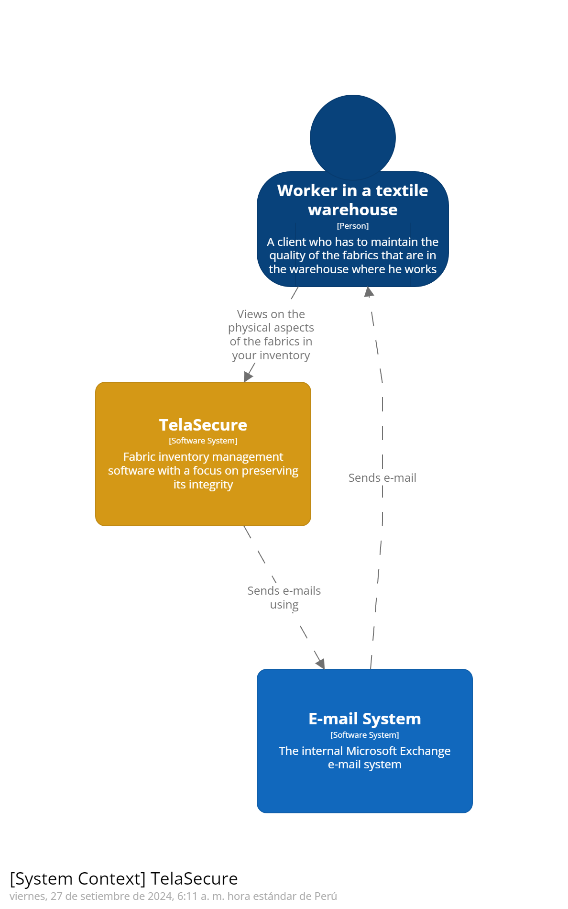

# 
Universidad Peruana de Ciencias Aplicadas

## 
Aplicaciones Web WS53

  

## 
Informe del TB1

<h4 style="text-align: center;"> Ingeniería de Software </h4>
<h4 style="text-align: center;"> Ciclo 2024-01 </h4>
<h4 style="text-align: center;"> Docente: Angel Augusto Velasquez Nuñez </h4>
<h4 style="text-align: center;"> Startup: WeaveGuard</h4>
<h4 style="text-align: center;"> Producto: TelaSecure</h4>

## Integrantes

|           Nombre            | Código de alumno |
| :-------------------------: | :--------------: |
|   Diego Rolin Acuña Tomas   |    U202221436    |
| Diego Ivan Cabrera Buitron  |    U20211B293    |
| John Telesforo Arevalo Meza |    U202117377    |
|    Godofredo Quispe Tipo    |    U202120772    |
|  Valentino Sandoval Paiva   |    U20211A962    |

## 
Agosto 2024

## Registro de versiones del informe

| Versión | Fecha    | Autor              | Descripción de la modificación                          |
| ------- | -------- | ------------------ | ------------------------------------------------------- |
| 1       | 16/08/24 | Diego Cabrera      | Creación del documento en formato Markdown              |
| 1       | 27/08/24 | Diego Cabrera      | Realización del capítulo I y el capítulo IV             |
| 1       | 27/08/24 | Diego Acuña        | Realización del capítulo I, capítulo II y capítulo V    |
| 1       | 28/08/24 | John Arevalo       | Realización del capítulo II, capítulo III y capítulo IV |
| 1       | 29/08/24 | Godofredo Quispe   | Realización del capítulo I y capítulo II                |
| 1       | 30/08/24 | Valentino Sandoval | Realización del capítulo III, capítulo IV y capítulo V  |

## Project Report Collaboration Insights

URL de la organización del proyecto: [https://github.com/si730-2402-ws53-WebApplications/documentation-WebApplications]

**TB1**
|Integrante|Tareas Asignadas|
|-|-|
|Diego Rolin Acuña Tomas|Landing Page, Service & Applications Implementation|
|Diego Ivan Cabrera Buitron|Lean UX Hypothesis. Estrategias y tácticas frente a competidores. Software Object-Oriented Design|
|John Telesforo Arevalo Meza|Landing Pade UI Design. Web Aplication UX/UI Design. Style Guidelines|  
|Godofredo Quispe Tipo| Lean UX Canvas. Segmentos Objetivos. User Person. User Journey Mapping|
|Valentino Sandoval Paiva| Software Configuration Management. Information Architecture. Impact Mapping|

**TB1 Github**

## Contenido

1. [Capítulo I: Introducción](#1.) 
   1.1. [**_Startup Profile_**](#1.1.)  
   1.1.1. [Descripción del startup](#1.1.1.) 
   1.1.2.[Perfiles de los integrantes del equipo](#1.1.2.) 
   1.2. [**_Solution Profile_**](#1.2.) 
   1.2.1. [Antecedentes y Problemática](#1.2.1.) 
   1.2.2. [Lean UX Process](#1.2.2.) 
   1.2.2.1. [Lean UX Problem Statements](#1.2.2.1.) 
   1.2.2.2. [Lean UX Assumptions](#1.2.2.2.) 
   1.2.2.3. [Lean UX Hypothesis Statements](#1.2.2.3.) 
   1.2.2.4. [Lean UX Canvas](#1.2.2.4.) 
   1.3. [**_Segmentos objetivo_**](#1.3.)  
1. [**Capítulo II: Requirements Elicitation & Analysis**](#2.) 
   2.1. [**_Competidores_**](#2.1.) 
   2.1.1. [Análisis competitivo](#2.1.1.) 
   2.1.2. [Estrategias y tácticas frente a competidores](#2.1.2.) 
   2.2. [**_Entrevistas_**](#2.2.) 
   2.2.1. [Diseño de entrevistas](#2.2.1.) 
   2.2.2. [Registro de entrevistas](#2.2.2.) 
   2.2.3. [Análisis de entrevistas](#2.2.3.) 
   2.3. [**_Needfinding_**](#2.3.) 
   2.3.1. [User Personas](#2.3.1.) 
   2.3.2. [User Task Matrix](#2.3.2.) 
   2.3.3. [User Journey Mapping](#2.3.3.) 
   2.3.4. [Empathy Mapping](#2.3.4.) 
   2.3.5. [As-is Scenario Mapping](#2.3.5.) 
   2.4. [**_Ubiquitous Language_**](#2.4.)  
1. [**Capítulo III: Requirements Specification**](#3.) 
   3.1. [**_To-Be Scenario Mapping_**](#3.1.) 
   3.2. [**_User Stories_**](#3.2.) 
   3.3. [**_Impact Mapping_**](#3.3.) 
   3.4. [**_Product Backlog_**](#3.4.)  
1. [**Capítulo IV: Product Design.**](#4.) 
   4.1. [**_Style Guidelines_**](#4.1.) 
   4.1.1. [General Style Guidelines](#4.1.1.) 
   4.1.2. [Web Style Guidelines](#4.1.2.) 
   4.2. [**_Information Architecture_**](#4.2.) 
   4.2.1. [Organization Systems](#4.2.1.) 
   4.2.2. [Labeling Systems](#4.2.2.) 
   4.2.3. [SEO Tags and Meta Tags](#4.2.3.) 
   4.2.4. [Searching Systems](#4.2.4.) 
   4.2.5. [Navigation Systems](#4.2.5.) 
   4.3. [**_Landing Page UI Design_**](#4.3.) 
   4.3.1. [Landing Page Wireframe](#4.3.1.) 
   4.3.2. [Landing Page Mock-up](#4.3.2.) 
   4.4. [**_Web Applications UX/UI Design_**](#4.4.) 
   4.4.1. [Web Applications Wireframes](#4.4.1.) 
   4.4.2. [Web Applications Wireflow Diagrams](#4.4.2.) 
   4.4.3. [Web Applications Mock-ups](#4.4.3.) 
   4.4.4. [Web Applications User Flow Diagrams](#4.4.4.) 
   4.5. [**_Web Applications Prototyping_**](#4.5.) 
   4.6. [**_Domain-Driven Software Architecture_**](#4.6.) 
   4.6.1. [Software Architecture Context Diagram](#4.6.1.) 
   4.6.2. [Software Architecture Container Diagrams](#4.6.2.) 
   4.6.3. [Software Architecture Components Diagrams](#4.6.3.) 
   4.7. [**_Software Object-Oriented Design_**](#4.7.) 
   4.7.1. [Class Diagrams](#4.7.1.) 
   4.7.2. [Class Dictionary](#4.7.2.) 
   4.8. [**_Database Design_**](#4.8.) 
   4.8.1. [Database Diagram](#4.8.1.)  
1. [**Capítulo V: Product Implementation, Validation & Deployment**](#5.) 
   5.1. [**_Software Configuration Management_**](#5.1.) 
   5.1.1. [Software Development Environment Configuration](#5.1.1.) 
   5.1.2. [Source Code Management](#5.1.2.) 
   5.1.3. [Source Code Style Guide & Conventions](#5.1.3.) 
   5.1.4. [Software Deployment Configuration](#5.1.4.) 
   5.2. [**_Landing Page, Services & Applications Implementation_**](#5.2.) 
   5.2.1. [Sprint 1](#5.2.1.) 
   5.2.1.1. [Sprint Planning 1](#5.2.1.1.) 
   5.2.1.2. [Sprint Backlog 1](#5.2.1.2.) 
   5.2.1.3. [Development Evidence for Sprint Review](#5.2.1.3.) 
   5.2.1.4. [Testing Suite Evidence for Sprint Review](#5.2.1.4.) 
   5.2.1.5. [Execution Evidence for Sprint Review](#5.2.1.5.) 
   5.2.1.6. [Services Documentation Evidence for Sprint Review](#5.2.1.6.) 
   5.2.1.7. [Software Deployment Evidence for Sprint Review](#5.2.1.7.) 
   5.2.1.8. [Team Collaboration Insights during Sprint](#5.2.1.8.) 
   5.2.2. [Sprint 2](#5.2.2.) 
   5.2.2.1. [Sprint Planning 2](#5.2.2.1.) 
   5.2.2.2. [Sprint Backlog 2](#5.2.2.2.) 
   5.2.2.3. [Development Evidence for Sprint Review](#5.2.2.3.) 
   5.2.2.4. [Testing Suite Evidence for Sprint Review](#5.2.2.4.) 
   5.2.2.5. [Execution Evidence for Sprint Review](#5.2.2.5.) 
   5.2.2.6. [Services Documentation Evidence for Sprint Review](#5.2.2.6.) 
   5.2.2.7. [Software Deployment Evidence for Sprint Review](#5.2.2.7.) 
   5.2.2.8. [Team Collaboration Insights during Sprint](#5.2.2.8.) 
   5.3. [**_Validation Interviews_**](#5.3.) 
   5.3.1.[Diseño de Entrevistas](#5.3.1.) 
   5.3.2.[Registro de Entrevistas](#5.3.2.) 
   5.3.3.[Evaluaciones según Heurísticas](#5.3.3.) 
   5.4. [**_Video About-the-Product_**](#5.4.)  
1. [**Conclusiones**](#6.) 
1. [**Bibliografía**](#7.) 
1. [**Anexos**](#8.) 

## Students Outcomes

**Student Outcome ABET 5**

Trabaja efectivamente en un equipo cuyos miembros juntos proporcionan liderazgo; crea un entorno colaborativo e inclusivo y establece metas, planifica tareas y cumple objetivos

| Criterio específico                                                                                      | Acciones realizadas                                                                                                                                                                                                                                                                                                                                                                                                                                                                                                                                                                                                                                                                                                                                                                                                                                                                                                                                                                                                                                                                                                                                                                                                                                                                                                                                                                                                                                                                                                                                                                                                                                                                                                                                                                                                                                                                                                                                                                                                                                                                                                                                                                                                                                                                                                                                                                                                                                                                                                                                                                                                                                                                                                                                                                                                  | Conclusiones                                                                                                                                                                                                     |
| -------------------------------------------------------------------------------------------------------- | -------------------------------------------------------------------------------------------------------------------------------------------------------------------------------------------------------------------------------------------------------------------------------------------------------------------------------------------------------------------------------------------------------------------------------------------------------------------------------------------------------------------------------------------------------------------------------------------------------------------------------------------------------------------------------------------------------------------------------------------------------------------------------------------------------------------------------------------------------------------------------------------------------------------------------------------------------------------------------------------------------------------------------------------------------------------------------------------------------------------------------------------------------------------------------------------------------------------------------------------------------------------------------------------------------------------------------------------------------------------------------------------------------------------------------------------------------------------------------------------------------------------------------------------------------------------------------------------------------------------------------------------------------------------------------------------------------------------------------------------------------------------------------------------------------------------------------------------------------------------------------------------------------------------------------------------------------------------------------------------------------------------------------------------------------------------------------------------------------------------------------------------------------------------------------------------------------------------------------------------------------------------------------------------------------------------------------------------------------------------------------------------------------------------------------------------------------------------------------------------------------------------------------------------------------------------------------------------------------------------------------------------------------------------------------------------------------------------------------------------------------------------------------------------------------------------- | ---------------------------------------------------------------------------------------------------------------------------------------------------------------------------------------------------------------- |
| **5.c.1 Trabaja en equipo para proporcionar liderazgo en forma conjunta**                                | **Diego Rolin Acuña Tomas**  TB1: Desarrollando el documento, me pareció más importante comprender el problema que nuestro proyecto soluciona. Investigando para el Solution Profile investigue en páginas confiables las consecuencias de este problema y como no permitir sus causas, esto me ayudo a ser una persona activa en las decisiones sobre la investigación de nuestros posibles clientes. En conjunto decidimos cuales serian nuestro Segmento Objetivo y cuales serian los User Story que nuestros clientes realmente valorarían. TP:  -Todos los miembros de nuestro equipo fueron muy activos en las reuniones en Discord, todos dijeron sus opiniones y fueron activos a la votación que ocurría cada que teníamos una duda sobre como continuar. -Cada vez que nos retrasábamos en algún aspecto, no buscábamos culpables, éramos conscientes que era un error como equipo y todos debían trabajan en conjunto para solucionarlo. -Nuestro equipo ha comprendido que el trabajo es una responsabilidad compartida, no hay un solo culpable. -Debemos esforzarnos para crear un ambiente sereno y abierto a las dudas, pues si nuestros compañeros no se abren no podremos solucionar los problemas a tiempo y completar el trabajo.   **Diego Ivan Cabrera Buitron**  TB1: Al realizar la sección de Estrategias y tácticas frente a competidores pude liderar a mi equipo para coordinar cuáles serían nuestras mejores opciones, también se decidió la estructura de nuestro Diagrama de clases y el Diagrama de Base de Datos. TP: Desarrollé el componente de Invenotry Management en llamadas colaborativas con el grupo para coordinar correctamente su creación. -Apoyé en la realización del Sprint II mediante llamadas en Discord para evitar la desorganización.  **John Telesforo Arevalo Meza**  TB1: Al trabajar en la landing page, lideré junto a mi equipo la coordinación de las mejores opciones de diseño y contenido. Así como a separar las diferentes partes de esta. Colaboramos en la elaboración de los wireframes y mockups tanto de la landing page como de la aplicación web, siempre teniendo en cuenta las ideas de los demas. TP:  Fomenté un ambiente de trabajo colaborativo donde todos participaron activamente en la planificación y ejecución. Establecimos metas claras, repartimos tareas de manera justa y mantuvimos una comunicación fluida. Esto nos ayudó a cumplir los objetivos y entregar todo a tiempo, desde el desarrollo hasta el despliegue sin problemas. **Godofredo Quispe Tipo**  **TB1:** La colaboración con los miembros del equipo fue clave no solo para completar mis propias tareas, sino también para asegurar el progreso general del equipo. Coordiné los puntos críticos en los que era necesario trabajar en conjunto, revisando los avances y comunicando oportunamente cualquier ajuste o mejora que debiera implementarse. Esta coordinación permitió optimizar el flujo de trabajo y mantener la calidad en cada etapa del proyecto. Para facilitar la comunicación, utilizamos dos canales principales: un chat grupal y llamadas por Discord. Estos medios resultaron esenciales para mantener una comunicación fluida y en tiempo real, permitiendo que todos los miembros estuvieran al tanto de los avances y que las decisiones se tomaran de manera rápida y eficiente. La combinación de estos canales aseguró una gestión dinámica de las tareas y permitió resolver problemas de forma ágil, favoreciendo así el cumplimiento de los objetivos. **TP:**  <li>Participe en una reunión para solventar y mejorar el documento.</li> <li>Participe en la reunion donde se comenzo a realizar los cambios</li> <li>Participe en la reunion donde se quedaron a ver los avances del frontend</li>**Valentino Sandoval Paiva**  TB1: Durante la fase de definición de estrategias, trabajé estrechamente con mi equipo para identificar y priorizar nuestras mejores opciones. Utilizamos herramientas como Lean UX Assumptions para validar hipótesis, User Task Matrix para optimizar tareas del usuario, y Empathy Mapping para entender su perspectiva. También aplicamos Impact Mapping para alinear nuestras decisiones con los objetivos del proyecto y Organization Systems para organizar nuestras estrategias de manera efectiva.TP: Trabajé con mi equipo para proporcionar liderazgo colaborativo, gestionando de manera efectiva la planificación y ejecución del sprint. Utilizamos un enfoque ágil para definir y priorizar tareas en el Sprint Backlog, asegurando alineación y asignación en el Sprint Planning. Mantuvimos una comunicación constante que permitió una ejecución fluida y la entrega de evidencias de desarrollo, pruebas, despliegue y documentación de servicios. La colaboración mejoró notablemente gracias a la implementación de un bounded context que organizó nuestras estrategias e integró eficientemente los servicios de software. | Para la presente TB1 se realizó de manera acertada la realización de los capítulos I, II, III, IV y V; cada integrante aportó de manera cooperativa y coordinada con los demás, demostrando el trabajo conjunto. Para el presente TP se realizó de todo lo relacionado al sprint II, teniendo ciertos inconvenientes, pero cada integrante aportó de manera cooperativa y coordinada con los demás, demostrando el trabajo conjunto. |
| **5.c.2 Crea un entorno colaborativo e inclusivo, establece metas, planifica tareas y cumple objetivos** | **Diego Rolin Acuña Tomas**  TB1: Unos días después de reunirnos hicimos una reunión virtual para separarnos tareas y objetivos que cumpliríamos en esa semana. Por supuesto que también creamos reuniones para solución dudas y apoyar cuando uno terminaba sus responsabilidades. TP:  -Nuestro equipo tuvo muchas reuniones para separar tareas a cada miembro del equipo Todos tuvieron sus oportunidades de opinar y dar sus propias versiones del trabajo, sin embargo, la elección fue por mayoría de opiniones. Pero nadie se quejó, entendíamos que a veces tenemos que ceder para seguir avanzando. -Hubieron muchos mensajes para motivar a compartir sus dudas y problemas para solucionarlo como equipo. -Cuando decidimos o tenemos alguna duda que nadie del equipo sabe, todos pueden decir sus ideas.  **Diego Ivan Cabrera Buitron**  TB1: Al realizar el diagrama de Base de Datos y el Diagrama de Clases se coordinó con el equipo mediante llamadas grupales por Google Meet, de esta manera cada miembro apoyó en la realización. TP: -Las reuniones realizadas en llamadas de Discord permitieron que desarrolle de manera ordenada el component de Inventory Management La designación de tareas realizadas en Trello permitieron organizar el desarrollo del informe y la mejora de este mismo.  **John Telesforo Arevalo Meza**  TB1: Durante la creación de los wireframes y mockups de la landing page y de la aplicación web, se estuvo un entorno inclusivo a través de reuniones grupales por Google Meet y Discord. Con el as-is y to-be mapping, establecimos metas claras y realistas, asu vez, planificamos las tareas necesarias y se contribuyó activamente para alcanzar los objetivos definidos. TP: Fomenté un ambiente de trabajo colaborativo donde todos participamos activamente en la planificación y ejecución. Establecimos metas claras, repartimos tareas de manera justa y mantuvimos una comunicación fluida.  **Godofredo Quispe Tipo**  TB1: A lo largo del proyecto, mantuve una actitud proactiva, tomando la iniciativa en la coordinación de tareas clave y promoviendo la colaboración dentro del equipo. Siempre estuve dispuesto a escuchar las ideas y opiniones de mis compañeros, lo que fomentó un ambiente abierto y enriquecedor. Ante las críticas constructivas, me encargué de analizarlas cuidadosamente y proponer soluciones viables, lo que permitió mejorar continuamente el proyecto. Para garantizar la cooperación y participación efectiva de todos, promoví una integración fluida, revisando avances, ajustando tareas cuando fue necesario, y asegurando una comunicación constante mediante el uso de canales como el chat grupal y las llamadas por Discord. **TP:**  <li>Me encargue de brindar los materiales necesarios para la realizacion de las correcciones, la cual se mando por el grupo de WhatsApp.</li> <li>Me encargue de verificacion de lo cumplido del capitulo 1 la cual se trabajo de forma conjunta en un docs compartido para visualizar los progresos.</li> **Valentino Sandoval Paiva**  TB1: Al crear un entorno colaborativo e inclusivo, organizamos sesiones de trabajo grupales a través de Google Meet para el desarrollo del cada apartado del proyecto. Establecimos metas claras y planificamos las tareas utilizando herramientas como Lean UX Assumptions, User Task Matrix y Empathy Mapping para garantizar que cada miembro pudiera contribuir efectivamente. Implementamos Impact Mapping y Organization Systems para asegurar que nuestras decisiones y esfuerzos se alinearan con los objetivos del proyecto y se cumplieran de manera efectiva. TP: Para esta entrega fomenté un entorno colaborativo e inclusivo, asegurando que todos los miembros del equipo participaran activamente en la planificación y ejecución de tareas. Establecimos metas claras y compartidas desde el Sprint Planning, y dividimos el trabajo de manera equitativa en el Sprint Backlog, asignando responsabilidades según las fortalezas individuales. A lo largo del sprint, promoví una comunicación abierta y fluida, lo que nos permitió cumplir con los objetivos planteados, entregar evidencias de desarrollo, pruebas, y desplegar los servicios con éxito. | Para la presente TB1 se realizaron varias sesiones colaborativas para la coordinación de las tareas asignadas y realizarlas de manera idónea. Para el presente TP se realizaron varias sesiones colaborativas para la coordinación de las tareas asignadas y realizarlas de manera idónea. |

<h2>Capítulo I: Introducción</h2>

<h3> 1.1 Startup Profile</h3>

<h4> 1.1.1. Descripción del startup</h4>

 
WeaveGuard es una Startup innovadora creada por estudiantes de la Facultad de Ingeniería de la Universidad Privada de Ciencias Aplicadas (UPC). Las empresas en el sector textil y confecciones enfrentan desafíos a la hora de cuidar y mantener la calidad de las telas en sus almacenes, destacando la falta de un Software gestión de inventario. Creamos nuestra Empresa emergente con el objetivo de solucionar estos problemas, el producto que desarrollamos ayudara a mantener informados a los encargados de supervisar el inventario si el ambiente es indicado para guardar la tela, al mismo tiempo fomentara una cultura de responsabilidad. La aplicación integrara tecnologías avanzadas, como inteligencias artificiales, para ayudar en la ubicación de las telas y características del ambiente, y bases de datos para tener un historial de importaciones y exportaciones.
  
Misión: Nuestra misión es elevar la calidad, rentabilidad y confianza de las empresas en el sector textil y confecciones dando una herramienta que facilite tener un seguimiento de la temperatura, fechas de fumigación y ubicación del producto, fomentando la importancia de la responsabilidad. Apuntamos a ser más que solo un proveedor de software, queremos ser un aliado para alcanzar el éxito y confianza con los clientes.
  
Vision: Como vision, apuntamos a ser la empresa mas conocida y confiable en el desarrollo de software de gestion de inventario, pretendemos personalizar y desarrollar varias versiones para muchos tipos de almacenes. Tendremos una base de datos con informacion sobre el cuidado y mantenimiento de muchos productos diferentes, pero siempre teniendo principal objetivo el cuidado de las telas.

<h4> 1.1.2. Perfiles de los integrantes del equipo</h4>

| Integrante                                           | Descripción                                                                                                                                                                                                                                                                                                                                                                                                                                                                                                                                                                                                                                                                                                                                                                                                                                                                                                                                                                                                                                                                                                           |
| ---------------------------------------------------- | --------------------------------------------------------------------------------------------------------------------------------------------------------------------------------------------------------------------------------------------------------------------------------------------------------------------------------------------------------------------------------------------------------------------------------------------------------------------------------------------------------------------------------------------------------------------------------------------------------------------------------------------------------------------------------------------------------------------------------------------------------------------------------------------------------------------------------------------------------------------------------------------------------------------------------------------------------------------------------------------------------------------------------------------------------------------------------------------------------------------- |
|                       | **Diego Ivan Cabrera Buitron**   Mi nombre es **Diego Cabrera**, estoy cursando la carrera de Ingeniería de Software, me considero una persona responsable y perseverante. Al culminar mi carrera quiero especializarme en el sector de la ciberseguridad                                                                                                                                                                                                                                                                                                                                                                                                                                                                                                                                                                                                                                                                                                                                                                                                                                                          |
|                 | **Diego Rolin Acuña Tomas**   Soy Diego Rolin Acuña Tomas, tengo 22 años y estoy cursando la carrera de Ingeniería de Software en la Universidad Peruana de Ciencias Aplicadas. Desde una temprana edad me han fascinado las computadoras y como se mostraban en las películas los expertos en informática. Hoy en día entiendo la importancia de mi disciplina en el mundo y quisiera ser parte de las ventajas que pueden proveer los conocimientos en el campo de la informática y la ciencia de la computación. He llevado cursos para aprender lenguajes como Python, C++ y MATLAB, aprendiendo patrones de algoritmo para mi vida profesional. También conozco los tipos de base de datos, aprendí SQL server para las bases de datos relacional y mongo DB para bases de datos no relaciones. Quiero seguir mejorando mis habilidades y especializarme en DataScience y Gestión de proyectos.                                                                                                                                                                                                               |
|              | **Godofredo Quispe Tipo**   Mi nombre es Godofredo y actualmente me encuentro cursando la carrera de Ingeniería de Software, un campo que me apasiona profundamente. Mi interés por las nuevas tecnologías es constante, y estoy siempre al tanto de las últimas innovaciones que están redefiniendo el panorama tecnológico. Me considero un entusiasta de la programación, área en la que he adquirido un dominio en diversos lenguajes, tales como Python, C++ y Assembler, lo que me ha permitido abordar una amplia gama de proyectos y desafíos técnicos.  Además, poseo un profundo conocimiento en el ámbito de la comunicación de redes, lo que me ha permitido comprender los complejos mecanismos detrás de la interconexión de sistemas y dispositivos. Mi formación en ciencia de datos, con un enfoque en Python, ha sido un pilar fundamental en mi desarrollo profesional, permitiéndome trabajar con grandes volúmenes de datos y obtener valiosos insights. Asimismo, cuento con experiencia en el manejo de Matlab, una herramienta clave en diversos proyectos de análisis y simulación. |
|  | **Valentino Sandoval Paiva**   Soy Valentino Sandoval, tengo 20 años y soy estudiante de la carrera de Ingeniería de Software, cursando el 4to ciclo. Siempre he estado interesado en la tecnología, el software y hardware de las computadoras. Además, me gustan mucho los videojuegos, esto me llevo a decidirme a estudiar esta carrera.                                                                                                                                                                                                                                                                                                                                                                                                                                                                                                                                                                                                                                                                                                                                                                       |
|       | **John Arévalo Meza**   Soy John Arévalo y estoy cursando la carrera de Ingeniería de Software, me considero una persona responsable y perseverante. Tengo conocimiento en lenguajes de programación como python y c++, y bases de datos como SQLServer y MongoDB.                                                                                                                                                                                                                                                                                                                                                                                                                                                                                                                                                                                                                                                                                                                                                                                                                                                 |

<h3> 1.2. Solution Profile</h3>

<h4> 1.2.1. Antecedentes y Problemática</h4>

Desde tiempos antiguos, la importancia de la ropa involucra aspectos sociales, cultirales y económicos. En la actualidad se ha convertido en un fenómeno más complejo pues se ha vuelto una expresión personal y social, señala la clase social, y la visibilidad aumento con las redes sociales. Las empresas de la industria Textil son conscientes de la importancia en el cuidado de sus telas para ser relevantes en el mercado, pues las empresas de la industria de la Moda y Confección crean sus productos en tiempos específicos y en grandes cantidades. Sin embargo, es evidente que muchos no pueden gestionar sus inventarios sin tener pedidas por la destrucción de la integridad de sus telas.

##### What?

- ¿Que problema se resuelve?
  Las empresas en el rubro textil tienen que mantener controlados los almacenes donde guardan su mercancía, pues un nivel más alto de humedad, existencia de insectos como polillas o la temperatura puede dañar la integridad de las telas. Esto significaría menos ingresos y baja confianza con los clientes, cosas que una empresa respetable no puede permitir. En otras palabras, necesitan una herramienta que permita monitorear en tiempo real las características del lugar donde se almacenaran las telas.

- ¿Que relacion tiene el problema con los clientes?
  Las empresas que distribuyan la tela desearan tener una solución a este problema para los supervisores del inventario y para la alta dirección, pues las consecuencias del cuidado inadecuado afectan la económica de la empresa y su reputación. Se convertirán en un mal producto y nadie lo comprara.

##### When?

- ¿Cuándo ocurre el problema?
  El ambiente óptimo para depositar las telas en el almacén debe ser constante, pues en una empresa no todos los productos se venden hasta no dejar sin existencia, generalmente el almacén contiene un producto. En otras palabras, si no quieres que tu producto guardado se malogre y no preparas el ambiente para la siguiente adquisición de tela, debes tomar precauciones de manera constante para que no ocurra el problema.

- ¿Cuándo el producto sera util?
  Nuestro software de gestión de inventario de telas, le permitirá mantenerse informado de todas las condiciones actuales del almacén, pues si algo no está dentro del rango aceptable como la humedad, temperatura o luz solar se le enviara notificación, junto con las herramientas necesarias para la gestión de inventarios pues está diseñada para almacenes que guarden la tela.

##### Where?

- ¿Dónde se encuentra el cliente al usar el producto?
  El cliente puede estar en cualquier lugar mientras tenga un dispositivo electrónico y acceso a internet.

##### Who?

- ¿Quienes son los afectados por el problema?
  Los afectados son todos los miembros de una organización o empresa que distribuye telas, pues el problema causa daños a la integridad de las telas y al ser este un mal producto no será fácil vender ni ganar la confianza de los posibles clientes, esto causará un daño económico que puede terminar con despidos o cierre.

- ¿Quienes utilizaran nuestro producto?
  Los que estarán más interesados son los empleados encargados del almacén e inventario, también otro tipo de personal encargada de la calidad y transporte, entre otros estarán interesados en un programa que confirme el cuidado óptimo de las telas.

##### Why?

- ¿Por qué hay que hacerlo?
  Estamos comprometidos a solucionar los problemas que otros softwares sobre gestión de inventario no pueden solucionar porque no se especializan en el producto guardado, se enfocan en tener una lista de inventario con sus facturas, olvidando que un inventario necesita tener las condiciones adecuadas si no quiere que se malogre el producto guardado. Nuestra empresa lo solucionara con un equipo comprometido.

- ¿Por qué los clientes elegiran nuestro producto?
  Conocerán los beneficios de una herramienta especializada, le ayudaremos no solo en la gestión de inventario sino también en el correcto mantenimiento del espacio para almacenar telas. Este problema escala con la cantidad y la diferencia será más notoria al compararnos con otros softwares.

##### How?

- ¿Cómo nos descubren nuestros clientes?

Nuestros clientes pueden conocer nuestra plataforma a través de una amplia variedad de estrategias publicitarias principalmente en línea, como anuncios en redes sociales, banners en sitios web y campañas de email. Además, la recomendación boca a boca por parte de clientes anteriores o actuales.

- ¿Cómo pueden los clientes acceder a nuestro contenido?

El acceso a la plataforma sera sencillo y flexible. Los clientes podrán conectarse a través de cualquier dispositivo, ya sea un teléfono inteligente, tablet, laptop o computadora de escritorio. Además, las funcionalidades serán las mismas desde todos los dispositivos.

- ¿Qué factores llevan a los clientes a elegirnos?

Los clientes se sentirán atraídos hacia nuestra plataforma debido a que combinamos la gestión tradicional de inventarios con la innovación de almacenes inteligentes. Los clientes podran tener acceso y control en tiempo real a factores críticos como la temperatura, humedad y otros parámetros, a través de sensores y controladores que serán instalados estratégicamente. Nuestra plataforma facilita el monitereo de las telas, lo que evita la contratación de personal adicional, lo que a su vez, puede ayudar a ahorrar recursos a nuestros clientes y así destinar estos a otras áreas, mejorando la calidad del producto final y costos operativos.

##### How much?

Durante el 2024 el sector textil peruano ha experimentado cierto crecimiento, debido en gran parte al invierno, sin embargo no estan surgiendo nuevos puestos de trabajo en el mismo, y es que, según una encuesta realizada por la SNI (Sociedad Nacional de Industrias), en el sector de textil y confecciones el 40% de los empresarios encuestados manifestó haber operado en el II trimestre 2024 a un nivel mayor al alcanzado en el mismo periodo del año anterior; mientras el 33% señaló haber producido a un nivel similar. A pesar de ello, en el corto plazo los empresarios de este sector se mantienen cautos para contratar más personal.

<h4> 1.2.2. Lean UX Process</h4>

<h5> 1.2.2.1. Lean UX Problem Statements</h5>

Hemos identificado que, tanto las empresas de confección como los distribuidores de telas, enfrentan dificultades a la hora de monitorear de manera continua aspectos claves relacionados al almacenamiento de sus telas, como la temperatura y la humedad. La falta de siguimiento puede derivar en la degradación del material, ocasionando pérdidas económicas, y en última instancia, una mala experiencia de cara al usuario final. Actualmente, si bien existen almacenes automáticos que ayudan a la gestión del inventario, no ofrecen una solución que integre esto, sumado al control en tiempo real de los factores mencionados inicialmente, lo que dificulta y desfavorece la preservación de la calidad de las telas.

<h5> 1.2.2.2. Lean UX Assumptions</h5>

## Business Assumptions

- **Necesidad del mercado:** Existe una creciente demanda en la industria textil por soluciones eficientes de gestión de inventarios y control ambiental que minimicen las pérdidas y mejoren la calidad del producto.
- **Interés en la automatización:** Las empresas de confección y los distribuidores de telas están buscando activamente herramientas tecnológicas que les permitan automatizar procesos y optimizar sus operaciones diarias.
- **Competitividad:** Las empresas que implementen soluciones tecnológicas avanzadas tendrán una ventaja competitiva significativa en el mercado, mejorando su posicionamiento frente a competidores que aún dependen de procesos manuales.
- **Sostenibilidad:** Hay un enfoque creciente hacia prácticas sostenibles en la industria textil, lo que impulsará a las empresas a adoptar tecnologías que reduzcan el desperdicio y optimicen el uso de recursos.
- **Costos de implementación:** Se asume que la inversión inicial en tecnologías de control ambiental y gestión de inventarios se amortizará rápidamente a través de la reducción de pérdidas y mejora en la eficiencia operativa.

## Business Outcome Assumptions

- **Reducir los tiempos de supervisión de variables ambientales:** Se espera que la automatización en el monitoreo de variables como temperatura y humedad permita que los empleados dediquen más tiempo a otras áreas críticas del negocio, mejorando la productividad general.
- **Aumentar el ingreso económico:** La implementación de sistemas de control ambiental y gestión de inventarios reducirá las pérdidas por degradación de materiales textiles, lo que se traducirá en un aumento significativo en los márgenes de beneficio.
- **Mejorar la reputación de la empresa:** Al garantizar la entrega de productos textiles de alta calidad y minimizar las quejas de los clientes, la reputación de la empresa se verá fortalecida, lo que atraerá a nuevos clientes y mejorará las relaciones con los actuales.
- **Optimización de recursos:** La mejora en el control de inventarios permitirá una gestión más eficiente de los recursos, reduciendo costos operativos y mejorando la rentabilidad a largo plazo.
- **Fidelización del cliente:** La calidad constante y la capacidad de respuesta rápida a las necesidades del cliente generarán una mayor fidelización, lo que conducirá a un crecimiento sostenible del negocio.

## User Assumptions

Miguel, un adulto de 30 años, es Responsable de Almacén de textiles y representa a los empleados en el rango de 20 a 40 años. Con más de una década de experiencia desde que terminó la secundaria, ha desarrollado una sólida comprensión de la operación de un almacén textil, enfrentándose a los desafíos diarios de gestionar inventarios, organizar el stock y controlar las condiciones ambientales del almacén.

### Objetivos:
- Optimización de tiempos en labores repetitivas.
- Busca soluciones tecnológicas que le permitan automatizar tareas rutinarias y optimizar el control ambiental y de inventarios.
- Controlar y regular de manera intuitiva los dispositivos de control ambiental, idealmente desde una plataforma móvil.
- Supervisión en tiempo real de los productos y el ambiente del almacén con reportes automáticos y alertas que le avisen de cualquier anomalía.
- Eficiencia en la toma de decisiones.

### Obstáculos:
- Dependencia de procesos manuales.
- Falta de integración de sistemas para los stocks, monitoreo ambiental y reportes.
- Riesgo de desajustes ambientales en horas de alta demanda o cuando no hay nadie para realizar la corrección.
- Falta de alertas automáticas.
- Complejidad en la implementación de nuevas tecnologías.

### Necesidades:
- Busca una solución que le permita reducir errores humanos y mejorar la precisión en el manejo del inventario.
- Desea herramientas que sean fáciles de usar y que requieran mínima capacitación para los empleados.
- Necesita soporte técnico confiable para resolver problemas que puedan surgir con el sistema.

### Expectativas:
- Espera que la solución propuesta no solo resuelva sus problemas actuales, sino que también se adapte a futuras necesidades a medida que su negocio crece.

## Feature Assumptions

- **Seguimiento de inventario en tiempo real:** Los usuarios tendrán acceso a la aplicación web en tiempo real, lo que les permitirá realizar un seguimiento preciso de las cantidades y condiciones de los productos almacenados.
- **Panel de control centralizado:** La plataforma contará con un panel de control intuitivo que permitirá a los usuarios configurar sensores y ajustar la climatización según las necesidades específicas de los diferentes tipos de textiles.
- **Accesibilidad remota:** Los usuarios podrán acceder a la aplicación desde cualquier dispositivo (móvil, tablet, computadora), lo que les permitirá gestionar su inventario y condiciones ambientales desde cualquier lugar y en cualquier momento.
- **Sistema de alertas:** Se implementará un sistema de notificaciones automáticas que alertará a los usuarios sobre anomalías en los datos proporcionados por los dispositivos de medición, permitiendo una respuesta rápida ante cualquier problema.
- **Herramientas de gestión de stock:** La aplicación incluirá funciones fáciles de usar para la gestión eficiente del stock de telas, como herramientas de planificación de reabastecimiento y reportes de tendencias de consumo.
- **Integración con sistemas existentes:** La solución deberá ser capaz de integrarse con sistemas de gestión de pedidos y producción ya existentes, facilitando una coordinación fluida entre el inventario y la cadena de suministro.
- **Análisis de datos y reportes:** La plataforma ofrecerá herramientas de análisis de datos que permitirán a los usuarios generar reportes sobre el rendimiento del inventario, identificando áreas de mejora y oportunidades de ahorro.

## User Outcomes Assumptions

### Distribuidores de telas:
- Tendrán un acceso inmediato a información actualizada sobre el estado de su inventario, lo que les permitirá tomar decisiones más informadas y rápidas.
- Mejorarán su capacidad para prever necesidades de reposición y reducir el riesgo de escasez de productos.

### Encargados de gestión de almacenes en empresas textiles:
- **Tener un mayor control sobre variables ambientales:** Lograrán mantener las condiciones óptimas para el almacenamiento de textiles, minimizando el riesgo de deterioro.
- **Mejorar el control sobre el inventario:** Obtendrán una visibilidad completa sobre el inventario, lo que les permitirá gestionar mejor los niveles de stock y reducir pérdidas.
- **Optimizar tiempos:** Disminuirán significativamente el tiempo dedicado a la gestión manual de inventarios y a la supervisión de condiciones ambientales, permitiendo enfocarse en tareas más estratégicas y de valor añadido.

<h5> 1.2.2.3. Lean UX Hypothesis Statements.</h5>

- **Hypothesis Statement 01:**

  **Creemos que** proporcionar una plataforma web de gestión de inventarios textiles con monitoreo en tiempo real y control de condiciones ambientales ayudará a los distribuidores de telas a mantener la calidad de sus productos y reducir las pérdidas por deterioro.

  **Sabremos que** hemos tenido éxito

  **Cuando** observemos una reducción significativa en las pérdidas de material debido a condiciones ambientales adversas y un aumento en la satisfacción de los usuarios con la plataforma, medido por un incremento en el uso continuo de las funcionalidades de monitoreo.

- **Hypothesis Statement 02:**

  **Creemos que** implementar un sistema de detección y alerta temprana de plagas dentro de la plataforma web permitirá a las empresas de confección proteger su inventario de manera más efectiva, mejorando la calidad del producto final.

  **Sabremos que** hemos tenido éxito

  **Cuando** veamos una disminución en los informes de pérdidas de inventario causadas por plagas y un aumento en los comentarios positivos sobre la calidad del producto preservado, así como una mayor retención de clientes.

- **Hypothesis Statement 03:**

  **Creemos que** ofrecer una interfaz intuitiva y herramientas de análisis detallado dentro de la plataforma permitirá a los usuarios optimizar la logística y la administración de sus recursos, mejorando la eficiencia operativa.

  **Sabremos que** hemos tenido éxito

  **Cuando** se vea una mejora en los tiempos de respuesta en la gestión de inventarios y una reducción en los errores operativos, reflejado en un aumento en la productividad reportada por los usuarios.

- **Hypothesis Statement 04:**

  **Creemos que** adaptando la plataforma a las necesidades específicas del manejo de textiles, y ofreciendo funciones especializadas, aumentará la adopción por parte de empresas del rubro textil.

  **Sabremos que** hemos tenido éxito

  **Cuando** observemos un aumento en el número de empresas de confección que adoptan la plataforma, junto con un incremento

<h5> 1.2.2.4. Lean UX Canvas</h5>

| Lean UX Canvas                                                                            |                                                                                                                                                                                                                                                                                                                                                                                                                                                                                                                                                                                                                                                                                                                                                                                                                                                                                         |
| ----------------------------------------------------------------------------------------- | --------------------------------------------------------------------------------------------------------------------------------------------------------------------------------------------------------------------------------------------------------------------------------------------------------------------------------------------------------------------------------------------------------------------------------------------------------------------------------------------------------------------------------------------------------------------------------------------------------------------------------------------------------------------------------------------------------------------------------------------------------------------------------------------------------------------------------------------------------------------------------------- |
| **Business Problem**                                                                      | El problema que enfrentan los usuarios es la falta de un control automatizado sobre la temperatura y la humedad, así como la dificultad para realizar un seguimiento eficiente de los cambios en el almacén y la gestión del stock. Actualmente, se ven obligados a realizar estas tareas manualmente, revisando medidores y utilizando hojas de cálculo para el seguimiento del inventario. Esta situación no solo representa una pérdida de tiempo, sino que también incrementa la probabilidad de cometer errores y dificulta la toma de decisiones rápidas e informadas, lo que puede resultar en pérdidas económicas significativas.                                                                                                                                                                                                                                               |
| **Business Outcomes**                                                                     | <ul><li>Aumentar la eficiencia y satisfaccion del usuario en el control y gestion del almacen.</li><li>Mejorar la retención de usuarios y la lealtad a la plataforma.</li><li>Establecer normas para instalar sensores y controladores de temperatura y humedad.</li></ul>                                                                                                                                                                                                                                                                                                                                                                                                                                                                                                                                                                                                              |
| **Users and Customers**                                                                   | <ul><li>Usuarios: Personas que quieren administra y gestionar su almacen de telas.</li><li>Clientes: Persona que trabaja en una Empresa Textilera.</li></ul>                                                                                                                                                                                                                                                                                                                                                                                                                                                                                                                                                                                                                                                                                                                            |
| **User Benefits**                                                                         | <ul><li>Mejorar el control de la temperatura y la humedad en el almacén, así como realizar un seguimiento eficiente de las existencias para optimizarlas de acuerdo con los materiales almacenados.</li><li>Aumento de la confianza en la plataforma gracias a un mejor control de la temperatura y la humedad dentro del almacén, junto con una gestión eficiente del stock.</li><li>Aumentar la satisfacción al poder monitorear y ajustar los niveles de temperatura y humedad del almacén desde una computadora, además de mejorar el control del inventario de stock..</li></ul>                                                                                                                                                                                                                                                                                                   |
| **Solution Ideas**                                                                        | <ul><li>Un sistema centralizado que muestre el estado actual del ambiente del almacén y permita ajustes instantáneos.</li><li> Notificaciones para alertar a los usuarios sobre condiciones fuera de rango o cambios en el inventario.</li><li>Funciones que registren las entradas y salidas de materiales, actualizando el inventario en tiempo real.</li><li>Generación de reportes sobre el estado del almacén y del inventario para ayudar en la toma de decisiones</li><li>Recordatorios y sugerencias para el mantenimiento de equipos de control ambiental, basados en su uso y condiciones.</li></ul>                                                                                                                                                                                                                                                                          |
| **Hypotheses**                                                                            | <ul><li>Creemos que al mejorar la capacidad de los usuarios para controlar el ambiente del almacén y gestionar el inventario desde cualquier lugar con acceso a internet, aumentará su satisfacción y eficiencia. Podrán realizar ajustes en tiempo real según las necesidades específicas de los materiales almacenados, y gestionar el stock de manera intuitiva, simplificando así los procesos y optimizando el funcionamiento del almacén.</li><li>Creemos que aumentar la fidelidad de los clientes y mejorar la retención de usuarios es posible si se les proporcionan herramientas que les permitan gestionar eficientemente el stock y controlar los sensores de temperatura y humedad en sus almacenes. Estas funcionalidades clave facilitan el control preciso del entorno y optimizan la gestión del inventario, lo que impulsa el uso continuo de la solución.</li></ul> |
| **What's the most important thing we need to learn first?**                               | <ul><li>Conocer la arquitectura del software de la solución, considerando las capas y componentes que la conforman (Base de Datos, Backend, Frontend, Landing Page).</li><li>Conocer las herramientas necesarias para aprovechar el uso de entrevistas y estudios de usuario.</li><li>Conocer las nociones y herramientas necesarias para el desarrollo de los diferentes servicios de la aplicación.</li></ul>                                                                                                                                                                                                                                                                                                                                                                                                                                                                         |
| **What's the least amount of work we need to do to learn tne next most important thing?** | <ul><li>Realizar el diseño de una Landing Page sencilla, eficiente y cómoda para que el usuario pueda conocer nuestra propuesta.</li><li>Recopilar información sobre el estudio del mercado objetivo a través de las entrevistas de usuario.</li><li>Realizar el diseño de prototipos y diagramas para expresar de manera gráfica los procesos y funcionalidades que tendrá nuestra aplicación.</li></ul>                                                                                                                                                                                                                                                                                                                                                                                                                                                                               |

<h3> 1.3. Segmento objetivo</h3>

    <h3>Descripción de cada segmento objetivo</h3>
        
<strong>Distribuidor de tela</strong>

    
Este segmento objetivo de nuestra plataforma está dirigido a distribuidores de tela en Perú que se dedican a la gestión y distribución de sus telas. Su principal enfoque radica en preservar la calidad y el buen estado de las telas, con el objetivo de ofrecer un producto de buena calidad y asegurar la satisfacción de quienes adquieren sus productos. 

    
<strong>Empresas de confeccion textil</strong>

    
El segmento objetivo de nuestra plataforma está dirigido a empresas de confección textil. Estas empresas se caracterizan por su capacidad para transformar materias primas en una amplia gama de productos textiles, a través de procesos complejos y demandantes. Están interesados en la adquisición de material de primera calidad y óptimos para su elaboración o transformación, priorizando a distribudores que les ofrezcan materiales con el menor defecto del este.

    

    <h3>Datos cuantitativos del problema para cada segmento</h3>
    
<strong>Distribuidor de tela</strong>

    
Según el Comité Nacional de Conservación Textil (2002), la temperatura y la humedad relativa son factores críticos en la preservación de textiles, ya que las fibras naturales, debido a su capacidad de absorber humedad, reaccionan a las variaciones ambientales. Estos cambios pueden causar hinchazón, encogimiento y eventualmente debilitar las fibras, resultando en roturas o rasgaduras. Una humedad relativa alta, por encima del 70%, no solo acelera el deterioro químico y biológico, sino que también propicia el crecimiento de moho y microorganismos, mientras que una humedad baja, inferior al 30%, puede resecar las fibras, volviéndolas quebradizas y susceptibles de desintegrarse con el tiempo. Las fluctuaciones de temperatura también pueden ser perjudiciales, favoreciendo la corrosión de componentes metálicos y acelerando la descomposición de materiales orgánicos

    
<strong>Empresas de confeccion textil</strong>

    
Según DELTA, la baja calidad en los productos textiles está estrechamente relacionada con la utilización de equipos obsoletos o inadecuados, lo que afecta directamente la calidad de las telas producidas. Por ejemplo, algunas empresas utilizan máquinas domésticas para probar muestras textiles, lo que no solo resulta en retrasos y pérdidas de material, sino que también impide una inspección adecuada de la calidad de los tejidos. Además, la negativa a comprobar los tejidos adquiridos compromete la integridad de la tela durante la producción, especialmente en la fase de dobladillado, lo que puede causar problemas de dimensiones y llevar a una inevitable pérdida de material. La falta de control sobre la tensión en los tejidos también puede causar deformaciones por estiramiento o contracción, impactando negativamente en la calidad final del producto. Por ello, invertir en soluciones automatizadas y optimizadas se vuelve esencial para garantizar una producción textil de alta calidad, evitando desperdicios y fortaleciendo la posición de la empresa en un mercado competitivo.

    

    <h3>Variables geográficas, demográficas y psicológicas para cada segmento</h3>
    
<strong>Distribuidor de tela</strong>

    
Variable geográfica:

    <ul>
        <li>País: Perú</li>
        <li>Ciudad: Zonas urbanas</li>
    </ul>
    
Variable demográfica:

    <ul>
        <li>Género: Femenino / Masculino.</li>
        <li>Ocupación: Todas las ocupaciones</li>
        <li>Estado civil: Todos los estados</li>
        <li>Edad y etapa de ciclo de vida: Ciudadanos mayores a 22 años.</li>
    </ul>
    
Variable psicográfica:

    <ul>
        <li>Nivel Socioeconómico (NSE): Nivel A y B</li>
        <li>Características de personalidad:
            <ul>
                <li>Asertivo</li>
                <li>Transparente</li>
                <li>Proactivo</li>
                <li>Perseverante</li>
            </ul>
        </li>
    </ul>
    
<strong>Empresas textiles</strong>

    
Variable geográfica:

    <ul>
        <li>País: Perú</li>
        <li>Ciudad: Zonas urbanas</li>
    </ul>
    
Variable demográfica:

    <ul>
        <li>Género: Femenino / Masculino.</li>
        <li>Ocupación: Todas las ocupaciones</li>
        <li>Estado civil: Todos los estados</li>
        <li>Edad y etapa de ciclo de vida: Ciudadanos mayores a 18 años.</li>
    </ul>
    
Variable psicográfica:

    <ul>
        <li>Nivel Socioeconómico (NSE): Nivel A, B y C</li>
        <li>Características de personalidad:
            <ul>
                <li>Responsable</li>
                <li>Perseverante</li>
                <li>Orientado a resultados</li>
                <li>Flexible</li>
            </ul>
        </li>
    </ul>

<h2> Capítulo II: Requirements Elicitation & Analysis</h2>

<h3> 2.1. Competidores</h3>

<h4> 2.1.1. Análisis Competitivo</h4>

|                              | WeaveGuard                                                                                                                                                                                                                                                                                                                         | SoftExpert                                                                                                                                                                                                                                                                 | Datatex                                                                                                                                                                                                                                           |
| ---------------------------- | ---------------------------------------------------------------------------------------------------------------------------------------------------------------------------------------------------------------------------------------------------------------------------------------------------------------------------------- | -------------------------------------------------------------------------------------------------------------------------------------------------------------------------------------------------------------------------------------------------------------------------- | ------------------------------------------------------------------------------------------------------------------------------------------------------------------------------------------------------------------------------------------------- |
| **Overview**                 | Plataforma innovadora enfocada en la gestión y control de productos textiles dentro de almacenes y fábricas. La solución permite a los usuarios realizar un seguimiento eficiente del inventario de telas, incluyendo el monitoreo de las condiciones ambientales, el control de plagas y la seguridad de acceso en los almacenes. | Plataforma integral para la gestión de la excelencia operacional, que ofrece soluciones para la gestión de calidad, procesos, riesgo, y cumplimiento normativo.                                                                                                            | Solución ERP desarrollado específicamente para las complejidades de la manufactura textil; abarca la gestión de la cadena de suministro, producción, inventario y control de calidad, todo en un solo sistema.                                    |
| **Ventajas competitivas**    | WeaveGuard está diseñada específicamente para la gestión de almacenes y productos textiles, lo que le permite abordar las necesidades particulares de esta industria (como el control de telas, seguimiento de inventarios, y gestión ambiental).                                                                                  | SoftExpert ofrece una plataforma modular que puede personalizarse para diferentes industrias, lo que permite a las empresas elegir y pagar solo por los módulos que necesitan.                                                                                             | A diferencia de otros ERP genéricos, Datatex está completamente diseñado para las necesidades específicas de la manufactura y la cadena de suministro textil, lo que lo convierte en una herramienta más eficaz para las empresas de este sector. |
| **Mercado Objetivo**         | Empresas dedicadas a la fabricación de telas y productos textiles que necesitan una gestión eficiente de inventarios, almacenaje y control de calidad de los materiales.                                                                                                                                                           | Empresas dedicadas a la fabricación de telas y productos textiles que necesitan una gestión eficiente de inventarios, almacenaje y control de calidad de los materiales.                                                                                                   | Empresas que gestionan procesos complejos de manufactura textil, desde la materia prima hasta el producto final, que necesitan un ERP especializado para optimizar cada paso del proceso.                                                         |
| **Estrategias de Marketing** | Utilización de redes sociales como LinkedIn, Instagram, y Facebook para llegar a las empresas textiles y confecciones, mostrando casos de uso, beneficios del software, y demostraciones en video.                                                                                                                                 | Contenido educativo como blogs, whitepapers, e-books, y webinars para educar a sus clientes sobre la gestión empresarial y la mejora de procesos.                                                                                                                          | Publica artículos, estudios de caso, y blogs técnicos que destacan las soluciones específicas para la industria textil, incluyendo la gestión de la cadena de suministro y optimización de la producción.                                         |
| **Productos y servicios**    | Solución para el monitoreo continuo de parámetros como temperatura, humedad, y calidad del aire en almacenes de productos textiles.                                                                                                                                                                                                | Plataforma integrada para la gestión empresarial que incluye módulos para la gestión de procesos, calidad, riesgos, cumplimiento, y recursos humanos.                                                                                                                      | ERP especializado para la industria textil que gestiona todos los aspectos de la cadena de suministro, desde la planificación de la producción hasta la distribución.                                                                             |
| **Precios y costos**         | Los precios de la licencia pueden variar según el tamaño del almacén, la cantidad de sensores y la personalización del software.                                                                                                                                                                                                   | El modelo de precios suele ser basado en suscripciones anuales, con costos que varían según el número de usuarios y módulos adquiridos. Las tarifas de licencia por usuario pueden empezar desde aproximadamente $1,000 a $3,000 por usuario/año para una solución básica. | Los costos iniciales para una implementación de ERP pueden comenzar desde $50,000 y escalar a cientos de miles de dólares en implementaciones grandes y complejas.                                                                                |
| **Canales de distribución**  | Plataforma en línea y aplicación móvil.                                                                                                                                                                                                                                                                                            | Plataforma en línea                                                                                                                                                                                                                                                        | Plataforma en línea                                                                                                                                                                                                                               |
| **Fortalezas**               | Enfocada en el sector textil, ofreciendo soluciones diseñadas para abordar los problemas particulares de almacenamiento y gestión de telas.                                                                                                                                                                                        | Ofrece una plataforma integral que abarca desde la gestión de la calidad, cumplimiento normativo y gestión de riesgos.                                                                                                                                                     | Proovedor ERP diseñado para la industria textil y de confección, lo que les da una ventaja significativa en términos de funcionalidad específica para este sector.                                                                                |
| **Debilidades**              | Al estar altamente especializado en la industria textil, WeaveGuard puede tener dificultades para diversificarse o atraer clientes de otros sectores, limitando su mercado potencial y crecimiento.                                                                                                                                | Sus soluciones, aunque completas, pueden ser percibidas como complejas de implementar, requiriendo tiempo y recursos considerables para su correcta integración, lo que puede desalentar a algunas empresas.                                                               | Su software es menos intuitivo y más difícil de usar en comparación con otros ERPs más modernos, lo que puede requerir capacitación adicional para los empleados.                                                                                 |
| **Oportunidades**            | Expandir nuestra presencia a mercados emergentes en Asia, América Latina y África, donde la industria textil está creciendo rápidamente y busca modernizarse con tecnología avanzada.                                                                                                                                              | SoftExpert puede aprovechar su especialización para ayudar a las empresas a cumplir con normativas internacionales en calidad, medio ambiente y seguridad.                                                                                                                 | Datatex puede capitalizar la tendencia hacia la adopción de software en la nube y SaaS, ofreciendo soluciones más flexibles y accesibles que permiten a las empresas textiles gestionar sus operaciones de manera más eficiente.                  |
| **Amenazas**                 | La entrada de nuevos actores con productos más avanzados o económicos puede erosionar la cuota de mercado de WeaveGuard.                                                                                                                                                                                                           | Las constantes actualizaciones en normativas y estándares pueden requerir ajustes continuos en sus soluciones, generando costos adicionales y riesgo de no cumplir con las expectativas de los clientes si no se actualizan a tiempo.                                      | Datatex enfrenta una fuerte competencia de otros proveedores de software ERP especializados y soluciones digitales para la industria textil, lo que puede presionar los precios y reducir sus márgenes de ganancia.                               |

<h4> 2.1.2. Estrategias y tácticas frente a competidores</h4>

**Estratregias**

- Desarrollar y ofrecer soluciones tecnológicas únicas y personalizadas que se adapten a las necesidades específicas de los clientes en la industria textil, destacando características que otros competidores no ofrecen.

- Ofrecer precios competitivos sin comprometer la calidad, posicionándose como una opción de alto valor para empresas textiles que buscan optimizar sus costos operativos.

- Expandir la presencia de WeaveGuard en mercados internacionales para reducir la dependencia de un solo mercado y aumentar la base de clientes.

**Tácticas**

- Personalización de las soluciones para ajustarse a los procesos específicos de cada cliente, creando un valor añadido frente a competidores con productos estandarizados.

- Crear planes de suscripción flexibles que se adapten a las necesidades y tamaño de los clientes, permitiendo escalabilidad.

- Implementar un sistema de atención al cliente ágil, con respuestas rápidas a problemas técnicos y consultas, mejorando la satisfacción del cliente.

- Colaborar con distribuidores y socios locales en mercados clave para facilitar la entrada y mejorar la adaptabilidad a las demandas locales.

<h3> 2.2. Entrevistas</h3>

<h4> 2.2.1. Diseño de entrevistas</h4>

**Segmento:** Encargados del inventario de empresas de confección.

1.  Descripción del Rol:  
    ¿Podría describir su rol en la empresa y su relación con la gestión y almacenamiento de telas?

2.  Importancia del Control de Factores Ambientales:  
    ¿Qué tan críticos son factores como la temperatura, humedad y control de plagas en la preservación de la calidad de las telas que manejan?

3.  Desafíos Actuales:  
    ¿Cuáles son los mayores desafíos que enfrenta en el monitoreo y mantenimiento del almacenamiento de las telas?

4.  Consecuencias de una Gestión Inadecuada:  
    ¿Ha tenido experiencias donde la falta de monitoreo haya resultado en pérdidas o degradación de telas?

5.  Necesidades Tecnológicas:  
    ¿Qué tipo de herramientas o sistemas utiliza para el control de inventarios y condiciones ambientales? ¿Qué mejoras desearía obtener?

6.  Impacto de la Innovación:  
    ¿Qué tan dispuesto estaría a implementar una solución tecnológica que permita el control en tiempo real de la temperatura, humedad y otras condiciones en sus almacenes?

7.  Evaluación de Procedimientos Manuales vs Automatizados:  
    ¿Cree que exista alguna diferencia notoria entre el uso de procedimientos manuales y automatizados en la gestión y almacenamiento de telas? ¿Qué impacto cree que genera cada uno?

8.  Visión Futura del Almacén:  
    ¿Cómo imagina la evolución de los procesos de gestión de almacenes en los próximos años?

9.  Adopción de Nuevas Tecnologías:  
    ¿Qué factores consideraría más importantes al evaluar la adopción de una nueva plataforma de gestión de almacenes?

10. Expectativas de Personalización:  
    ¿Qué tan importante es para usted que una solución tecnológica se pueda adaptar a las necesidades y procesos de su empresa?

11. Preocupaciones:  
    ¿Qué podría generar dudas a la hora de implementar nuevas tecnologías para la gestión del almacén?

12. Retroalimentación y Mejora Continua:
    Si implementara una nueva herramienta, ¿qué tan dispuesto estaría a colaborar con el proveedor para mejorar la plataforma en función de sus necesidades?

**Segmento:** Distribuidores de telas.

1.  Descripción del Negocio:  
    ¿Podría describir cómo funciona su proceso de distribución de telas y qué tipos de telas maneja mayoritariamente?

2.  Gestión del Inventario en Tránsito:  
    ¿Qué tan importante es para usted el monitoreo de condiciones ambientales como la temperatura y humedad a la hora de almacenar las telas?

3.  Desafíos en la Logística de Distribución:  
    ¿Cuáles son los mayores desafíos logísticos que enfrenta a la hora de evitar la degradación del material y mantener así su calidad?

4.  Impacto de las Condiciones de Almacenamiento:  
    ¿Ha tenido problemas en los que las telas sufrieron daños debido a las condiciones en el almacén antes de ser distribuidas? ¿Cómo afectó esto a su negocio?

5.  Expectativas de Calidad del Cliente:  
    ¿Qué tan exigentes son sus clientes en cuanto a la calidad de las telas que reciben? ¿Cómo asegura que se cumplan estas exigencias?

6.  Herramientas de Control Actuales:  
    ¿Qué herramientas utiliza actualmente para monitorear las condiciones ambientales en su almacén y durante la distribución?

7.  Innovación en la Distribución:  
    ¿Qué tan interesado estaría en una solución que no solo gestione el inventario, sino que también monitoree en tiempo real las condiciones que podrían afectar la calidad de las telas?

8.  Relación con Proveedores de soluciones:  
    ¿Cómo selecciona actualmente a sus proveedores de soluciones para la gestión de su negocio?

9.  Futuro del negocio:  
    ¿Cómo ve la evolución del negocio de distribución de telas en los próximos años? ¿Qué cambios espera implementar para mantenerse vigente?

10. Personalización de Soluciones:  
    ¿Qué tan importante es para usted contar con una solución tecnológica que pueda ajustarse a los procesos específicos de su empresa?

11. Preocupaciones de Seguridad:  
    ¿Qué preocupaciones tiene respecto a la seguridad de las telas durante el almacenamiento? ¿Cómo aborda estos desafíos actualmente?

12. Colaboración con Proveedor de Soluciones:  
    Si adoptara una nueva herramienta para mejorar la gestión y mejora del almacenamiento, ¿estaría dispuesto a trabajar en conjunto con la empresa para asegurar que la herramienta cumpla con todas sus necesidades?

<h4> 2.2.2. Registro de entrevistas</h4>

**Segmento 1:** Encargados del inventario de empresas de confección.

| **Nombre entrevistado**                                                                                                                                                                                                                                  | **Juan Garces**                                                                                                                                                                                                                                                                                                                                                                                                                                                                                                                                                                                                                                                                                                                                                                                                                                                                                                                                                                                                                                                                                                                                                                                                                                                         |
| :------------------------------------------------------------------------------------------------------------------------------------------------------------------------------------------------------------------------------------------------------- | :---------------------------------------------------------------------------------------------------------------------------------------------------------------------------------------------------------------------------------------------------------------------------------------------------------------------------------------------------------------------------------------------------------------------------------------------------------------------------------------------------------------------------------------------------------------------------------------------------------------------------------------------------------------------------------------------------------------------------------------------------------------------------------------------------------------------------------------------------------------------------------------------------------------------------------------------------------------------------------------------------------------------------------------------------------------------------------------------------------------------------------------------------------------------------------------------------------------------------------------------------------------------- |
| Edad                                                                                                                                                                                                                                                     | 23 años                                                                                                                                                                                                                                                                                                                                                                                                                                                                                                                                                                                                                                                                                                                                                                                                                                                                                                                                                                                                                                                                                                                                                                                                                                                                 |
| Profesión                                                                                                                                                                                                                                                | Reservado                                                                                                                                                                                                                                                                                                                                                                                                                                                                                                                                                                                                                                                                                                                                                                                                                                                                                                                                                                                                                                                                                                                                                                                                                                                               |
| Departamento                                                                                                                                                                                                                                             | San Martin de Porres, Perú                                                                                                                                                                                                                                                                                                                                                                                                                                                                                                                                                                                                                                                                                                                                                                                                                                                                                                                                                                                                                                                                                                                                                                                                                                              |
| Inicio del video                                                                                                                                                                                                                                         | 00:00                                                                                                                                                                                                                                                                                                                                                                                                                                                                                                                                                                                                                                                                                                                                                                                                                                                                                                                                                                                                                                                                                                                                                                                                                                                                   |
| Fin del video                                                                                                                                                                                                                                            | 08:28                                                                                                                                                                                                                                                                                                                                                                                                                                                                                                                                                                                                                                                                                                                                                                                                                                                                                                                                                                                                                                                                                                                                                                                                                                                                   |
|Link del video:                                                                                                                                                                                                                                           | URL: [https://upcedupe-my.sharepoint.com/:v:/g/personal/u20211b293_upc_edu_pe/EWW8tkL1UxpIs8ShXXuC33IBAeP6mHzhpoi_LS3HFE1aKg?nav=eyJyZWZlcnJhbEluZm8iOnsicmVmZXJyYWxBcHAiOiJPbmVEcml2ZUZvckJ1c2luZXNzIiwicmVmZXJyYWxBcHBQbGF0Zm9ybSI6IldlYiIsInJlZmVycmFsTW9kZSI6InZpZXciLCJyZWZlcnJhbFZpZXciOiJNeUZpbGVzTGlua0NvcHkifX0&e=xPyhgt]                                                                                                                                                                                                                                                                                                                                                                                                                                                                                                                                                                                                                                                                                                                                                                                                                                                                                                                                      |
|  | Como primer entrevistado, tenemos a Juan, encargado de gestionar el inventario de telas en su empresa, utiliza dispositivos android y generalemnte usa el buscador de Google Chrome, describe su rol como responsable de mantener el inventario en condiciones óptimas, coordinando el almacenamiento y supervisando la calidad. Destaca la importancia de controlar factores ambientales como temperatura, humedad y plagas para preservar la calidad de las telas. Enfrenta desafíos relacionados con la fluctuación ambiental y la gestión de plagas. La falta de control adecuado ha llevado a problemas como la degradación de telas y retrasos en la producción. María usa sistemas tecnológicos para el monitoreo y gestión del inventario, pero busca mejoras en integración y alertas en tiempo real. Valora la automatización por su precisión y eficiencia y anticipa una mayor automatización en el futuro, con tecnologías avanzadas como IA y IoT. La adopción de nuevas tecnologías se basa en la integración con sistemas existentes, escalabilidad y soporte técnico. También se preocupa por la integración con los sistemas actuales y la capacitación del personal. Está abierta a colaborar con proveedores para mejorar las plataformas tecnológicas según las necesidades de la empresa.                                       |
| **Nombre entrevistado**                                                                                                                                                                                                                                  | **Natalie Casas**                                                                                                                                                                                                                                                                                                                                                                                                                                                                                                                                                                                                                                                                                                                                                                                                                                                                                                                                                                                                                                                                                                                                                                                                                                                       |
| Edad                                                                                                                                                                                                                                                     | 23 años                                                                                                                                                                                                                                                                                                                                                                                                                                                                                                                                                                                                                                                                                                                                                                                                                                                                                                                                                                                                                                                                                                                                                                                                                                                                 |
| Profesión                                                                                                                                                                                                                                                | Administración y Marketing                                                                                                                                                                                                                                                                                                                                                                                                                                                                                                                                                                                                                                                                                                                                                                                                                                                                                                                                                                                                                                                                                                                                                                                                                                              |
| Departamento                                                                                                                                                                                                                                             | Los Olivos, Perú                                                                                                                                                                                                                                                                                                                                                                                                                                                                                                                                                                                                                                                                                                                                                                                                                                                                                                                                                                                                                                                                                                                                                                                                                                                        |
| Inicio del video                                                                                                                                                                                                                                         | 08:47                                                                                                                                                                                                                                                                                                                                                                                                                                                                                                                                                                                                                                                                                                                                                                                                                                                                                                                                                                                                                                                                                                                                                                                                                                                                   |
| Fin del video                                                                                                                                                                                                                                            | 17:34                                                                                                                                                                                                                                                                                                                                                                                                                                                                                                                                                                                                                                                                                                                                                                                                                                                                                                                                                                                                                                                                                                                                                                                                                                                                   |
|Link del video:                                                                                                                                                                                                                                           | URL: [https://upcedupe-my.sharepoint.com/:v:/g/personal/u20211b293_upc_edu_pe/EWW8tkL1UxpIs8ShXXuC33IBAeP6mHzhpoi_LS3HFE1aKg?nav=eyJyZWZlcnJhbEluZm8iOnsicmVmZXJyYWxBcHAiOiJPbmVEcml2ZUZvckJ1c2luZXNzIiwicmVmZXJyYWxBcHBQbGF0Zm9ybSI6IldlYiIsInJlZmVycmFsTW9kZSI6InZpZXciLCJyZWZlcnJhbFZpZXciOiJNeUZpbGVzTGlua0NvcHkifX0&e=xPyhgt]                                                                                                                                                                                                                                                                                                                                                                                                                                                                                                                                                                                                                                                                                                                                                                                                                                                                                                                                      |
|                                                       | Como segunda entrevistada tenemos a Natalie, una graduada en la carrera de administración nos comenta que en su trabajo como supervisora de un almacén para guardar telas su prioridad es verificar que se entregue la tela en buen estado, también nos comenta que utiliza dispositivos android y utiliza con frecuencia el buscador de Chrome. Nos advierte que existen riesgos ambientales y que pueden ocasionar perdidas, por ello en su trabajo hay horarios estrictos para verificar las condiciones ambientales del almacén y actuar en consecuencia. Solo usan Excel para ayudarles al cuidado de su producto, pero los trabajadores se sienten interesados en un programa que facilite esta tarea. Considera interesante que un software que ayude en la gestión de inventario tenga la capacidad de ayudarlos también en mantener el ambiente de los almacenes en condiciones óptimas.                                                                                                                                                                                                                                                                                                                                                                                                                                                                            |
| **Nombre entrevistado**                                                                                                                                                                                                                                  | **Matías Munives Santamaria**                                                                                                                                                                                                                                                                                                                                                                                                                                                                                                                                                                                                                                                                                                                                                                                                                                                                                                                                                                                                                                                                                                                                                                                                                                           |
| Edad                                                                                                                                                                                                                                                     | 23 años                                                                                                                                                                                                                                                                                                                                                                                                                                                                                                                                                                                                                                                                                                                                                                                                                                                                                                                                                                                                                                                                                                                                                                                                                                                                 |
| Profesión                                                                                                                                                                                                                                                | Ingeniero de Sistemas                                                                                                                                                                                                                                                                                                                                                                                                                                                                                                                                                                                                                                                                                                                                                                                                                                                                                                                                                                                                                                                                                                                                                                                                                                                   |
| Departamento                                                                                                                                                                                                                                             | Lima, Perú                                                                                                                                                                                                                                                                                                                                                                                                                                                                                                                                                                                                                                                                                                                                                                                                                                                                                                                                                                                                                                                                                                                                                                                                                                                              |
| Inicio del video                                                                                                                                                                                                                                         | 17:40                                                                                                                                                                                                                                                                                                                                                                                                                                                                                                                                                                                                                                                                                                                                                                                                                                                                                                                                                                                                                                                                                                                                                                                                                                                                   |
| Fin del video                                                                                                                                                                                                                                            | 22:51                                                                                                                                                                                                                                                                                                                                                                                                                                                                                                                                                                                                                                                                                                                                                                                                                                                                                                                                                                                                                                                                                                                                                                                                                                                                   |
|Link del video:                                                                                                                                                                                                                                           | URL: [https://upcedupe-my.sharepoint.com/:v:/g/personal/u20211b293_upc_edu_pe/EWW8tkL1UxpIs8ShXXuC33IBAeP6mHzhpoi_LS3HFE1aKg?nav=eyJyZWZlcnJhbEluZm8iOnsicmVmZXJyYWxBcHAiOiJPbmVEcml2ZUZvckJ1c2luZXNzIiwicmVmZXJyYWxBcHBQbGF0Zm9ybSI6IldlYiIsInJlZmVycmFsTW9kZSI6InZpZXciLCJyZWZlcnJhbFZpZXciOiJNeUZpbGVzTGlua0NvcHkifX0&e=xPyhgt]                                                                                                                                                                                                                                                                                                                                                                                                                                                                                                                                                                                                                                                                                                                                                                                                                                                                                                                                      |
|  | Como último entrevistado tenemos a Matías; es gerente del almacén de su empresa de confección y supervisa el almacenamiento de telas para garantizar que su calidad esté garantizada y que haya existencias siempre disponibles para la producción, nos comenta que es muy fan de los dispositivos android y que su buscador favorito es Google Chrome. Prioriza la importancia de controlar factores como la temperatura, la humedad y las plagas, ya que pueden afectar negativamente a los materiales. Enfrenta el desafío de monitorear continuamente las condiciones del almacén y lidiar con problemas imprevistos como alta humedad o plagas de insectos. Por falta de una supervisión adecuada, sufrió pérdidas que afectaron la producción y la economía. Matías utiliza tecnología para la gestión de inventario, pero buscaba una mejor integración y acceso a alertas instantáneas. Él cree que la automatización es clave para reducir errores y mejorar la eficiencia, y espera que la gestión de inventario esté más automatizada en el futuro. Al adoptar nuevas tecnologías, se centra en la facilidad de integración, la personalización y la rentabilidad, con especial atención a la capacitación del personal. Está dispuesto a trabajar con proveedores para personalizar las herramientas tecnológicas que satisfagan las necesidades de su negocio. |
| Duración de todas las entrevistas: 22:51                                                                                                                                                                                                                 | URL: [https://upcedupe-my.sharepoint.com/:v:/g/personal/u20211b293_upc_edu_pe/EWW8tkL1UxpIs8ShXXuC33IBAeP6mHzhpoi_LS3HFE1aKg?nav=eyJyZWZlcnJhbEluZm8iOnsicmVmZXJyYWxBcHAiOiJPbmVEcml2ZUZvckJ1c2luZXNzIiwicmVmZXJyYWxBcHBQbGF0Zm9ybSI6IldlYiIsInJlZmVycmFsTW9kZSI6InZpZXciLCJyZWZlcnJhbFZpZXciOiJNeUZpbGVzTGlua0NvcHkifX0&e=xPyhgt]                                                                                                                                                                                                                                                                                                                                                                                                                                                                                                                                                                                                                                                                                                                                                                                                                                                                                                                                      |

**Segmento 2:** Distribuidores de telas.

| **Nombre entrevistado**                                                                                                                                                                                                                                                                  | **Owen Wanderley Pinedo**                                                                                                                                                                                                                                                                                                                                                                                                                                                                                                                                                                                                                                                                                                                                                                                                                                                                                                                                                                                                                                                                                                        |
| :--------------------------------------------------------------------------------------------------------------------------------------------------------------------------------------------------------------------------------------------------------------------------------------- | :------------------------------------------------------------------------------------------------------------------------------------------------------------------------------------------------------------------------------------------------------------------------------------------------------------------------------------------------------------------------------------------------------------------------------------------------------------------------------------------------------------------------------------------------------------------------------------------------------------------------------------------------------------------------------------------------------------------------------------------------------------------------------------------------------------------------------------------------------------------------------------------------------------------------------------------------------------------------------------------------------------------------------------------------------------------------------------------------------------------------------- |
| Edad                                                                                                                                                                                                                                                                                     | 24 años                                                                                                                                                                                                                                                                                                                                                                                                                                                                                                                                                                                                                                                                                                                                                                                                                                                                                                                                                                                                                                                                                                                          |
| Profesión                                                                                                                                                                                                                                                                                | Reservado                                                                                                                                                                                                                                                                                                                                                                                                                                                                                                                                                                                                                                                                                                                                                                                                                                                                                                                                                                                                                                                                                                                        |
| Departamento                                                                                                                                                                                                                                                                             | San Miguel, Perú                                                                                                                                                                                                                                                                                                                                                                                                                                                                                                                                                                                                                                                                                                                                                                                                                                                                                                                                                                                                                                                                                                                 |
| Inicio del video                                                                                                                                                                                                                                                                         | 00:00                                                                                                                                                                                                                                                                                                                                                                                                                                                                                                                                                                                                                                                                                                                                                                                                                                                                                                                                                                                                                                                                                                                            |
| Fin del video                                                                                                                                                                                                                                                                            | 12:37                                                                                                                                                                                                                                                                                                                                                                                                                                                                                                                                                                                                                                                                                                                                                                                                                                                                                                                                                                                                                                                                                                                            |
|Link del video:                                                                                                                                                                                                                                                                           | URL: [https://upcedupe-my.sharepoint.com/:v:/g/personal/u20211b293_upc_edu_pe/Ea-8go80rp1EtXvLEj-WppEBJ3TX6tNq39jQvw2_MuTWYw?nav=eyJyZWZlcnJhbEluZm8iOnsicmVmZXJyYWxBcHAiOiJPbmVEcml2ZUZvckJ1c2luZXNzIiwicmVmZXJyYWxBcHBQbGF0Zm9ybSI6IldlYiIsInJlZmVycmFsTW9kZSI6InZpZXciLCJyZWZlcnJhbFZpZXciOiJNeUZpbGVzTGlua0NvcHkifX0&e=sHlXUM]                                                                                                                                                                                                                                                                                                                                                                                                                                                                                                                                                                                                                                                                                                                                                                                               |
|  | Owen forma parte de una empresa que se especializa en la distribución de telas, incluyendo algodón, poliéster, lino y telas especiales, que luego se transforman en productos como ropa y muebles, nos comenta que ha dejado de utilizar dispositivos iOS y ha migrado a los dispositivos android, lo mismo con el buscador que migró de Safari a Google Chrome. El proceso de distribución incluye la recepción de pedidos, selección y empaque, y transporte, donde es crucial mantener la temperatura adecuada para evitar la degradación de las telas. Anteriormente, la empresa enfrentó problemas con el almacenamiento inadecuado, lo que resultó en pérdidas económicas, por lo que ahora implementan medidas estrictas para mantener las condiciones óptimas. Owen destaca la importancia de la calidad para sus clientes y usa herramientas como controladores de humedad y software de monitoreo continuo para garantizarla. Están interesados en proyectos que permitan gestionar y monitorear en tiempo real el ambiente del almacén y planean implementar IoT para mejorar la eficiencia y minimizar errores. También están preocupados por la seguridad contra incendios y están dispuestos a colaborar con otras empresas para adaptar nuevas soluciones a sus necesidades. |
| **Nombre entrevistado**                                                                                                                                                                                                                                                                  | **Giovanna Arteaga Ayala**                                                                                                                                                                                                                                                                                                                                                                                                                                                                                                                                                                                                                                                                                                                                                                                                                                                                                                                                                                                                                                                                                                       |
| Edad                                                                                                                                                                                                                                                                                     | 53 años                                                                                                                                                                                                                                                                                                                                                                                                                                                                                                                                                                                                                                                                                                                                                                                                                                                                                                                                                                                                                                                                                                                          |
| Profesión                                                                                                                                                                                                                                                                                | Administracion de empresas                                                                                                                                                                                                                                                                                                                                                                                                                                                                                                                                                                                                                                                                                                                                                                                                                                                                                                                                                                                                                                                                                                       |
| Departamento                                                                                                                                                                                                                                                                             | San Isidro, Perú                                                                                                                                                                                                                                                                                                                                                                                                                                                                                                                                                                                                                                                                                                                                                                                                                                                                                                                                                                                                                                                                                                                 |
| Inicio del video                                                                                                                                                                                                                                                                         | 12:40                                                                                                                                                                                                                                                                                                                                                                                                                                                                                                                                                                                                                                                                                                                                                                                                                                                                                                                                                                                                                                                                                                                            |
| Fin del video                                                                                                                                                                                                                                                                            | 22:30                                                                                                                                                                                                                                                                                                                                                                                                                                                                                                                                                                                                                                                                                                                                                                                                                                                                                                                                                                                                                                                                                                                            |
|Link del video:                                                                                                                                                                                                                                                                           | URL: [https://upcedupe-my.sharepoint.com/:v:/g/personal/u20211b293_upc_edu_pe/Ea-8go80rp1EtXvLEj-WppEBJ3TX6tNq39jQvw2_MuTWYw?nav=eyJyZWZlcnJhbEluZm8iOnsicmVmZXJyYWxBcHAiOiJPbmVEcml2ZUZvckJ1c2luZXNzIiwicmVmZXJyYWxBcHBQbGF0Zm9ybSI6IldlYiIsInJlZmVycmFsTW9kZSI6InZpZXciLCJyZWZlcnJhbFZpZXciOiJNeUZpbGVzTGlua0NvcHkifX0&e=sHlXUM]                                                                                                                                                                                                                                                                                                                                                                                                                                                                                                                                                                                                                                                                                                                                                                                               |
|                                  | En la entrevista a Giovanna, nos comenta su que su negocio se basa en venta de telas al por mayor, y que sus principales productos son poli algodón y bramante, también nos comenta que utiliza dispositivos android y que usa el buscador de Google Chrome a menudo. Advierte de la importancia de revisar la temperatura y la humedad en el almacén, por ello tiene un protocolo de limpieza y cuidado. Nos menciona que compra en gran cantidad y volumen, su mercadería sufrió daño y ha ocasionado pérdidas económicas. Aunque tiene años en el negocio, su equipo de trabajo no usa un software para ayudarla a monitorear los protocolos de cuidado de telas, sin embargo, se encuentra interesada en encontrar un producto que le ayude si encuentra una empresa proveedora que la escuche y se adecue a sus necesidades.                                                                                                                                                                                                                                                                                                                                                                                                      |
| **Nombre entrevistado**                                                                                                                                                                                                                                                                  | **Paco Ramirez Cerna**                                                                                                                                                                                                                                                                                                                                                                                                                                                                                                                                                                                                                                                                                                                                                                                                                                                                                                                                                                                                                                                                                                           |
| Edad                                                                                                                                                                                                                                                                                     | 25 años                                                                                                                                                                                                                                                                                                                                                                                                                                                                                                                                                                                                                                                                                                                                                                                                                                                                                                                                                                                                                                                                                                                          |
| Profesión                                                                                                                                                                                                                                                                                | Reservado                                                                                                                                                                                                                                                                                                                                                                                                                                                                                                                                                                                                                                                                                                                                                                                                                                                                                                                                                                                                                                                                                                                        |
| Departamento                                                                                                                                                                                                                                                                             | Lima, Perú                                                                                                                                                                                                                                                                                                                                                                                                                                                                                                                                                                                                                                                                                                                                                                                                                                                                                                                                                                                                                                                                                                                       |
| Inicio del video                                                                                                                                                                                                                                                                         | 22:35                                                                                                                                                                                                                                                                                                                                                                                                                                                                                                                                                                                                                                                                                                                                                                                                                                                                                                                                                                                                                                                                                                                            |
| Fin del video                                                                                                                                                                                                                                                                            | 27:02                                                                                                                                                                                                                                                                                                                                                                                                                                                                                                                                                                                                                                                                                                                                                                                                                                                                                                                                                                                                                                                                                                                            |
|Link del video:                                                                                                                                                                                                                                                                           | URL: [https://upcedupe-my.sharepoint.com/:v:/g/personal/u20211b293_upc_edu_pe/Ea-8go80rp1EtXvLEj-WppEBJ3TX6tNq39jQvw2_MuTWYw?nav=eyJyZWZlcnJhbEluZm8iOnsicmVmZXJyYWxBcHAiOiJPbmVEcml2ZUZvckJ1c2luZXNzIiwicmVmZXJyYWxBcHBQbGF0Zm9ybSI6IldlYiIsInJlZmVycmFsTW9kZSI6InZpZXciLCJyZWZlcnJhbFZpZXciOiJNeUZpbGVzTGlua0NvcHkifX0&e=sHlXUM]                                                                                                                                                                                                                                                                                                                                                                                                                                                                                                                                                                                                                                                                                                                                                                                               |
|                                  | Paco gestiona la distribución de tejidos como algodón, lino, poliéster, seda y lana, asegurando la calidad desde la recepción hasta la entrega a los clientes, también nos comenta que utiliza dispositivos android y que su buscador por preferencia es Chrome. Se enfrenta a problemas como el control de la humedad y el calor para evitar daños durante el almacenamiento y el envío de telas ya que estos problemas han dañado la reputación de la empresa. Consciente de las altas expectativas de sus clientes, Paco utiliza sensores para monitorizar el medio ambiente y busca soluciones tecnológicas avanzadas para mejorar la gestión de inventarios y el control de las condiciones ambientales. Espera mayores niveles de automatización en el futuro y apreciaría trabajar con proveedores que puedan brindarle soluciones personalizadas y seguras basadas en las necesidades específicas de su empresa.                                                                                                                                                                                                                                                                                                           |
| Duración de todas las entrevistas: 27:02                                                                                                                                                                                                                                                 | URL: [https://upcedupe-my.sharepoint.com/:v:/g/personal/u20211b293_upc_edu_pe/Ea-8go80rp1EtXvLEj-WppEBJ3TX6tNq39jQvw2_MuTWYw?nav=eyJyZWZlcnJhbEluZm8iOnsicmVmZXJyYWxBcHAiOiJPbmVEcml2ZUZvckJ1c2luZXNzIiwicmVmZXJyYWxBcHBQbGF0Zm9ybSI6IldlYiIsInJlZmVycmFsTW9kZSI6InZpZXciLCJyZWZlcnJhbFZpZXciOiJNeUZpbGVzTGlua0NvcHkifX0&e=sHlXUM]                                                                                                                                                                                                                                                                                                                                                                                                                                                                                                                                                                                                                                                                                                                                                                                               |

<h4> 2.2.3. Análisis de entrevistas</h4>

**Segmento 1: Encargados del inventario de empresas de confección.**

Basándonos en las entrevistas, concluimos que los responsables de la gestión de inventarios de telas enfrentan desafíos importantes relacionados con el control ambiental, como temperatura, humedad y plagas que afectan la calidad del producto. Si bien todos reconocen la importancia de utilizar la tecnología para gestionar y monitorear estos factores, existen diferencias en el grado en que se implementan. Mientras que algunos han adoptado sistemas de tecnología avanzada y buscan una mejor integración y automatización, otros todavía dependen de herramientas básicas y ven la necesidad de un software más sofisticado. Por lo tanto, una plataforma que brinde soluciones tecnológicas integradas para la gestión de inventarios y control ambiental será de gran valor para ellos.

**Segmento 2: Distribuidores de telas.**

Con base en las entrevistas, llegamos a la conclusión de que los minoristas de telas enfrentan desafíos importantes en la gestión de la calidad del producto debido a factores ambientales como la temperatura y la humedad. Todos los entrevistados reconocieron la importancia de controlar estos factores para evitar pérdidas materiales y financieras. Sin embargo, la implementación de soluciones técnicas difiere entre ellos.
Si bien Owen y Paco han utilizado tecnología avanzada, como sensores y software de monitoreo, para mejorar la gestión de inventario y monitorear las condiciones ambientales, Giovanna todavía confía en métodos tradicionales y busca un software que satisfaga sus necesidades específicas. Este contraste resalta la necesidad de plataformas que ofrezcan soluciones tecnológicas integradas con capacidades de monitoreo inmediato y automatización de procesos para satisfacer las diversas necesidades de este segmento.

<h3> 2.3. Needfinding</h3>

<h4> 2.3.1. User Personas</h4>
En esta seccion se presentan las personas que se han identificado como usuarios de la aplicación. Teniendo en cuanta nuestro segmento predefinido, DISTRIBUIDOR DE TELAS y ENCARGADOS DEL INVENTARIO DE EMPRESAS DE CONFECCIÓN. A contunuación se presentra los user person:

**DISTRIBUIDOR DE TELAS:**
 

 

**ENCARGADOS DEL INVENTARIO DE EMPRESAS DE CONFECCIÓN:**
 

<h4> 2.3.2. User Task Matrix</h4>

En este apartado, se presenta una matriz de tareas que resume las actividades diarias y semanales que Juan y Owen realizan en la gestión de su negocio textil. Esta matriz destaca la frecuencia e importancia de cada tarea, lo que permite identificar áreas clave de enfoque y mejora en sus operaciones.

| Task                                                          | JUAN Frequency | JUAN Importance | OWEN Frequency | OWEN Importance |
|---------------------------------------------------------------|----------------|------------------|----------------|------------------|
| Monitorear condiciones ambientales (temperatura, humedad)     | Daily          | High             | Daily          | High             |
| Gestionar el inventario de telas y productos                  | Daily          | High             | Daily          | High             |
| Controlar y gestionar plagas en el almacén                    | Weekly         | High             | Weekly         | Medium           |
| Mantener sistemas de monitoreo en tiempo real                 | Daily          | High             | Often          | High             |
| Capacitar al personal en el uso de herramientas existentes     | Weekly         | Medium           | Monthly        | Medium           |
| Colaborar con proveedores para reabastecimiento de materiales  | Weekly         | High             | Sometimes      | High             |
| Evaluar la eficiencia de los procesos de almacenamiento        | Monthly        | Medium           | Monthly        | Medium           |
| Adaptar herramientas y sistemas a las necesidades diarias      | Weekly         | High             | Weekly         | High             |
| Revisar y actualizar registros de inventario                  | Daily          | High             | Daily          | High             |
| Evaluar y asegurar la implementación de medidas de seguridad  | Monthly        | Medium           | Weekly         | High             |

<h4> 2.3.3. User Journey Mapping</h4>

A continuacion se presentran los User Journey Mapping.

SEGMENTO DISTRINUIDORES DE TELAS: Aquí para el segmento de distribuidores de telas se presenta el viaje del usuario
 

 

SEGMENTO ENCARGADOS DEL INVENTARIO DE EMPRESAS DE CONFECCIÓN: Aquí para el segmento de encargados del inventario de empresas de confección. se presenta el viaje del usuario

 

 

<h4> 2.3.4. Empathy Mapping</h4>

# Segmento 1 : Encargados del inventario de empresas de confección. (Jeffrey Diaz)

# Segmento 2: Distribuidores de Telas (Owen)

| **What He Thinks and Feels**                                                                                                                                   | **What He Sees**                                                                                                                                                                 |
| -------------------------------------------------------------------------------------------------------------------------------------------------------------- | -------------------------------------------------------------------------------------------------------------------------------------------------------------------------------- |
| Cree firmemente en la importancia de mantener las telas en condiciones óptimas para preservar su calidad y evitar pérdidas económicas.                         | Ve que el almacenamiento adecuado es crítico para la preservación de la calidad de las telas y que cualquier fallo en las condiciones puede resultar en pérdidas significativas. |
| Está enfocado en mejorar la eficiencia de sus operaciones mediante la implementación de tecnologías avanzadas como IoT y sistemas de monitoreo en tiempo real. | Nota que la tecnología avanza rápidamente y que muchas soluciones innovadoras están disponibles para mejorar la gestión del almacén.                                             |
| Se siente motivado a colaborar con otras empresas y buscar soluciones a medida que puedan adaptarse a sus necesidades específicas.                             | Observa la creciente tendencia hacia la colaboración y la integración de soluciones para optimizar procesos y asegurar estándares de calidad.                                    |

| **What He Says and Does**                                                                                                                                      | **What He Hears**                                                                                                                                      |
| -------------------------------------------------------------------------------------------------------------------------------------------------------------- | ------------------------------------------------------------------------------------------------------------------------------------------------------ |
| Habla sobre la necesidad de controlar la temperatura y humedad de manera efectiva para evitar la degradación de las telas.                                     | Escucha sobre nuevos desarrollos tecnológicos y soluciones que podrían mejorar el monitoreo y la gestión del ambiente en el almacén.                   |
| Utiliza herramientas como controladores de humedad y software de monitoreo continuo y está en busca de proyectos que mejoren la eficiencia y reduzcan errores. | Recibe comentarios sobre la importancia de adoptar tecnologías emergentes y las mejores prácticas en el almacenamiento de telas.                       |
| Está dispuesto a adaptar y colaborar con nuevas soluciones que puedan ofrecer una mejora significativa en la calidad y seguridad.                              | Escucha sobre la necesidad de soluciones que también integren medidas de seguridad contra incendios y que puedan ajustarse a necesidades específicas.. |

| **Pains**                                                                                                         | **Gains**                                                                                                                                                             |
| ----------------------------------------------------------------------------------------------------------------- | --------------------------------------------------------------------------------------------------------------------------------------------------------------------- |
| Ha enfrentado pérdidas económicas debido a almacenamiento inadecuado y problemas en mantener condiciones óptimas. | Beneficiarse de tecnologías avanzadas como IoT que proporcionen un monitoreo en tiempo real y ajuste automático para mantener condiciones óptimas.                    |
| Los sistemas actuales a veces no ofrecen la precisión y la integración necesarias para una gestión eficiente.     | Implementar soluciones a medida que integren monitoreo, gestión de condiciones ambientales, y medidas de seguridad, mejorando así la eficiencia y reduciendo riesgos. |
| Existen preocupaciones sobre la seguridad contra incendios que también deben ser abordadas.                       | Colaborar con otras empresas y adoptar nuevas tecnologías que también incluyan medidas efectivas de seguridad contra incendios.                                       |

<h4> 2.3.5. As-is Scenario Mapping</h4>

### Segmento Objetivo: Distribuidor de telas

### Segmento Objetivo: Distribuidor de telas

#### Link: https://miro.com/app/board/uXjVKisFQ3E=/?share_link_id=689871797552

 
<h3> 2.4. Ubiquituos Language</h3>
 
  **Lino:** Fibra natural que proviene de la planta de lino, utilizada para hacer tejidos suaves y duraderos.  

  **Entretela:** Material que se usa entre dos capas de tela para darle rigidez a una prenda.  
  
  **Metraje:** Longitud total de la tela disponible, medida en metros.  
  
  **Gramaje:** Peso de la tela por metro cuadrado, un factor clave en la clasificación de materiales.  
  
  **Telas técnicas:** Tejidos especializados con propiedades funcionales (resistencia al fuego, impermeabilidad, etc.).  
  
  **Rotación de stock:** Frecuencia con la que las telas ingresan y salen del inventario, importante para evitar la obsolescencia.  
  
  **Mermas:** Pérdidas o desperdicio de tela durante el almacenamiento, que deben ser contabilizadas.  
  
  **Lote de telas:** Conjunto de telas producidas bajo las mismas condiciones, importante para mantener la consistencia en color y calidad.  
  
  **Acabado:** Tratamiento final que se le da a la tela, como impermeabilización, antiestático, ignífugo, etc.  
  
  **Reabastecimiento:** Proceso de reponer telas en el inventario cuando alcanzan el stock mínimo.  
  
  **Inventario cíclico:** Revisión periódica del inventario de telas para asegurar la precisión en los registros.  

 

<h2>Capítulo III: Requirements Specification</h2>

<h3> 3.1. To-be scenario mapping</h3>

### Segmento Objetivo: Distribuidor de telas

### Segmento Objetivo: Distribuidor de telas

#### Link: https://miro.com/app/board/uXjVKisFQ3E=/?share_link_id=689871797552

<h3> 3.2. User Stories</h3>

**EPICS**
| Epic ID | Título                                   | Descripción                                                                                           |
|---------|------------------------------------------|-------------------------------------------------------------------------------------------------------|
| EP001   | Experiencia en la Landing Page          | Como visitante, quiero que la landing page me brinde una experiencia clara y atractiva para facilitar mi registro y acceso a la plataforma. |
| EP002   | Interfaz de Usuario                      | Como usuario de la aplicación, quiero que la interfaz sea intuitiva y funcional, para poder navegar fácilmente por las diferentes secciones. |
| EP003   | Gestión de Inventario                   | Como usuario de la aplicación (cliente o empresa), quiero gestionar el inventario de telas para mantener un control actualizado y preciso de las existencias. |
| EP004   | Gestión Ambiental                        | Como encargado de almacén, quiero contar con herramientas para monitorear y gestionar las condiciones ambientales, asegurando la integridad de las telas. |
| EP005   | Gestión de Almacenes                        | Como usuario de la aplicación, quiero contar con herramientas  para gestionar mis almacenes de telas, asegurando la integridad y calidad de los materiales a través de la asignación de sensores y sistemas de monitoreo. |
| EP006   | Gestión de Reportes | Como encargado de almacén, quiero poder generar y monitorear reportes periódicos y detallados sobre diversos aspectos del inventario, condiciones ambientales, y detección de plagas, para mantener un control eficiente y realizar acciones correctivas basadas en datos. |
| EP07       | Desarrollo de las funcionalidades de la aplicación | Como equipo de desarrollo, queremos optimizar la generación de reportes y la visualización de datos en la plataforma, implementando funcionalidades que permitan a los usuarios crear reportes personalizados, visualizar datos ambientales en gráficos y gestionar información sobre plagas y almacenes.|

<h3> 3.2.1 User Stories </h3>

## User Stories - Usuarios

| ID     | Título                                | Descripción                                                                                   | Escenarios (Gherkin)                                                                                                                                                                                                                                                                                         | EpicID |
|--------|----------------------------------------|-----------------------------------------------------------------------------------------------|-------------------------------------------------------------------------------------------------------------------------------------------------------------------------------------------------------------------------------------------------------------------------------------------------------------|--------|
| US001  | Mostrar beneficios de la plataforma    | Como visitante, quiero ver una sección de beneficios claros en la landing page para entender las ventajas de usar la plataforma.  | **Escenario 1**: Mostrar beneficios. Dado que el visitante está en la landing page, Cuando carga la página, Entonces se muestran claramente los beneficios de la plataforma. **Escenario 2**: Ocultar beneficios. Dado que el visitante está en la landing page, Cuando hace scroll hasta el final, Entonces la sección de beneficios deja de ser visible. | EP01   |
| US002  | Llamada a la acción (Call to Action)   | Como visitante, quiero una llamada a la acción clara en la landing page que me invite a registrarme o probar la plataforma para iniciar el uso rápidamente. | **Escenario 1**: Llamada a la acción visible. Dado que el visitante está en la landing page, Cuando carga la página, Entonces se muestra una llamada a la acción clara para registrarse o probar la plataforma. **Escenario 2**: Llamada a la acción no visible. Dado que el visitante está en la landing page, Cuando hace scroll hasta el final, Entonces la llamada a la acción permanece visible y accesible en todo momento. | EP01   |
| US003  | Sección de preguntas frecuentes (FAQ)  | Como visitante, quiero una sección de preguntas frecuentes en la landing page para resolver dudas comunes sobre el uso de la plataforma. | **Escenario 1**: Preguntas frecuentes visibles. Dado que el visitante está en la landing page, Cuando desplaza la página hacia la sección FAQ, Entonces se muestran las preguntas frecuentes de manera clara y organizada. **Escenario 2**: Búsqueda en preguntas frecuentes. Dado que el visitante está en la landing page, Cuando busca una palabra clave en el buscador de FAQ, Entonces se filtran las preguntas frecuentes relacionadas con el término. | EP01   |
| US004  | Acceso rápido desde la landing page    | Como usuario recurrente, quiero poder acceder rápidamente a la aplicación desde la landing page para utilizarla sin demoras.       | **Escenario 1**: Acceso rápido disponible. Dado que el usuario recurrente está en la landing page, Cuando quiere acceder a la aplicación, Entonces puede hacerlo mediante un botón de acceso rápido visible en la página. **Escenario 2**: Acceso rápido no disponible. Dado que el usuario recurrente está en la landing page, Cuando el botón de acceso rápido no carga correctamente, Entonces el sistema muestra una opción alternativa de acceso en el pie de página. | EP01   |
| US005  | Landing Page Responsive                | Como visitante, quiero poder acceder a la landing page desde cualquier dispositivo y que esta se adecue al mismo.                   | **Escenario 1**: Adaptación a dispositivos. Dado que el visitante está accediendo desde un dispositivo móvil o tablet, Cuando carga la landing page, Entonces la página se adapta al tamaño del dispositivo de manera óptima. **Escenario 2**: Fallo en adaptación. Dado que el visitante está accediendo desde un dispositivo móvil, Cuando la página no se adapta correctamente, Entonces el sistema muestra una advertencia y permite recargar la página para corregir el problema. | EP01   |
| US006  | Links de redirección a secciones       | Como visitante que se encuentra en la landing page, quiero poder ir directamente a cada sección a través de la barra de navegación. | **Escenario 1**: Navegación entre secciones. Dado que el visitante está en la landing page, Cuando hace clic en una sección del menú de navegación, Entonces la página lo redirige a la sección seleccionada de manera suave.                                                                                 | EP01   |
| US007  | Conocer a TelaSecure                   | Como visitante que se encuentra en la landing page, quiero conocer al equipo para obtener información.                             | **Escenario 1**: Conocer al equipo. Dado que el visitante está en la landing page, Cuando desplaza hacia la sección "Conócenos", Entonces se muestra la información sobre el equipo de TelaSecure. **Escenario 2**: Información del equipo no cargada. Dado que el visitante está en la landing page, Cuando la sección "Conócenos" no carga correctamente, Entonces el sistema muestra un mensaje de error y un botón para recargar la sección. | EP01   |
| US008  | Link a redes sociales                  | Como visitante que se encuentra en la landing page, quiero poder tener un acceso rápido a las redes sociales del proyecto.          | **Escenario 1**: Acceso a redes sociales. Dado que el visitante está en la landing page, Cuando hace clic en un ícono de redes sociales, Entonces es redirigido a la red social correspondiente en una nueva pestaña. **Escenario 2**: Error en redirección a redes sociales. Dado que el visitante está en la landing page, Cuando hace clic en un ícono de redes sociales y hay un problema de conexión, Entonces el sistema muestra un mensaje de error temporal. | EP01   |
| US009  | Menú Lateral                           | Como usuario de la aplicación, quiero contar con un menú lateral para poder acceder a las secciones de manera sencilla.            | **Escenario 1**: Menú lateral visible. Dado que el usuario está en la aplicación, Cuando accede a la aplicación, Entonces puede ver un menú lateral con las secciones disponibles. **Escenario 2**: Error al cargar menú lateral. Dado que el usuario está en la aplicación, Cuando el menú lateral no carga correctamente, Entonces se muestra un mensaje de error y se permite actualizar la página. | EP02   |
| US010  | Ocultar y Mostrar Menú Lateral         | Como usuario de la aplicación, quiero poder esconder y aparecer el menú lateral para poder visualizar el contenido de las secciones de manera más grande. | **Escenario 1**: Mostrar/Ocultar menú. Dado que el usuario está en la aplicación, Cuando hace clic en el botón de mostrar/ocultar menú, Entonces el menú lateral aparece o desaparece según su elección.                                                                                                    | EP02   |
| US011  | Vista en la Barra Superior para Configuración | Como usuario, quiero contar con una vista ubicada en la barra superior para poder configurar mi cuenta.                              | **Escenario 1**: Acceso a configuración. Dado que el usuario está en la aplicación, Cuando quiere cambiar la configuración de su cuenta, Entonces puede acceder a la vista de configuración desde la barra superior.                                                                                         | EP02   |
| US012  | Inicio de Sesión Sencillo              | Como usuario, quiero poder iniciar sesión de manera sencilla en la aplicación.                                                     | **Escenario 1**: Inicio de sesión exitoso. Dado que el usuario está en la pantalla de inicio de sesión, Cuando introduce sus credenciales correctas, Entonces el sistema lo redirige a la página principal de la aplicación. **Escenario 2**: Error en inicio de sesión. Dado que el usuario está en la pantalla de inicio de sesión, Cuando introduce credenciales incorrectas, Entonces el sistema muestra un mensaje de error. | EP02   |
| US013  | Creación de Cuentas                    | Como usuario, quiero poder crear varias cuentas en la aplicación para gestionar diferentes perfiles según mis necesidades.          | **Escenario 1**: Creación de cuenta exitosa. Dado que el usuario quiere crear una cuenta, Cuando ingresa la información requerida, Entonces la cuenta se crea exitosamente. **Escenario 2**: Error en creación de cuenta. Dado que el usuario quiere crear una cuenta, Cuando no completa toda la información requerida, Entonces el sistema le muestra un mensaje de error y no permite continuar. | EP02   |
| US014  | Registro de Telas en el Inventario     | Como usuario, quiero poder registrar nuevas telas en el inventario, proporcionando detalles como tipo de tela, cantidad y ubicación en el almacén. | **Escenario 1**: Registro de tela exitoso. Dado que el distribuidor se encuentra en la sección de inventario, Cuando ingresa los datos correctamente de una nueva tela, Entonces el sistema registra la tela exitosamente. **Escenario 2**: Error en el registro de tela. Dado que el usuario se encuentra en la sección de inventario, Cuando ingresa los datos parcialmente incompletos, Entonces el sistema le notifica que debe colocar los datos correctamente y no lo deja continuar. | EP03   |
| US015  | Registrar Categoría de Tela            | Como usuario, quiero registrar la categoría de telas que manejo en el almacén.                                                    | **Escenario 1**: Registro de categoría exitoso. Dado que el usuario está en la sección de inventario, Cuando ingresa una nueva categoría, Entonces esta se registra correctamente. **Escenario 2**: Error en el registro de categoría. Dado que el usuario está en la sección de inventario, Cuando no completa la información requerida para registrar una categoría, Entonces el sistema no permite continuar y muestra un mensaje de error. | EP03   |
| US016  | Filtros para Ver Inventario por Almacén | Como usuario, quiero poder aplicar filtros para ver el inventario por almacén, para gestionar y revisar más eficientemente los productos disponibles en cada ubicación. | **Escenario 1**: Aplicar filtros correctamente. Dado que el usuario está en la sección de inventario, Cuando aplica un filtro por almacén, Entonces se muestra la lista de productos correspondiente a ese almacén. **Escenario 2**: Error en aplicar filtros. Dado que el usuario está en la sección de inventario, Cuando selecciona un filtro que no se aplica correctamente, Entonces el sistema muestra un mensaje de error y permite intentar nuevamente. | EP03   |
| US017  | Edición de Telas del Inventario        | Como usuario, quiero poder editar telas ya creadas en el inventario.                                                             | **Escenario 1**: Edición exitosa de tela. Dado que el usuario está en la sección de inventario, Cuando selecciona una tela para editar y modifica los detalles, Entonces el sistema guarda los cambios correctamente. **Escenario 2**: Error al editar tela. Dado que el usuario está en la sección de inventario, Cuando no ingresa los datos correctos para editar la tela, Entonces el sistema muestra un mensaje de error y no guarda los cambios. | EP03   |
| US018  | Eliminación de Telas del Inventario    | Como usuario, quiero eliminar telas deseadas del inventario.                                                                     | **Escenario 1**: Eliminación exitosa de tela. Dado que el usuario está en la sección de inventario, Cuando selecciona una tela para eliminar, Entonces el sistema la elimina correctamente del inventario. **Escenario 2**: Error en eliminación de tela. Dado que el usuario está en la sección de inventario, Cuando el sistema no permite eliminar la tela, Entonces muestra un mensaje de error. | EP03   |
| US019  | Notificación de la Cantidad de Tela en el Inventario | Como usuario, quiero recibir notificaciones sobre la cantidad de tela en el inventario.                                             | **Escenario 1**: Notificación por bajo stock. Dado que el usuario está gestionando el inventario, Cuando el nivel de stock de una tela es bajo, Entonces el sistema envía una notificación automática. **Escenario 2**: Error en notificaciones. Dado que el usuario está gestionando el inventario, Cuando el sistema falla al enviar notificaciones, Entonces muestra una alerta sobre el error. | EP03   |
| US020  | Configuración de Alertas de Temperatura | Como usuario, quiero configurar alertas de temperatura para recibir notificaciones cuando los niveles estén fuera del rango óptimo. | **Escenario 1**: Configuración exitosa de alertas de temperatura. Dado que el usuario está en la sección de gestión ambiental, Cuando configura las alertas de temperatura, Entonces el sistema guarda la configuración correctamente. **Escenario 2**: Error al configurar alertas de temperatura. Dado que el usuario está en la sección de gestión ambiental, Cuando no completa correctamente los parámetros de alerta, Entonces el sistema muestra un mensaje de error y no permite continuar. | EP04   |
| US021  | Visualización en Tiempo Real de Temperatura | Como usuario, quiero visualizar en tiempo real la temperatura de un almacén mediante los termómetros registrados.                   | **Escenario 1**: Visualización exitosa de temperatura. Dado que el usuario está en la sección de monitoreo, Cuando abre la vista de temperatura, Entonces los datos en tiempo real se muestran correctamente. **Escenario 2**: Error en la visualización de temperatura. Dado que el usuario está en la sección de monitoreo, Cuando los datos no se muestran correctamente, Entonces el sistema muestra un mensaje de error y permite intentar cargar nuevamente los datos. | EP04   |
| US022  | Visualización en Tiempo Real de Humedad | Como usuario, quiero visualizar en tiempo real la humedad de un almacén mediante los higrómetros registrados.                      | **Escenario 1**: Visualización exitosa de humedad. Dado que el usuario está en la sección de monitoreo, Cuando abre la vista de humedad, Entonces los datos en tiempo real se muestran correctamente. **Escenario 2**: Error en la visualización de humedad. Dado que el usuario está en la sección de monitoreo, Cuando los datos no se muestran correctamente, Entonces el sistema muestra un mensaje de error y permite intentar cargar nuevamente los datos. | EP04   |
| US023  | Configuración de Parámetros de Alerta para Humedad | Como encargado de almacén, quiero configurar los parámetros de alerta para la humedad.                                              | **Escenario 1**: Configuración exitosa de alertas de humedad. Dado que el encargado de almacén está en la sección de gestión ambiental, Cuando configura las alertas de humedad, Entonces el sistema guarda la configuración correctamente. **Escenario 2**: Error al configurar alertas de humedad. Dado que el encargado de almacén está en la sección de gestión ambiental, Cuando no completa correctamente los parámetros de alerta, Entonces el sistema muestra un mensaje de error y no permite continuar. | EP04   |
| US024  | Monitoreo de Zonas Específicas         | Como encargado, quiero monitorear la temperatura y humedad en zonas específicas del almacén.                                      | **Escenario 1**: Monitoreo exitoso de zonas. Dado que el encargado de almacén está en la sección de monitoreo, Cuando selecciona una zona específica, Entonces el sistema muestra los datos de temperatura y humedad de esa zona en tiempo real. **Escenario 2**: Error en monitoreo de zonas. Dado que el encargado de almacén está en la sección de monitoreo, Cuando los datos no se muestran correctamente para una zona específica, Entonces el sistema muestra un mensaje de error y permite reintentar la visualización. | EP04   |
| US025  | Modificación de Temperatura            | Como encargado, quiero poder modificar la temperatura de un almacén a través de calentadores desde la misma aplicación.            | **Escenario 1**: Modificación exitosa de temperatura. Dado que el encargado está en la sección de gestión ambiental, Cuando ajusta la temperatura desde la aplicación, Entonces los calentadores se activan o desactivan según el ajuste realizado. **Escenario 2**: Error en modificación de temperatura. Dado que el encargado está en la sección de gestión ambiental, Cuando la temperatura no se ajusta correctamente, Entonces el sistema muestra un mensaje de error y permite reintentar la acción. | EP04   |
| US026  | Modificación de Humedad                | Como encargado, quiero poder modificar la humedad de un almacén a través de humidificadores desde la misma aplicación.             | **Escenario 1**: Modificación exitosa de humedad. Dado que el encargado está en la sección de gestión ambiental, Cuando ajusta la humedad desde la aplicación, Entonces los humidificadores se activan o desactivan según el ajuste realizado. **Escenario 2**: Error en modificación de humedad. Dado que el encargado está en la sección de gestión ambiental, Cuando la humedad no se ajusta correctamente, Entonces el sistema muestra un mensaje de error y permite reintentar la acción. | EP04   |
| US027  | Registrar un almacén    | Como usuario de la aplicación, quiero poder agregar un nuevo almacén, para que pueda gestionar los sensores de ese almacén.    | **Escenario 1**: Registro exitoso de un nuevo almacén. Dado que el usuario puede utilizar la función de administración de almacenes, Cuando introduces todos los datos necesarios (nombre del almacén, localización, tipo de telas a guardar, etc.) y pulsar el botón "Registrar", Entonces el sistema tiene que almacenar los datos del nuevo almacén y mostrar un mensaje de éxito, señalando que el almacén ha sido correctamente registrado.  **Escenario 2**: Registro de un almacén con datos incompletos. Dado que el usuario trata de registrar un nuevo almacén sin completar todos los campos requeridos, Cuando pulsa el botón "Registrar", Entonces el sistema debe presentar un mensaje de error señalando que no se completaron correctamente los datos del almacén. | EP05   |
| US028  | Quitar un almacén registrado    | Como usuario de la aplicación, quiero poder eliminar un almacén existente, para que pueda mantener mi lista de almacenes actualizada.    | **Escenario 1**: Eliminación exitosa de un almacén. Dado que el usuario puede acceder a la lista de almacenes que se han registrado y ha elegido un almacén actual para eliminar, Cuando el usuario pulsa el botón "Eliminar" y valida el acto, Entonces el sistema tiene que eliminar el almacén de la lista.   **Escenario 2**: Cancelación de la eliminación de un almacén. Dado que el usuario puede acceder a la lista de almacenes que se han registrado y ha elegido un almacén actual para eliminar, Cuando pulsa el botón "Eliminar" y optar por anular la acción, Entonces el sistema tiene que tener el almacén en la lista. | EP05    |
| US029  | Registrar un sensor de un almacén    | Como usuario, poder agregar sensores a un almacén, para que pueda monitorear condiciones específicas (temperatura, humedad, etc.) del inventario.    | **Escenario 1**:Registro exitoso de un sensor. Dado que el usuario puede utilizar la funcionalidad de administración de sensores en un almacén y ha elegido un depósito ya existente para incorporar un sensor, Cuando introduce la información del sensor (tipo, localización, límites de temperatura y humedad, etc.) y pulsar el botón "Registrar", Entonces el sistema tiene que almacenar y mostrar los datos del nuevo sensor. **Escenario 2**: Registro de un sensor con datos incompletos. Dado que el usuario trata de registrar un sensor nuevo sin completar todos los campos necesarios, Cuando haces clic en el botón "Registrar", Entonces el sistema debe presentar un mensaje de error que señale la ausencia de los datos requeridos.    | EP05   |
| US030  | Eliminar la conexión a un sensor de un almacén    | Como usuario, quiero poder eliminar sensores de un almacén, para que pueda gestionar adecuadamente los sensores en uso.    | **Escenario 1**: Eliminación exitosa de un sensor. Dado que el usuario puede acceder a la lista de sensores vinculados a un depósito y ha elegido un sensor actual que busca suprimir, Cuando el usuario pulsa el botón "Deshacer", Entonces el sistema tiene que suprimir el sensor de la lista de sensores en el almacén. | EP05   |
| US031  |    Visualizar Almacenes y Sensores    | Como usuario, poder visualizar la lista de almacenes y sus sensores que pueda tener una visión general de la infraestructura de inventario.    | **Escenario 1**: Visualización exitosa de almacenes y sus sensores. Dado que el usuario puede acceder a la característica de visualización de almacenes y sensores, Cuando el usuario visita la sección de "Almacenes", Entonces el sistema debe presentar una lista de todos los almacenes que se han registrado y para cada depósito, debe exhibir el listado de sensores relacionados. **Escenario 2**: Almacén sin sensores. Dado que el usuario puede acceder a la característica de visualización de almacenes y sensores, Cuando el usuario accede a la sección "Almacenes" y elige un almacén que carece de sensores relacionados, Entonces el sistema debe presentar los datos del almacén y señalar que en ese almacén no se registraron sensores. | EP05   |
| US032 | Generación de reportes de estado | Como encargado, quiero generar reportes detallados sobre el estado del inventario y las condiciones ambientales | **Escenario 1**: Generación de reporte de inventario Dado que el encargado selecciona el rango de fechas para el reporte, Cuando el sistema genera el informe, Entonces el encargado recibe un documento detallado con el estado de las existencias. **Escenario 2**: Generación de reporte de condiciones ambientales Dado que el sistema monitorea temperatura y humedad, Cuando el encargado solicita un informe indicando el periodo a conocer, Entonces se genera un reporte que muestra las variaciones en las condiciones ambientales durante el periodo seleccionado. | EP06 |
| US033 | Monitoreo de zona específicas | Como encargado, quiero monitorear la temperatura y humedad en zonas específicas del almacén | **Escenario 1**: Monitoreo de una zona específica del almacén Dado que el encargado tiene telas delicadas almacenadas en una zona particular, Cuando el sistema detecta un aumento de temperatura en esa zona, Entonces se envía una alerta inmediata para que se tomen medidas correctivas. **Escenario 2**: Verificación del historial de condiciones ambientales Dado que el encargado necesita revisar cómo han fluctuado las condiciones ambientales en los últimos 30 días, Cuando solicita un informe detallado del historial de temperatura y humedad, Entonces el sistema genera un informe que muestra los datos con gráficos y resúmenes diarios. | EP06 |
| US034 | Seguimiento del historial de movimientos de tela | Como encargado de almacén, quiero realizar un seguimiento del historial de movimientos de cada rollo de tela. | **Escenario 1**: Seguimiento exitoso Dado que el encargado se encuentra en el historial de movimientos de tela, Cuando consulta el historial de un rollo específico, Entonces los movimientos se muestran correctamente. **Escenario 2**: No hay historial de movimientos de tela Dado que el encargado se encuentra por primera vez en el historial de movimientos de tela, Cuando intenta consultar el historial, Entonces no se muestran datos registrados. | EP06 |
| US035 | Informes periódicos de detección de plagas | Como encargado, quiero recibir informes periódicos sobre la actividad de detección de plagas. | **Escenario 1**: Generación automática de informes de plagas cada semana Dado que el encargado necesita evaluar las condiciones del almacén, Cuando solicita un informe semanal, Entonces el sistema genera automáticamente un reporte con las detecciones registradas y las acciones tomadas. **Escenario 2**: Ausencia de actividad de plagas en el informe Dado que no se ha detectado actividad de plagas durante la última semana, Cuando el sistema genera el informe, Entonces se notifica al distribuidor que no ha habido detecciones y que el almacén está libre de riesgos por plagas. | EP06 |
| US036 | Historial de Detección de Plagas | Como usuario, quiero acceder al historial de detección de plagas en el almacén. | **Escenario 1**: Acceso exitoso al historial Dado que el usuario está en el módulo de control de plagas, Cuando selecciona el historial de detección de plagas, Entonces puede visualizar los registros correctamente. **Escenario 2**: Historial de plagas vacío Dado que el usuario está por primera vez en el módulo de control de plagas, Cuando selecciona el historial de detección de plagas, Entonces recibe un mensaje de "No se ha detectado plagas". | EP06 |

<h3> 3.2.2 Technical Stories </h3>

| ID     | Título                                              | Descripción                                                                                                                                                                                                                                                                                        | Criterios de Aceptación                                                                                                                                                                                                                                                                                                                                                                                                                               | EpicID |
|--------|-----------------------------------------------------|----------------------------------------------------------------------------------------------------------------------------------------------------------------------------------------------------------------------------------------------------------------------------------------------------|-------------------------------------------------------------------------------------------------------------------------------------------------------------------------------------------------------------------------------------------------------------------------------------------------------------------------------------------------------------------------------------------------------------------------------------------------------|--------|
| TS001  | Implementar API REST para generación de reportes personalizables | Como developer, necesito implementar un endpoint RESTful que permita a los usuarios generar reportes personalizados basados en los criterios de fecha, tipo de reporte, y área específica. Este endpoint debe soportar filtros avanzados y responder con la información en formato JSON.       | - **Escenario 1:** Generación de reporte exitoso     **Dado** que se envía una solicitud GET con criterios de filtro válidos,     **Cuando** el backend procesa la solicitud,     **Entonces** se debe devolver el reporte filtrado en formato JSON con un código 200.   - **Escenario 2:** Filtro inválido en generación de reporte     **Dado** que se envía una solicitud GET con parámetros incorrectos,     **Entonces** se debe devolver un código 400 con un mensaje de error. | EP07   |
| TS002 | Implementar endpoint para generación de gráficos en reportes ambientales | Como developer, necesito crear un endpoint que genere gráficos de temperatura y humedad en reportes ambientales, facilitando la visualización de datos históricos. | - Escenario 1: Generación de gráfico exitoso   Dado que se envía una solicitud GET para generar un reporte ambiental,   Cuando el backend recibe los datos y los procesa,   Entonces debe responder con un gráfico de línea en JSON que muestre las tendencias de temperatura y humedad.   - Escenario 2: Error en la generación de gráfico   Dado que faltan datos para el gráfico,   Entonces el backend debe devolver un mensaje de error con código 400. | EP07 |
| TS003 | Configuración de API para almacenamiento de datos históricos de plagas | Como developer, necesito configurar un endpoint que permita almacenar el historial de detección de plagas, incluyendo fecha, ubicación, tipo de plaga, y medidas correctivas. | - Escenario 1: Registro exitoso de plaga detectada   Dado que se detecta una plaga y se envían los datos correspondientes,   Cuando se envía una solicitud POST,   Entonces el backend debe almacenar un registro detallado y devolver un código 201.   - Escenario 2: Consulta de historial de plagas   Dado que se envía una solicitud GET para consultar el historial,   Entonces el backend debe devolver los registros históricos en JSON con un código 200. | EP07 |
| TS004 | Endpoint para mostrar beneficios de la plataforma en la landing page | Como developer, necesito crear un endpoint que proporcione los beneficios de la plataforma para mostrarlos en la landing page. | - Escenario 1: Respuesta exitosa con beneficios   Dado que el frontend solicita los beneficios,   Cuando se envía una solicitud GET,   Entonces el backend debe responder con los beneficios en formato JSON y un código 200.   - Escenario 2: Beneficios destacados por relevancia   Dado que hay múltiples beneficios,   Cuando se envía una solicitud GET,   Entonces el backend debe ordenar los beneficios más relevantes en la parte superior de la respuesta. | EP07 |
| TS005 | Implementar API para llamada a la acción en la landing page | Como developer, necesito crear un endpoint que proporcione la información de la llamada a la acción (CTA) en la landing page, invitando al usuario a registrarse o probar la plataforma. | - Escenario 1: Visualización de la CTA exitosa   Dado que se solicita la CTA,   Cuando se envía una solicitud GET,   Entonces el backend responde con los datos de la CTA en JSON y un código 200.   - Escenario 2: Cambios en la CTA según interacción   Dado que la CTA tiene estados interactivos,   Cuando el backend recibe una solicitud de actualización,   Entonces debe responder con el estado actualizado en JSON. | EP07 |
| TS006 | Crear API para menú lateral navegable | Como developer, necesito implementar un endpoint que proporcione las opciones de navegación para un menú lateral dinámico en la aplicación. | - Escenario 1: Visualización exitosa del menú lateral   Dado que el usuario solicita el menú lateral,   Cuando se envía una solicitud GET,   Entonces el backend responde con las opciones de navegación en JSON y un código 200.   - Escenario 2: Apertura y cierre del menú lateral   Dado que el usuario solicita actualizar el estado del menú,   Cuando se envía una solicitud POST,   Entonces el backend debe responder confirmando el cambio. | EP07 |
| TS007 | API para configuración de la cuenta del usuario | Como developer, necesito implementar un endpoint para la configuración de la cuenta del usuario, permitiendo modificar su información. | - Escenario 1: Acceso a configuración de cuenta   Dado que el usuario desea modificar su configuración,   Cuando envía una solicitud GET,   Entonces el backend responde con los datos de configuración actuales en JSON.   - Escenario 2: Guardado exitoso de configuración   Dado que el usuario envía modificaciones en su configuración,   Cuando envía una solicitud PUT,   Entonces el backend guarda los cambios y devuelve un mensaje de éxito. | EP07 |
| TS008 | Crear API para registro de telas en el inventario | Como developer, necesito implementar un endpoint que permita registrar nuevas telas en el inventario. | - Escenario 1: Registro exitoso de tela   Dado que el usuario proporciona todos los detalles necesarios,   Cuando envía una solicitud POST,   Entonces el backend crea un nuevo registro de tela y devuelve un código 201.   - Escenario 2: Validación de datos incompletos   Dado que el usuario omite detalles importantes,   Entonces el backend debe devolver un código de error 400 con un mensaje adecuado. | EP07 |
| TS009 | API para aplicar filtros de inventario por almacén | Como developer, necesito crear un endpoint que permita aplicar filtros al inventario por almacén específico. | - Escenario 1: Filtros aplicados correctamente   Dado que el usuario desea ver el inventario de un almacén específico,   Cuando envía una solicitud GET con filtros,   Entonces el backend responde con los productos de ese almacén en JSON.   - Escenario 2: Sin filtros aplica todo el inventario   Dado que el usuario no aplica filtros,   Entonces el backend devuelve todo el inventario. | EP07 |
| TS010 | Endpoint para configurar alertas de temperatura y humedad | Como developer, necesito implementar un servicio que permita configurar alertas de temperatura y humedad. | - Escenario 1: Configuración exitosa de alertas   Dado que el usuario establece parámetros válidos,   Cuando envía una solicitud POST,   Entonces el backend guarda la configuración y devuelve un código 201.   - Escenario 2: Validación de parámetros incorrectos   Dado que el usuario ingresa parámetros inválidos,   Entonces el backend devuelve un mensaje de error 400. | EP07 |
| TS011 | Implementar API para monitoreo en tiempo real de temperatura y humedad | Como developer, necesito crear un endpoint que permita la visualización en tiempo real de datos de temperatura y humedad para un almacén específico. | - Escenario 1: Monitoreo en tiempo real exitoso   Dado que el usuario solicita datos en tiempo real,   Cuando envía una solicitud GET,   Entonces el backend responde con los datos actualizados.   - Escenario 2: Manejo de desconexiones   Dado que se pierde la conexión,   Entonces el backend envía un mensaje de error y reintenta automáticamente. | EP07 |
| TS012 | Crear API para registro de almacenes y sensores | Como developer, necesito implementar un endpoint que permita registrar almacenes y sus sensores asociados. | - Escenario 1: Registro exitoso de almacén y sensor   Dado que el usuario proporciona todos los datos necesarios,   Cuando envía una solicitud POST,   Entonces el backend registra el almacén con el sensor y devuelve un código 201.   - Escenario 2: Validación de datos incompletos   Dado que el usuario omite datos requeridos,   Entonces el backend devuelve un código 400 con un mensaje de error. | EP07 |
| TS013 | Endpoint para visualización de almacenes y sensores | Como developer, necesito crear un endpoint que permita visualizar todos los almacenes y sus sensores registrados. | - Escenario 1: Visualización exitosa de almacenes y sensores   Dado que el usuario accede a la sección de almacenes,   Cuando envía una solicitud GET,   Entonces el backend devuelve la lista en JSON.   - Escenario 2: Ordenar almacenes por nombre   Dado que el usuario solicita orden alfabético,   Entonces el backend devuelve la lista ordenada por nombre. | EP07 |

# Epic 01: Experiencia en la Landing Page

| Story ID | Título                                   |
|----------|-------------------------------------------|
| US001    | Mostrar beneficios de la plataforma       |
| US002    | Llamada a la acción (Call to Action)     |
| US003    | Sección de preguntas frecuentes (FAQ)     |
| US004    | Acceso rápido desde la landing page       |
| US005    | Landing Page Responsive                   |
| US006    | Links de redirección a secciones         |
| US007    | Conocer a TelaSecure                      |
| US008    | Link a redes sociales                     |

# Epic 02: Interfaz de Usuario

| Story ID | Título                                   |
|----------|-------------------------------------------|
| US09     | Menú Lateral                             |
| US10     | Ocultar y Mostrar Menú Lateral           |
| US11     | Vista en la Barra Superior para Configuración |
| US12     | Inicio de Sesión Sencillo                |
| US13     | Creación de Cuentas                      |

# Epic 03: Gestión de Inventario

| Story ID | Título                                   |
|----------|-------------------------------------------|
| US14     | Registro de Telas en el Inventario       |
| US15     | Registrar Categoría de Tela               |
| US16     | Filtros para Ver Inventario por Almacén   |
| US17     | Edición de Telas del Inventario          |
| US18     | Eliminación de Telas del Inventario      |
| US19     | Notificación de la Cantidad de Tela      |

# Epic 04: Gestión Ambiental

| Story ID | Título                                   |
|----------|-------------------------------------------|
| US20     | Configuración de Alertas de Temperatura   |
| US21     | Visualización en Tiempo Real de Temperatura|
| US22     | Visualización en Tiempo Real de Humedad   |
| US23     | Configuración de Parámetros de Alerta para Humedad |
| US24     | Monitoreo de Zonas Específicas           |
| US25     | Modificación de Temperatura               |
| US26     | Modificación de Humedad                   |

# Epic 05: Gestión de Almacenes

| Story ID | Título                                   |
|----------|-------------------------------------------|
| US27    |  Registrar un almacén  |
| US28    |  Quitar un almacén registrado  |
| US29    |    Registrar un sensor de un almacén   |
| US30    |  Eliminar la conexión a un sensor de un almacén    |
| US31    |  Visualizar Almacenes y Sensores  |

# Epic 06: Gestión de reportes
| Story ID | Título                                   |
|----------|-------------------------------------------|
| US032     | Generación de reportes de estado        |
| US033     | Monitoreo de zona específicas           |
| US034     | Seguimiento del historial de movimientos de tela |
| US035     | Informes periódicos de detección de plagas |
| US036     | Historial de Detección de Plagas         |

# Epic 07: Desarrollo de las funcionalidades de la aplicación

| Story ID | Título                                   |
|----------|-------------------------------------------|
| TS001     | Implementar API REST para generación de reportes personalizables|
| TS002     | Implementar visualización de datos en gráficos para reportes ambientales|
| TS003     | Configuración del almacenamiento de datos históricos de plagas   |
| TS004     | Implementar Sección de Beneficios en la Landing Page|
| TS005     | Crear Llamada a la Acción en la Landing Page  |
| TS006     |Implementar Menú Lateral Navegable|
|TS007|Crear Vista de Configuración en la Barra Superior|
|TS008|Crear API para Registro de Telas en el Inventario|
|TS009|Implementar Filtros para Visualización de Inventario por Almacén |
|TS010|API para Configuración de Alertas de Temperatura y Humedad|
|TS011|Monitoreo en Tiempo Real de Temperatura y Humedad|
|TS012|Crear API para Registrar Almacenes y Sensores|
|TS013|Implementar Visualización de Almacenes y Sensores |

<h3> 3.3. Impact Mapping. </h3>

<h3> 3.4. Product Backlog. </h3>

| Prioridad | ID      | Descripción                                                                                                             | Tipo              | Story Points (SP) |
|-----------|---------|-------------------------------------------------------------------------------------------------------------------------|-------------------|--------------------|
| 1         | TS001   | Implementar API REST para generar reportes personalizados en formato JSON.                                              | Technical Story   | 3                  |
| 2         | TS010   | Crear API para configuración de alertas de temperatura y humedad.                                                       | Technical Story   | 4                  |
| 3         | US001   | Mostrar beneficios de la plataforma en la landing page para facilitar el registro.                                      | User Story        | 3                  |
| 4         | TS002   | Crear gráficos para reportes ambientales que muestren tendencias de temperatura y humedad.                              | Technical Story   | 4                  |
| 5         | TS006   | Desarrollar un menú lateral navegable en la aplicación.                                                                 | Technical Story   | 3                  |
| 6         | US002   | Implementar una llamada a la acción (Call to Action) para registro rápido en la landing page.                           | User Story        | 2                  |
| 7         | US004   | Habilitar acceso rápido desde la landing page para usuarios recurrentes.                                                | User Story        | 5                  |
| 8         | US005   | Asegurar que la landing page sea responsive en distintos dispositivos.                                                  | User Story        | 5                  |
| 9         | TS011   | Visualizar datos de temperatura y humedad en tiempo real en almacenes.                                                  | Technical Story   | 5                  |
| 10        | US012   | Crear un sistema sencillo de inicio de sesión.                                                                          | User Story        | 3                  |
| 11        | US013   | Permitir la creación de cuentas múltiples para gestión de perfiles.                                                     | User Story        | 5                  |
| 12        | US014   | Registrar nuevas telas en el inventario con detalles de tipo, cantidad y ubicación.                                     | User Story        | 3                  |
| 13        | US020   | Configurar alertas de temperatura en la sección de gestión ambiental.                                                   | User Story        | 3                  |
| 14        | US021   | Visualizar la temperatura en tiempo real en los almacenes.                                                              | User Story        | 5                  |
| 15        | US027   | Registrar nuevos almacenes para gestionar sensores y condiciones ambientales.                                           | User Story        | 3                  |
| 16        | TS004   | Crear una sección en la landing page para mostrar los beneficios de la plataforma.                                      | Technical Story   | 2                  |
| 17        | TS005   | Implementar una llamada a la acción (CTA) en la landing page.                                                           | Technical Story   | 2                  |
| 18        | TS012   | Implementar API para registrar almacenes y sus sensores asociados.                                                      | Technical Story   | 3                  |
| 19        | TS013   | Desarrollar vista para visualizar almacenes y sensores registrados.                                                     | Technical Story   | 3                  |

<h2>Capítulo IV: Product Design</h2>

<h3> 4.1. Style Guidelines</h3>

<h4> 4.1.1. General Style Guidelines</h4>

### Paleta de colores:

### Logotipo

### Tipografía

Escala:  
En formato general se utiliza 30px y Sulphur point como tipografía del programa. Estas medidas tendrán variaciones según el dispositivo. A continuación, se presentará la tipografía elegida para el diseño de la app web.

- Base: 30 px
- Ratio: 2,05
- Tipografía: Sulphur Point

### Elementos gráficos:

La estética principal será minimalista, respetando siempre la paleta de colores y buscando resaltar los atributos de la plataforma.

<h4> 4.1.2. Web Style Guidelines</h4>

### Diseño responsive

Para permitir que la página se adapte a diferentes pantallas o que el usuario cambie el tamaño de la ventana para que el contenido siga siendo entendible. Los elementos clave, como la barra de navegación y el footer, se ajustarán automáticamente en diferentes dispositivos mediante unidades de medida relativas.

### Imágenes

Los formatos de imagen recomendados serán JPEG y PNG para priorizar la calidad. Se definirán tamaños de imágenes recomendados y se aplicarán reglas de compresión para optimizar el rendimiento.

### Interacción con el usuario

Se emplearán animaciones simples y básicas para mostrar imágenes y texto que ayuden al usuario a conocer más acerca del servicio.

### Navegación

La barra de navegación y el footer contarán con márgenes y espaciado adecuados para asegurar una presentación óptima en diferentes dispositivos. El menú de navegación será claro y fácil de usar, con la opción de un menú de hamburguesa para dispositivos más pequeños. Los enlaces a las redes sociales en el footer serán fácilmente accesibles y se ajustarán al diseño responsive.

<h4> 4.1.3. Mobile Style Guidelines</h4>

### Diseño responsive

Para permitir que la página se adapte a diferentes pantallas.

### Hamburger Menu (menú de hamburguesa):

El espacio en la pantalla es “mercancía valiosa” en un móvil y el hamburger menu (o menú lateral) es uno de los patrones más comunes para ahorrar espacio. Este menú nos permite ocultar la navegación en el borde izquierdo de la pantalla y se muestra solo luego de una acción del usuario. Puede ser particularmente útil si queremos que el usuario se centre en el contenido principal.

### Tamaño de Elementos

Elementos interactivos de mediano tamaño, puesto que según la ley de Fitts, a más pequeños estos, mayor el tiempo en acceder a estos, ya que se incrementa la posibilidad de equivocarse.

<h3> 4.2. Information Architecture</h3>

<h4> 4.2.1. Organization Systems</h4>

Nuestro propósito es ofrecer una solución integral que optimice la gestión del inventario textil y el control ambiental en los almacenes. Nuestra plataforma, diseñada con tecnologías avanzadas, busca abordar los problemas críticos que enfrentan las empresas del sector textil y de confección. A continuación, se detalla la estructura visual y funcional de nuestra plataforma, diseñada para adaptarse a nuestros dos segmentos objetivos: Distribuidores de Tela y Empresas de Confección Textil.

## 1. Registro y Configuración del Perfil

El proceso inicia con el acceso a la plataforma TelaSecure. Los usuarios, ya sean distribuidores de tela o empresas de confección, se registran y configuran su perfil. Esto incluye ingresar información relevante sobre sus operaciones, como el tipo de telas, las condiciones óptimas de almacenamiento y los objetivos de gestión de inventario. La personalización del Dashboard permite ajustar la visualización de datos y alertas según las necesidades específicas.

## 2. Monitoreo y Control Ambiental

TelaSecure ofrece herramientas avanzadas para el monitoreo en tiempo real de la temperatura y la humedad en los almacenes. Los usuarios pueden:

- **Distribuidores de Tela**: Acceder a un mapa visual del almacén que muestra la ubicación de los sensores ambientales y ajustar los parámetros según las necesidades específicas de las telas que manejan. Reciben alertas sobre condiciones fuera de rango para tomar acciones preventivas.

- **Empresas de Confección Textil**: Monitorear y controlar las condiciones del ambiente del almacén para asegurar la calidad de las telas en cada etapa de la producción. La plataforma proporciona datos históricos y análisis sobre cómo las variaciones ambientales afectan la calidad de los materiales.

## 3. Gestión de Inventario

La plataforma facilita la gestión del inventario a través de:

- **Registro y Seguimiento**: Registro detallado de entradas y salidas de materiales con actualizaciones en tiempo real para ambos segmentos. Los distribuidores y las empresas de confección pueden optimizar su stock y planificación de recursos.

- **Reportes y Análisis**: Generación de reportes personalizados sobre el estado del almacén y el inventario. Esto incluye informes sobre la eficiencia de la gestión y el impacto de las condiciones ambientales en la calidad de los materiales.

## 4. Automatización y Notificaciones

TelaSecure automatiza múltiples aspectos del control y la gestión del inventario:

- **Alertas en Tiempo Real**: Notificaciones instantáneas sobre cambios en las condiciones ambientales o irregularidades en el inventario. Esto permite una respuesta rápida para prevenir pérdidas y ajustar los parámetros de almacenamiento.

- **Recordatorios y Mantenimiento**: La plataforma también envía recordatorios para el mantenimiento de equipos de control ambiental y sugiere acciones basadas en el uso y las condiciones detectadas.

<h4> 4.2.2. Labeling Systems</h4>

En WeaveGuard, hemos diseñado un sistema de etiquetado claro y funcional para nuestra plataforma, con el objetivo de facilitar una navegación intuitiva y eficiente para todos los usuarios. A continuación, se presentan las secciones principales de nuestra plataforma y sus relaciones, cada una adaptada a las necesidades específicas de distribuidores de tela y empresas de confección textil.

## 1. Inventario

La sección de Inventario es el núcleo de la gestión de materiales en WeaveGuard. Aquí, los usuarios pueden crear, visualizar y administrar el inventario de telas y otros productos. Esta sección incluye herramientas para:

- **Registro de Entradas y Salidas**: Añadir nuevos materiales, registrar su ubicación y actualizar los niveles de stock en tiempo real.
- **Categorías y Etiquetas**: Clasificar telas y productos según tipo, características y condiciones de almacenamiento, facilitando la búsqueda y el seguimiento.
- **Historial de Movimientos**: Revisar el historial completo de entradas y salidas para un control detallado y auditable.

## 2. Control Ambiental

La sección de Control Ambiental está diseñada para gestionar las condiciones de almacenamiento, cruciales para mantener la calidad de las telas. Incluye:

- **Monitoreo en Tiempo Real**: Visualizar datos actuales de temperatura y humedad a través de gráficos y mapas del almacén.
- **Alertas y Notificaciones**: Recibir alertas automáticas sobre condiciones fuera de rango y eventos críticos, como fallos en los sensores.
- **Configuración de Parámetros**: Ajustar los umbrales de temperatura y humedad según las necesidades específicas de cada tipo de tela.

## 3. Reportes y Análisis

La sección de Reportes y Análisis ofrece un conjunto de herramientas para evaluar el rendimiento y el estado del inventario y el entorno. Aquí los usuarios pueden:

- **Generación de Reportes**: Crear informes detallados sobre el estado del inventario, el control ambiental y los eventos recientes.
- **Análisis de Tendencias**: Revisar gráficos y datos históricos para identificar patrones y posibles problemas recurrentes.
- **Optimización de Recursos**: Analizar la eficiencia del uso de espacio y la rotación de inventario para mejorar la gestión.

## 4. Mantenimiento y Soporte

La sección de Mantenimiento y Soporte se enfoca en asegurar el buen funcionamiento de la plataforma y los equipos asociados. Incluye:

- **Gestión de Equipos de Control**: Registrar el mantenimiento y las actualizaciones de sensores y otros dispositivos de monitoreo.
- **Soporte Técnico**: Acceder a guías, tutoriales y asistencia directa para resolver problemas técnicos y responder a consultas.
- **Registro de Incidencias**: Documentar y seguir el progreso de problemas reportados y solicitudes de soporte.

## 5. Configuración del Usuario

La sección de Configuración del Usuario permite personalizar la experiencia en WeaveGuard según las preferencias individuales y de equipo. Ofrece opciones para:

- **Preferencias de Visualización**: Ajustar la disposición del dashboard, los colores y los widgets según las necesidades personales.
- **Notificaciones y Alertas**: Configurar qué tipos de alertas y notificaciones recibir y cómo se presentan.
- **Seguridad y Acceso**: Gestionar configuraciones de seguridad, como la autenticación en dos pasos y permisos de usuario.

<h4> 4.2.3. SEO Tags and Meta Tags</h4>

Para optimizar la visibilidad de WeaveGuard en los motores de búsqueda y atraer a los usuarios adecuados, hemos definido los siguientes datos para cada sección de nuestra plataforma:

### Página de Inicio

- **Title**: WeaveGuard - Gestión de Inventario y Control Ambiental para la Industria Textil
- **Meta Description**: WeaveGuard ofrece una solución integral para el control de inventario y condiciones ambientales en el sector textil. Mejora la calidad de tus telas con monitoreo en tiempo real, alertas automáticas y gestión avanzada de inventarios.
- **Keywords**: gestión de inventario textil, control ambiental de telas, software para el sector textil, monitoreo de temperatura y humedad, gestión de almacenes textiles.
- **Author**: WeaveGuard Team

### Inventario

- **Title**: Gestión de Inventario de Telas
- **Meta Description**: Optimiza la administración de tu inventario textil con WeaveGuard. Registra entradas y salidas de materiales, organiza tus telas por categorías, y mantiene un historial detallado para un control eficiente.
- **Keywords**: administración de inventario, gestión de telas, registro de entradas y salidas, categorización de productos, historial de inventario.
- **Author**: WeaveGuard Team

### Control Ambiental

- **Title**: Control Ambiental para Almacenes Textiles
- **Meta Description**: Monitorea y ajusta las condiciones de almacenamiento de tus telas con WeaveGuard. Accede a datos en tiempo real de temperatura y humedad, recibe alertas y ajusta parámetros para mantener la calidad óptima de tus materiales.
- **Keywords**: monitoreo de temperatura y humedad, control ambiental textil, gestión de condiciones de almacén, alertas de condiciones críticas, optimización del entorno de almacenamiento.
- **Author**: WeaveGuard Team

### Reportes y Análisis

- **Title**: Reportes y Análisis del Inventario Textil
- **Meta Description**: Genera reportes detallados con WeaveGuard para analizar el estado de tu inventario y las condiciones ambientales. Obtén insights valiosos para mejorar la eficiencia y tomar decisiones informadas.
- **Keywords**: reportes de inventario, análisis de datos textil, generación de informes, evaluación del estado de almacén, insights de gestión.
- **Author**: WeaveGuard Team

### Mantenimiento y Soporte

- **Title**: Mantenimiento y Soporte de Equipos en WeaveGuard
- **Meta Description**: Asegura el óptimo funcionamiento de tus equipos de control ambiental con WeaveGuard. Accede a guías de mantenimiento, soporte técnico y registros de incidencias para una gestión efectiva.
- **Keywords**: mantenimiento de equipos, soporte técnico, gestión de incidencias, guía de mantenimiento, optimización de herramientas.
- **Author**: WeaveGuard Team

### Configuración del Usuario

- **Title**: Configuración y Personalización en WeaveGuard
- **Meta Description**: Personaliza tu experiencia en WeaveGuard con opciones avanzadas de configuración. Ajusta notificaciones, gestiona permisos de acceso y adapta la plataforma a tus necesidades específicas.
- **Keywords**: configuración de usuario, personalización de plataforma, ajustes de notificaciones, gestión de permisos, preferencias de usuario.
- **Author**: WeaveGuard Team

<h4> 4.2.4. Searching Systems</h4>

## Búsqueda Global

- **Objetivo**: Permitir a los usuarios realizar búsquedas amplias a través de toda la plataforma de WeaveGuard.
- **Ubicación**: En el encabezado o el panel lateral de la aplicación.
- **Funcionalidad**: Los usuarios pueden ingresar términos de búsqueda para encontrar información en todas las secciones de la plataforma, incluyendo Inventario, Control Ambiental, Reportes, Mantenimiento y Soporte, y Configuración.
- **Sugerencias en Tiempo Real**: Muestra sugerencias mientras el usuario escribe, basadas en términos de búsqueda comunes y resultados previos relacionados con el inventario textil, condiciones ambientales, y soporte técnico.
- **Vista de Resultados**: Muestra una lista de resultados categorizados por tipo de contenido, como Inventario, Control Ambiental, Reportes, Documentos de Soporte, y Configuración.

## Búsqueda en Inventario

- **Objetivo**: Facilitar la localización de telas, registros de entradas y salidas, y detalles específicos del inventario.
- **Ubicación**: En la sección de Inventario.
- **Funcionalidad**: Permite buscar por nombre de tela, categoría, fecha de entrada/salida, o código de inventario.
- **Vista de Resultados**: Muestra los registros de inventario relevantes junto con detalles como ubicación en el almacén, cantidad disponible, y estado de la tela.

## Búsqueda en Control Ambiental

- **Objetivo**: Permitir a los usuarios localizar configuraciones y datos relacionados con las condiciones ambientales del almacén.
- **Ubicación**: En la sección de Control Ambiental.
- **Funcionalidad**: Permite buscar por tipo de configuración de temperatura y humedad, eventos de alerta, o registros de cambios en las condiciones.
- **Vista de Resultados**: Muestra eventos y configuraciones relevantes con detalles como fecha, tipo de evento, y parámetros ambientales.

## Búsqueda en Reportes

- **Objetivo**: Facilitar la localización de informes y análisis específicos sobre el inventario y condiciones ambientales.
- **Ubicación**: En la sección de Reportes.
- **Funcionalidad**: Permite buscar por tipo de reporte, fecha, o palabras clave contenidas en los informes.
- **Vista de Resultados**: Muestra reportes relevantes con opciones para ver, editar o exportar, incluyendo análisis de eficiencia y estado del inventario.

## Búsqueda en Mantenimiento y Soporte

- **Objetivo**: Facilitar la localización de guías de mantenimiento, incidencias registradas, y soporte técnico relacionado con los equipos de control ambiental.
- **Ubicación**: En la sección de Mantenimiento y Soporte.
- **Funcionalidad**: Permite buscar por tipo de incidencia, fecha de registro, o términos en las guías de mantenimiento.
- **Vista de Resultados**: Muestra registros de incidencias y guías de mantenimiento con detalles como fecha de reporte, tipo de problema, y acciones recomendadas.

## Búsqueda en Configuración del Usuario

- **Objetivo**: Permitir a los usuarios encontrar ajustes y configuraciones personalizadas de su perfil y preferencias.
- **Ubicación**: En la sección de Configuración.
- **Funcionalidad**: Permite buscar por tipo de ajuste, notificaciones, o permisos de usuario.
- **Vista de Resultados**: Muestra configuraciones relevantes con opciones para modificar ajustes, gestionar notificaciones, y personalizar la experiencia del usuario.

<h4> 4.2.5. Navigation Systems</h4>

## Página de Inicio (Landing Page)

- _Estructura:_

  - _Encabezado (Header):_ Incluye el logotipo de WeaveGuard, un menú de navegación principal con enlaces a las secciones clave (Inventario, Control Ambiental, Reportes, Mantenimiento y Soporte, Foro, Configuración), y un campo de búsqueda.
  - _Llamadas a la Acción (CTAs):_ Botones prominentes para "Registrarse" y "Iniciar Sesión". Opcionalmente, un botón de "Solicitar una Demostración" para nuevos usuarios interesados en explorar la plataforma.
  - _Sección Principal:_ Breve descripción de WeaveGuard destacando sus características principales y beneficios. Enlaces a páginas detalladas como "Características" y "Precios".

- _Acción del Usuario:_
  - _Nuevos Visitantes:_ Se les anima a registrarse o solicitar una demostración para conocer las capacidades de WeaveGuard.
  - _Usuarios Existentes:_ Pueden iniciar sesión para acceder a su cuenta y gestionar sus operaciones.

## Registro e Inicio de Sesión

- _Estructura:_

  - _Formulario de Registro:_ Campos para nombre, correo electrónico, contraseña, y otros datos necesarios para crear una cuenta.
  - _Formulario de Inicio de Sesión:_ Campos para correo electrónico y contraseña, con opciones para recuperar contraseña y activar autenticación en dos pasos (2FA).

- _Acción del Usuario:_
  - _Nuevos Usuarios:_ Completar el registro para acceder al panel principal de WeaveGuard.
  - _Usuarios Recurrentes:_ Ingresar credenciales para acceder a su cuenta y comenzar a usar la plataforma.

## Panel Principal (Dashboard)

- _Estructura:_

  - _Menú Lateral o Superior:_ Enlaces a las secciones de Inventario, Control Ambiental, Reportes, Mantenimiento y Soporte, Foro, y Configuración.
  - _Resumen de Actividades:_ Vista general que muestra inventario actual, alertas ambientales recientes, y notificaciones importantes.
  - _Widgets Personalizables:_ Herramientas para acceso rápido a datos clave y funciones como estadísticas de inventario y alertas ambientales.

- _Acción del Usuario:_
  - _Interacción Inicial:_ Explorar el panel para acceder a los inventarios, gestionar alertas, y revisar notificaciones.
  - _Acceso a Secciones:_ Utilizar el menú para navegar a otras secciones de la plataforma según las necesidades.

## Sección de Inventario

- _Estructura:_

  - _Lista de Inventario:_ Muestra registros de telas, cantidades disponibles, y detalles de entradas y salidas.
  - _Detalles del Inventario:_ Información sobre cada tipo de tela, ubicación en el almacén, y estado.
  - _Opciones de Gestión:_ Crear, editar y actualizar registros de inventario.

- _Acción del Usuario:_
  - _Gestión del Inventario:_ Añadir nuevas telas, actualizar el estado de los registros y revisar las existencias.

## Sección de Control Ambiental

- _Estructura:_

  - _Configuración Ambiental:_ Ajustes para temperatura, humedad, y otros parámetros del almacén.
  - _Historial de Datos:_ Registro de datos y eventos relacionados con las condiciones ambientales.

- _Acción del Usuario:_
  - _Monitoreo y Ajuste:_ Revisar y ajustar configuraciones ambientales, y consultar el historial de eventos para asegurar el cumplimiento de las condiciones óptimas.

## Sección de Reportes

- _Estructura:_

  - _Creación de Reportes:_ Herramientas para generar reportes personalizados basados en datos de inventario y condiciones ambientales.
  - _Visualización de Reportes:_ Gráficos, tablas y resúmenes para analizar información y obtener insights clave.

- _Acción del Usuario:_
  - _Generación de Reportes:_ Crear y revisar reportes para evaluar el desempeño del inventario y las condiciones ambientales.

## Sección de Mantenimiento y Soporte

- _Estructura:_

  - _Registro de Incidencias:_ Información sobre incidencias reportadas y su estado.
  - _Guías de Mantenimiento:_ Documentación y procedimientos para el mantenimiento de equipos y sistemas de control ambiental.

- _Acción del Usuario:_
  - _Gestión de Incidencias:_ Reportar nuevos problemas, revisar el estado de incidencias existentes y consultar guías de mantenimiento.

## Sección de Configuración

- _Estructura:_

  - _Ajustes de Usuario:_ Configuración de notificaciones, preferencias de idioma, y perfil de usuario.
  - _Configuración de Cuenta:_ Cambiar contraseñas, activar 2FA, y gestionar permisos de usuario.

- _Acción del Usuario:_
  - _Personalización:_ Ajustar configuraciones personales y de cuenta para adaptar la plataforma a las necesidades individuales y del equipo.

<h4> 4.3.1. Landing Page Wireframes</h4>

Link a figma: https://www.figma.com/design/wtjdA05SJmNhu0Pxk8hkBN/landing-aw?node-id=29-28&t=8E7iF9yetZEUy1hx-1

##### Desktop Web Browser:

La landing page contará con diferentes secciones como: Descripción general, beneficios, inicio de sesion, registro, hero, footer y una especializada con un call to action para registrarse. Además se contara con una barra de navegación, desde donde se podrá acceder a las diferentes secciones de una manera más rápida y fluida. 

 

En la sección de registro se contará con un formulario con todos los apartados requeridos para la creación de una cuenta de manera segura.

 

En la sección de registro, se necesitará que el usuario ingrese los datos de su cuenta correctamente, para asi ser redirigido a la aplicación web,

 

##### Mobile Web Browser:

La landign page será responsive, y contará con un hamburger mernu, lo que asegura una correcta visualización desde cualquier tipo de dispositivo.

 

 

 

 

 

<h4> 4.3.2. Landing Page Mock-up</h4>

Link a figma: https://www.figma.com/design/wtjdA05SJmNhu0Pxk8hkBN/Landing-Page-TelaSecure?node-id=0-1&t=vEoprmNOVY4ZiwNl-1

##### Desktop Web Browser:

La landing page cuenta con diferentes secciones como descripcion general, en donde se muestran los principales features de la aplicación, beneficios, en donde se muestran los beneficios mas notorios, nosotros, en donde se conocen aspectos como la visión y misión de la empresa, e iniciar sesión y registrarse. Además en la parte de Hero, se cuenta con un eslogan y un call to action a registrarse. Por último en el footer se muestran links a las redes sociales de la plataforma. 

 

En esta sección, el usuario ingresa los datos correctamente para poder registrarse.

 

En esta sección, el usuario puede ingresar los datos deseados, para así crear una nueva cuenta.

 

##### Mobile Web Browser:

La landing page cuenta con un diseño responsive, que se adapta a diferentes tipos de pantallas, contando con un hamburger menu.

 

 

 

 

<h3> 4.4. Web Applications UX/UI Design</h3>

<h4> 4.4.1. Web Applications Wireframes</h4>

Link a figma: https://www.figma.com/design/VVRIvZgSl1WPhbla6bDxa9/Web-Application-TelaSecure?node-id=0-1&t=L7EaXphGupDY7cYj-1

Sección encargada de agregar, eliminar y editar telas en el inventario.

 

Sección encargada de permitir al usuario modificar y visualizar los diferentes sensores y herramientas instaladas y compatibles con la aplicación.

 

Sección encargada de mostrar reportes sobre variables de entorno en los almacenes.

 

Sección en la cual el usuario puede comunicar fallas al soporte técnico.

 

Sección encargada de gestionar todos los cambios posibles en la aplicación.

 

<h4> 4.4.2. Web Applications Wireflow Diagrams</h4>

Link: https://lucid.app/lucidchart/62c3f7ad-1e69-44ee-b538-37f68e284862/edit?viewport_loc=-9312%2C-2800%2C13875%2C5963%2C0_0&invitationId=inv_273a5656-5804-424f-b1da-0e7195daa536 

### User goal: Registrar un nuevo usuario  
El usuario ingresa los datos pertinentes de manera correcta en el formulario de registro.

 

### User goal: Iniciar sesión  
El usuario ingresa tanto su correo electrónico, como su contraseña en el formulario de inicio de sesión.

 

### User goal: Registrar nuevas telas en el inventario  
EL usuario ingresa los datos correspondientes en el apartado de Agregar, dentro de la sección invetory.

 

### User goal: Modificar la cantidad de telas  
EL usuario modifica la cantidad de telas dentro de un lote, al seleccionar editar dentro de la sección invetory.

 

### User goal: Registrar tipo de telas  
EL usuario ingresa los datos correspondientes en el apartado de Agregar categoria, dentro de la sección invetory.

 

### User goal: Visualizar en tiempo real temperatura del almacén  
El usuario ingresa a la sección de environmental control, en donde puede visualizar diferentes variables como la temperatura con tan solo seleccionar el dispositivo deseado.

 

<h4> 4.4.3. Web Applications Mock-ups</h4>

Link a figma: https://www.figma.com/design/VVRIvZgSl1WPhbla6bDxa9/Web-Application-TelaSecure?node-id=11-71&t=L7EaXphGupDY7cYj-1

En la sección inventory, se muestra una tabla al usuario con todas las telas registradas, además, el usuario puede agregar nuevas telas, eliminarlas, o editar características de las mismos  

 

En la sección de Environmental control, el usuario observa los diferentes dispositivos instalados en los almacenes, ademas de poder controlar diferentes aspectos de los mismos, como temperatura máxima o mínima.

 

En el apartado de Reports, el usuario puede visualizar diferentes análisis y gráficos en relación al inventario y calidad de las telas.

 

En esta sección el usuario puede observar las versiones de diferetes dependencias, además de enviar incidencias al soporte técnico.

 

En esta sección el usuario tiene acceso a diferentes tipos de configuración y personalización de la aplicación web.

 

<h4> 4.4.2. Web Applications User Flow Diagrams</h4>

Link: Link: https://lucid.app/lucidchart/62c3f7ad-1e69-44ee-b538-37f68e284862/edit?viewport_loc=-9312%2C-2800%2C13875%2C5963%2C0_0&invitationId=inv_273a5656-5804-424f-b1da-0e7195daa536 

### User goal: Como usuario, quiero registrarme

 

#### Para lograrlo, presiono en cualquiera de los botones "Registrarse",. Posteriormente, se pedirá que ingrese los datos necesarios y una vez listo, seré redirigido a "Iniciar Sesión", para de esta manera, poder acceder con la nueva cuenta.

### User goal: Como usuario quiero iniciar sesión en TelaSecure

 

#### Para lograrlo, presiono "Iniciar Sesión" y posteriormente, relleno los campos correspondientes y acepto.

### User goal: Como usuario, quiero registrar nuevas telas en el inventario

 

#### Para lograrlo, presiono "Agregar" en la sección "Inventario". Posteriormente relleno los campos correspondientes y presiono "aceptar" para guardar el nuevo producto.

### User goal: Como usuario, quiero poder modificar la cantidad de telas

 

#### Para lograrlo, me dirijo al ícono de editar, a la derecha de la tela deseada. Tras presionar el botón, podré editar todos los datos de esta, para finalmente presionar "Aceptar".

### User goal: Como usuario quiero registrar diferentes tipos de telas

 

#### Para lograrlo, me dirijo a "Categoría +", para posteriormente ingresar el nombre de la nueva categoría o tipo de telas y aceptar.

### User goal: Como usuario, quiero poder visualizar la temperatura mediante el termómetro vinculado a la plataforma y en tiempo real.

 

#### Para lograrlo, me dirijo a "Control Ambiental" con ayuda del panel lateral, posteriormente selecciono el termómetro al cual quiero hacer seguimiento, para así poder ver la temperatura actual, además de la mínima y máxima registradas en las últimas 24h.

<h3> 4.5. Web Applications Prototyping</h3>

Link del prototipo: https://www.figma.com/proto/VVRIvZgSl1WPhbla6bDxa9/Web-Application-TelaSecure?page-id=11%3A71&node-id=11-72&node-type=canvas&viewport=936%2C720%2C0.42&t=CXtQFW4bwsyIOSbM-1&scaling=scale-down&content-scaling=fixed&starting-point-node-id=11%3A72

  

<h3> 4.6. Domain-Driven Software Architecture</h3>

<h4> 4.6.1. Software Architecture Context Diagram</h4>

<h4> 4.6.2. Software Architecture Container Diagrams</h4>

En el presente diagrama de contenedores, se ha decidido realizar una arquitectura monolítica modular en la cual los usuarios pueden conectarse a través de sus dispositivos móviles o navegadores a la aplicación. 

<h4> 4.6.3. Software Architecture Components Diagrams</h4>

Los componentes del sistema siguen el patrón de arquitectura en capas, organizados en cinco áreas funcionales principales: Sistema de inicio de sesión (Login Service), manejo del inventario (Inventory Management), control de la temperatura (Temperature Management). Cada área está estructurada en capas que separan las responsabilidades de la lógica de presentación, la lógica de negocio, y el acceso a datos. Esta organización en capas facilita la escalabilidad, el desarrollo independiente, y la reutilización de código; de esta forma se garantiza que cada área del sistema maneje sus propias reglas de negocio y operaciones de manera eficiente.

**Login Service**

**Inventory Managment**

**Temperature Management**

<h3> 4.7. Software Object-Oriented Design</h3>

<h4> 4.7.1. Class Diagrams</h4>

<h4>4.7.2. Class Dictionary</h4>

| Clase                  | Nombre de Atributos | Definición                                  | Tipo de dato | Unidad de Medida     | Valores Restringidos                    |
| ---------------------- | ------------------- | ------------------------------------------- | ------------ | -------------------- | --------------------------------------- |
| **Almacen**            | storeID             | Identificador del almacén                   | int          | 4 bytes              | Mayor a cero                            |
|                        | ubication           | Ubicación del almacén                       | string       | Cadena de caracteres | No aplica                               |
|                        | capacity            | Capacidad máxima del almacén                | int          | 4 bytes              | Mayor a cero                            |
| **Usuario**            | userID              | Identificador del usuario                   | int          | 4 bytes              | Mayor a cero                            |
|                        | name                | Nombre del usuario                          | string       | Cadena de caracteres | Permite solo caracteres o letras        |
|                        | role                | Rol del usuario                             | string       | Cadena de caracteres | No aplica                               |
|                        | email               | Correo del usuario                          | string       | Cadena de caracteres | Formato de correo electrónico           |
|                        | password            | Contraseña del usuario                      | string       | Cadena de caracteres | Permite solo caracteres o letras        |
| **Inventario**         | inventoryID         | Identificador del inventario                | int          | 4 bytes              | Mayor a cero                            |
|                        | dateCreate          | Fecha de creación del inventario            | date         | Fecha                | Permite solo fechas                     |
|                        | status              | Estado del inventario                       | string       | Cadena de caracteres | Valores predefinidos                    |
| **Tela**               | fabricID            | Identificador de la tela                    | int          | 4 bytes              | Mayor a cero                            |
|                        | type                | Tipo de tela                                | string       | Cadena de caracteres | No aplica                               |
|                        | amount              | Cantidad de tela                            | int          | 4 bytes              | Mayor o igual a cero                    |
|                        | status              | Estado de la tela                           | string       | Cadena de caracteres | Valores predefinidos                    |
| **Reporte**            | reportID            | Identificador del reporte                   | int          | 4 bytes              | Mayor a cero                            |
|                        | dateCreate          | Fecha de creación del reporte               | date         | Fecha                | Permite solo fechas                     |
|                        | details             | Detalles del reporte                        | string       | Cadena de caracteres | No aplica                               |
| **CondicionAmbiental** | temperature         | Temperatura registrada                      | float        | Grados Celsius       | No aplica                               |
|                        | humidity            | Humedad registrada                          | float        | Porcentaje           | 0 a 100                                 |
|                        | dateRegister        | Fecha de registro de la condición ambiental | date         | Fecha                | Permite solo fechas                     |
| **Alerta**             | alertID             | Identificador de la alerta                  | int          | 4 bytes              | Mayor a cero                            |
|                        | message             | Mensaje de la alerta                        | string       | Cadena de caracteres | No aplica                               |
|                        | level               | Nivel de la alerta                          | string       | Cadena de caracteres | Valores predefinidos (e.g., bajo, alto) |

<h3> 4.8. Database Design</h3>

<h4> 4.8.1. Database Diagram</h4>

<h2>Capítulo V: Product Implementation, Validation & Deployment</h2>

<h3> 5.1. Software Configuration Management</h3>

<h4> 5.1.1.Software Development Environment Configuration</h4>

En esta sección, detallaremos las convenciones y etiquetas específicas que hemos implementado en HTML, CSS y JavaScript para el desarrollo de WeaveGuard. Estas directrices están diseñadas para garantizar una estructura coherente, mejorar la mantenibilidad del código y optimizar la funcionalidad de nuestra plataforma de gestión de inventario textil. A continuación, describiremos cómo aplicamos estas prácticas en cada una de las tecnologías utilizadas.

## Definición de Requisitos

Antes de comenzar el desarrollo, es esencial definir claramente los requisitos de WeaveGuard. Esto incluye las funcionalidades clave que queremos ofrecer, tales como:

- **Monitoreo de Condiciones Ambientales**: Seguimiento de temperatura y humedad en tiempo real.
- **Historial de Fumigación**: Registro de fechas y detalles de tratamientos de fumigación.
- **Ubicación de Tela**: Sistema para la localización precisa de productos dentro del almacén.
- **Integración de Inteligencia Artificial**: Para optimizar la ubicación de las telas y evaluar las condiciones del ambiente.

## Elección de la Tecnología

En base a los requisitos, hemos seleccionado las siguientes tecnologías para WeaveGuard:

- **Frontend**: React para una interfaz de usuario dinámica y receptiva que facilite la interacción del usuario con las funciones de monitoreo y gestión.
- **Backend**: Express.js sobre Node.js, proporcionando una solución robusta para manejar la lógica del servidor y las operaciones con la base de datos.
- **Base de Datos**: PostgreSQL para almacenar información crítica sobre importaciones, exportaciones, y condiciones de almacenamiento.

## Configuración del Entorno de Desarrollo

- **Editor de Código**: Visual Studio Code
  - **Propósito**: Desarrollo y edición de código con soporte extensivo para JavaScript y herramientas de desarrollo.
  - **Ruta de descarga**: [Visual Studio Code](https://code.visualstudio.com/)
- **Control de Versiones**: Git, con repositorios en GitHub.
  - **Propósito**: Gestión de versiones y colaboración en el código.
  - **Ruta de descarga**: [Git](https://git-scm.com/)
  - **Repositorio**: [GitHub - WeaveGuard](https://github.com/WeaveGuard)
- **Pruebas**: Jest para pruebas unitarias y Cypress para pruebas end-to-end.
  - **Propósito**: Validación exhaustiva de la funcionalidad del software.
  - **Ruta de descarga**: [Jest](https://jestjs.io/) | [Cypress](https://www.cypress.io/)
  - **Nota**: Las pruebas unitarias se documentan utilizando lenguaje Gherkin para mejorar la claridad y comprensión.

## Diseño y Desarrollo

- **UI/UX**: Crear una interfaz amigable y accesible para los usuarios.
  - **Herramienta**: Figma
  - **Propósito**: Diseño de prototipos y interfaces de usuario.
  - **Ruta del proyecto**: [Figma - WeaveGuard](https://www.figma.com/)

<h4> 5.1.2.Source Code Management</h4>
En esta sección, nuestro equipo define los métodos y la estructura organizativa para gestionar los cambios usando GitHub como plataforma de control de versiones. Así, hemos configurado un repositorio remoto en GitHub para almacenar el código fuente y colaborar con los miembros del equipo.

## Estructura del Repositorio

Hemos organizado el repositorio en ramas específicas para distintos entornos como desarrollo, pruebas y producción. Las ramas principales y sus propósitos son:

- _Main branch_ (rama principal): Contiene la versión estable de producción.
- _Develop branch_: Contiene el código en desarrollo que se integrará eventualmente en la rama principal.

Para cada nueva funcionalidad, creamos una rama específica siguiendo las convenciones de nomenclatura:

- _Feature branches_: feature/<nombre-feature>

Además, implementamos GitFlow siguiendo el modelo de Vincent Driessen, que incluye la creación de las siguientes ramas:

- _Main branch_: Rama principal con el código estable preparado para producción.
- _Develop branch_: Rama de desarrollo para integrar nuevas funcionalidades.
- _Feature branches_: Se crean a partir de develop para añadir nuevas características. Ejemplo de nomenclatura: feature/nueva-funcionalidad.

## Mensajes de Commits

Empleamos Conventional Commits para los mensajes de nuestros commits. Algunos ejemplos son:

- feat: agregar nueva funcionalidad de pago
- fix: corregir error en la validación del formulario
- docs: actualizar la documentación de la API
- style: aplicar formato al código
- refactor: refactorizar el módulo de autenticación
- test: añadir pruebas unitarias para el servicio de usuario

Documentación: La documentación se encuentra en el archivo README.md dentro del repositorio.

Backup y Recuperación: Hemos configurado backups automáticos para protegernos contra la pérdida de datos.

Monitoreo: Usamos herramientas de monitoreo para rastrear cambios y recibir alertas sobre problemas en tiempo real.

<h4> 5.1.3.Source Code Style Guide & Conventions</h4>
### HTML

- Usa nombres de clases e IDs que sean claros y representativos.
- Indenta el código HTML adecuadamente para facilitar su lectura.
- Emplea etiquetas semánticas apropiadas (como <header>, <nav>, <main>, <footer>) para mejorar tanto la accesibilidad como el SEO.
- Añade comentarios para clarificar secciones complejas o importantes del código HTML.

### CSS

- Usa nombres de clases y selectores que sean descriptivos y coherentes.
- Agrupa propiedades relacionadas y separa diferentes secciones del CSS con comentarios.
- Prefiere clases en lugar de IDs para estilos que se puedan reutilizar.
- Incluye prefijos de vendedor y asegúrate de la compatibilidad con distintos navegadores cuando sea necesario.
- Utiliza unidades relativas (como em, rem, %) siempre que sea posible para mayor flexibilidad y accesibilidad.

### JavaScript

- Usa nombres claros y descriptivos para variables y funciones.
- Añade comentarios para explicar la lógica compleja o el propósito de las funciones.
- Usa espacios en blanco y sangrías para hacer el código más legible.
- Evita crear funciones globales y opta por módulos o patrones de diseño para organizar el código cuando sea posible.
- Usa camelCase para nombrar variables y funciones.

### Comentarios

- Emplea comentarios para explicar la función de bloques de código, funciones o partes complejas.
- Mantén los comentarios actualizados conforme el código cambia.
- Evita comentarios innecesarios o redundantes que no aporten información valiosa.

<h4> 5.1.4.Software Deployment Configuration</h4>

**Preparación del Código:** Asegúrate de que el código esté listo para su implementación, lo que implica la minificación de archivos CSS y JavaScript, la optimización de imágenes, y la eliminación de código de depuración o comentarios innecesarios.

**Control de Versiones:** Emplea una herramienta de control de versiones, como Git, para mantener un historial de modificaciones y facilitar el manejo de diferentes versiones.

**Pruebas Automatizadas:** Implementa pruebas automatizadas para garantizar que no existan errores en la aplicación antes de su despliegue.

**Entorno de Staging:** Configura un entorno de staging que replique el entorno de producción para llevar a cabo pruebas finales previas al despliegue.

**Servidor de Producción:** Selecciona un proveedor de hosting confiable y configura el servidor de producción con las especificaciones necesarias para la aplicación.

**Base de Datos:** Configura la base de datos en el servidor de producción, asegurándote de que las credenciales y conexiones sean seguras..

**CI/CD:** Establece un pipeline de integración y despliegue continuo para automatizar el proceso de despliegue utilizando herramientas como Jenkins, Travis CI o GitHub Actions.

**Monitoreo y Registro:** Implementa soluciones para monitorear y registrar el rendimiento de la aplicación, permitiendo la detección rápida de problemas.

**Backup y Recuperación:** Establece procedimientos de backup y recuperación para proteger los datos de los usuarios y garantizar la continuidad del negocio.

**Documentación:** Documenta todo el proceso de despliegue y mantenimiento para que cualquier miembro del equipo pueda comprenderlo y gestionarlo.

<h3> 5.2.Landing Page, Services & Applications Implementation </h3>

<h4> 5.2.1.Sprint 1</h4>

<h5> 5.2.1.1.Sprint Planning 1</h5>

| Sprint #                        | Sprint 1                                                                                                                                       |
| ------------------------------- | ---------------------------------------------------------------------------------------------------------------------------------------------- |
| Sprint Planning Background      | Sprint 1                                                                                                                                       |
| Time                            | 6:00 PM                                                                                                                                        |
| Location                        | Reunion virtual en Meet                                                                                                                        |
| Prepared by                     | Godofredo Quispe Tipo                                                                                                                          |
| Attendees (to planning meeting) | Diego Rolin Acuña Tomas, Diego Ivan Cabrera Buitron, John Telesforo Arevalo Meza, Valentino Sandoval Paiva, Godofredo Quispe Tipo              |
| Sprint Goal & User stories      |                                                                                                                                                |
| Sprint 1 Goal                   | Diseñar, programar y probar una landing page con una interfaz de usuario intuitiva, concisa y sophisticada para la aplicación web "TelaSecure" |
| Sprint n Velocity               |                                                                                                                                                |
| Sum of story points             | 21                                                                                                                                             |

<h5> 5.2.1.2.Sprint Backlog 1</h5>

En nuestro primer sprint backlog, nuestro objetivo fue completar las user stories de la EP012, experiencia en la landing page. La herramienta que utilizamos para monitorear y dividir las tareas pendientes fue Trello. Al crear un tablero del cual cada miembro del equipo tiene acceso, se facilitó la gestión de las tareas para cada miembro. Completamos las que consideramos las user stories con más valor en una landing page, pues nuestra intención era crearlo lo más completo posible enfocándonos en diseñarlo para que sea intuitivo, libre de elementos innecesarios y consistente para el usuario. Esperamos completar todos los user stories en su totalidad en el próximo sprint.

<table border="1" cellpadding="5" cellspacing="0">
  <tr>
    <th colspan="8">Sprint #</th>
    <th colspan="8">Sprint 1</th>
  </tr>
  <tr>
    <th>User Story</th>
    <th></th>
    <th>Work-Item/Task</th>
    <th></th>
    <th></th>
    <th></th>
    <th></th>
    <th></th>
  </tr>
  <tr>
    <th>ID</th>
    <th>Title</th>
    <th>ID</th>
    <th>Title</th>
    <th>Description</th>
    <th>Estimation (Hours)</th>
    <th>Assigned To</th>
    <th>Status (To-do / In-Process / To-Review / Done)</th>
  </tr>
  <tr>
    <td>US017</td>
    <td>Links de redirección a secciones (Header)</td>
    <td>01</td>
    <td>Accesibilidad a los hipervínculos desde el Header</td>
    <td>El Header contiene hipervínculos que redirigen correctamente a la sección indicada.</td>
    <td>1/2 hora</td>
    <td>Diego Acuña</td>
    <td>Done</td>
  </tr>
  <tr>
    <td>US017</td>
    <td>Links de redirección a secciones (Header)</td>
    <td>02</td>
    <td>Desplazamiento por Ancla desde el Header</td>
    <td>El Header contiene botones que realizan desplazamiento por Ancla para llevar al usuario directamente a secciones dentro de la página.</td>
    <td>1/2 hora</td>
    <td>Diego Acuña</td>
    <td>Done</td>
  </tr>
  <tr>
    <td>US018</td>
    <td>Landing Page Responsive</td>
    <td>03</td>
    <td>Diseño ordenado</td>
    <td>El Landing page se divide en secciones, como descripción, header, beneficios.</td>
    <td>1/2 hora</td>
    <td>Diego Acuña</td>
    <td>Done</td>
  </tr>
  <tr>
    <td>US018</td>
    <td>Landing Page Responsive</td>
    <td>04</td>
    <td>Agregar estilos y imágenes</td>
    <td>Se agregan estilos con CSS para el Header, Footer, entre otros. Y se agrega una carpeta para poner las imágenes.</td>
    <td>1 hora</td>
    <td>Diego Acuña</td>
    <td>In-Process</td>
  </tr>
  <tr>
    <td>US019</td>
    <td>Sección nosotros en landing page</td>
    <td>05</td>
    <td>Descripción de la startup</td>
    <td>Se agrega la sección "Nosotros" donde se puede ver una descripción de nuestra empresa, su visión y misión. También puede ver los beneficios de nuestro producto y nuestro compromiso.</td>
    <td>1/2 hora</td>
    <td>Valentino Sandoval Paiva</td>
    <td>In-Process</td>
  </tr>
  <tr>
    <td>US016</td>
    <td>Link a redes sociales</td>
    <td>06</td>
    <td>Botón con hipervínculo a redes sociales en el Footer</td>
    <td>Se agregan hipervínculos en forma de botones con el logo de cada red social en el Footer para redireccionar a nuestras redes sociales.</td>
    <td>1/2 hora</td>
    <td>Godofredo Quispe Tipo</td>
    <td>To-Review</td>
  </tr>
  <tr>
    <td>US007</td>
    <td>Conocer TelaSecure</td>
    <td>07</td>
    <td>Descripción de nuestro producto</td>
    <td>Agregamos la información de nuestro producto, el enfoque al cuidado de las telas, las ventajas frente a competidores.</td>
    <td>1/2 hora</td>
    <td>Diego Acuña</td>
    <td>To-Review</td>
  </tr>
</table>

<h5> 5.2.1.3.Development Evidence for Sprint Review</h5>

| Repository                                                      | Branch | Commint Id | Commint Message                                                                          | Commint Message Body                                                                     | Commited on (Date) |
| --------------------------------------------------------------- | ------ | ---------- | ---------------------------------------------------------------------------------------- | ---------------------------------------------------------------------------------------- | ------------------ |
| https://github.com/si730-2402-ws53-WebApplications/landing-page | main   | 8ab182f    | init: landing page navbar setup                                                          | init: landing page navbar setup                                                          | 06/09/2024         |
|                                                                 | main   | ffa91ff    | feat: Initial setup of landing page structure, header, description                       | feat: Initial setup of landing page structure, header, description                       | 07/09/2024         |
|                                                                 | main   | 3f15615    | feat: Initial setup of landing page structure, header, description, beneficios, nosotros | feat: Initial setup of landing page structure, header, description, beneficios, nosotros | 07/09/2024         |
|                                                                 | main   | 3c2b1f4    | Add Footer Landing Page                                                                  | feat(footer): add a footer in the landing page.                                          | 07/09/2024         |
|                                                                 | main   | 961a843    | added login to styles.css                                                                | added login to styles.css                                                                | 07/09/2024         |
|                                                                 | main   | b812346    | added login.html and register.html                                                       | added login.html and register.html                                                       | 07/09/2024         |

<h5> 5.2.1.4.Testing Suite Evidence for Sprint Review</h5>

<h5> 5.2.1.5.Execution Evidence for Sprint Review</h5>

Durante el primer sprint del proyecto TelaSecure, logramos un avace parcial de la lading page, donde los potenciales usuarios pueden visualiar aspectos como visisón y misión de la empresa, beneficios, características, etc. El trabajo en equipo fue y seguira siendo fundamental para seguir llevando el proyecto por buen camino.

Sección de inicio de sesión:  
Dentro de la sección, los usuarios pueden agregar el correo y contraseña pertinentes, y en caso de no tener acceso, se sugerirá registrarse. Asi mismo, se encuentra la barra de navegación, con atajos a diferentes secciones, y el footer con las redes sociales de la empres.  
 

 

Sección Registro:  
En esta sección, el usuario puede registrarse rellenando todos los datos de manera acorde. Además, cuenta con el footer y barra de navegación al igual que en inicio de sesión.
 

 

Sección inicio:  
En esta sección se recibe a los usuarios con un eslogan atractivo y una pequeña descripción, lo que invita a averiguar más sobre TelaSecure.
 

 

Sección principales características:  
En esta sección, se muestra al usuario las principales características de TelaSecure y qué es lo que ofrece.
 

 
Sección Beneficios, Nosotros, y lanzar:  
En estas secciones, el usuario puede seguir viendo los beneficios del proyecto, además de conocer más sobre los creadores de la misma. Por otro lado, en la sección de lanzar, pueden acceder rápidamente al registro.
 

 

<h5> 5.2.1.6.Services Documentation Evidence for Sprint Review</h5>

Para esta entrega no fue contemplada la evidencia de documentación de los servicios

<h5> 5.2.1.7.Software Deployment Evidence for Sprint Review</h5>

Durante nuestro primer sprint del desarrollo de nuestro programa TelaSecure, utilizando herramientas como GitHub que nos permite hacer un control de versiones, hemos creado una organización donde creados un repositorio para guardar nuestro documento y otro repositorio para guardar y hacer el despliegue del landing page. En la creación de nuestra página nos enfocamos en diseñarlo por secciones y crear botones para el fácil desplazamiento a estas secciones, para que nuestros clientes puedan acceder fácilmente a la información relevante sobre nuestra empresa emergente y nuestro producto. Junto con herramientas como Trello, nos separamos las tareas y funcionalidades.

<h5> 5.2.1.8.Team Collaboration Insights during Sprint</h5>

|           Alumno            |               Actividad               |
| :-------------------------: | :-----------------------------------: |
|   Diego Rolin Acuña Tomas   |  Realizacion del capitulo I, II y V   |
| Diego Ivan Cabrera Buitron  |    Realizacion del capitulo I y IV    |
| John Telesforo Arevalo Meza | Realizacion del capitulo II, III y IV |
|    Godofredo Quispe Tipo    |    Realizacion del capitulo I y II    |
|  Valentino Sandoval Paiva   | Realizacion del capitulo III, IV y V  |

En el desarrollo del landing page hemos subido 7 commits para el desarrollo de estilos, secciones, correccion de errores y subida de imagenes.

Una tabla con nuestros usernames para asegurar la visibilidad el progreso de cada miembro:

|           Alumno            | Username (Github) |
| :-------------------------: | :---------------: |
|   Diego Rolin Acuña Tomas   |  ComidaRapida007  |
| Diego Ivan Cabrera Buitron  |      omele7       |
| John Telesforo Arevalo Meza |    John_Arvlo     |
|    Godofredo Quispe Tipo    |    GodofredoGT    |
|  Valentino Sandoval Paiva   |     SoyValzzz     |

<h3> 5.2.2. Sprint 2</h3>

<h4> 5.2.2.1. Sprint Planning 2</h4>

| Sprint #                        | Sprint 2                                                                                                                                       |
| ------------------------------- | ---------------------------------------------------------------------------------------------------------------------------------------------- |
| Sprint Planning Background       | Sprint 2                                                                                                                                       |
| Fecha                            | 23/09/2024                                                                                                                                    |
| Hora                             | 12:00 AM                                                                                                                                       |
| Lugar                            | Discord (Reunión virtual)                                                                                                                      |
| Preparado por                    | Godofredo Quispe Tipo                                                                                                                          |
| Asistentes (reunión de planificación) | Diego Rolin Acuña Tomas, Diego Ivan Cabrera Buitron, John Telesforo Arevalo Meza, Valentino Sandoval Paiva, Godofredo Quispe Tipo            |
| Sprint Goal & User Stories       |                                                                                                                                                |
| Sprint 2 Goal                    | Nuestro enfoque está en separar las tareas para cada integrante respecto al bounded context que elijan y finalizar el informe detallando el trabajo realizado por cada integrante |
| Sprint 2 Velocity                | El velocity establecido para el Sprint 2 es de 18 Story Points, lo que es la capacidad que el equipo ha acordado aceptar para este Sprint.   -US001(3 puntos),  -US003 (3 puntos),  -US00 (2 puntos),  -US002(2 puntos),  -US004(5 puntos),  -US009: (3 puntos) |
| Sum of story points             | 18                                                                                                                                             |

<h4> 5.2.2.2. Sprint Backlog 2</h4>

| Sprint #       | Sprint 2 | | | | | | |
| -------------- | -------- | - | - | - | - | - | - |
| **User Story** | | **Work-Item /Task** | | | **Estimation (Hours)** | **Assigned To** | **Status (To-do /InProcess / To-Review /Done)** |
| **ID**         | **Title** | **ID** | **Title** | **Description** | | |
| US01 | Registro de telas de inventario | TA001 | Añadir telas al inventario |Facilitar el añadir telas al inventario por parte del usuario| 3 horas | John Arevalo| InProcess |
| US02 | Actualizacion de cantidad de telas | TA002 | Editar cantidad de telas |Facilitar el poder editar y actualizar la cantidad de telas| 2 horas |Valentino Sandoval| InProcess |
| US03 | Configuracion de alertas de temperatura | TA003 | Añadir alertas a ciertas temperaturas |Agregar la función de emitir alertasa dependiendo de la temperatura máxima o mínima del almacen, escogida por el usuario| 4 horas | Diego Cabrera| InProcess |
| US04 | Visualización en tiempo real de condiciones ambientales | TA004 | Añadir apartado para visualizar la temperatura en tiempo real de los almacenes |Agregar apartado para visualizar la temperatura de los diferentes almacenes registrados| 3 horas | Diego Acuña| InProcess |
| US08 | Registro de tipo de tela | TA005 | Añadir tipos/categorias de tela inventario |Facilitar el añadir diferentes tipos de telas por parte del usuario| 2 horas | Godofredo Quispe| InProcess |
| US09 | Agregado de áreas del almacen | TA006 | Añadir diferentes areas a los almacenes |Facilitar la distribucion en los almacenes al divir estos en secciones| 2 horas | Valentino Sandoval| InProcess |
| US15 | Alerta de mantenimiento del almacén | TA007 | Recibe informes periódicos sobre la actividad de detección de plagas |Generación automática de informes y ausencia de actividad de plagas.| 4 horas | John Arévalo| InProcess |
| US30 | Informes periódicos de detección de plagas | TA008 |Generar reportes detallados sobre el estado del inventario y las condiciones ambientales |Generación de reporte de inventario y generación de reporte de condiciones ambientales| 4 horas | Diego Cabrera| InProcess |

<h4> 5.2.2.3. Development Evidence for Sprint Review</h4>

Tabla de commits del frontend

| Repository | Branch | CommitId | Commit message | Commit message body | Commited on |
| https://github.com/si730-2402-ws53-WebApplications/weaveguard-frontend | master | bc2332b3ca0793fc3411bcfb1963b1744eb617a1 | feat: update fabrics. | feat: update fabrics. | 02/11/2024 |
| https://github.com/si730-2402-ws53-WebApplications/weaveguard-frontend | master | 6cb48ee6bbd3c09a6bc02fabc78342688eda3c56 | fix: v-if on enviroDevices and climateSensors | fix: v-if on enviroDevices and climateSensors | 01/11/2024 |
| https://github.com/si730-2402-ws53-WebApplications/weaveguard-frontend | master | 75771150eeb039ee7f76dccb71dc487b6f096ad4 | fix: services and entities deleted | fix: services and entities deleted | 01/11/2024 |
| https://github.com/si730-2402-ws53-WebApplications/weaveguard-frontend | master | c18f16a025faea9c596f0933257fe4d27cf5ff4c | fix: fixed dbjson and temperature component | fix: fixed dbjson and temperature component | 02/11/2024 |
| https://github.com/si730-2402-ws53-WebApplications/weaveguard-frontend | develop | 2fdf1099507d613bc9b976501ccdeb95ace6031d | feat(temperature): fixed the temperature component. | feat(temperature): fixed the temperature component. | 31/10/2024 |
| https://github.com/si730-2402-ws53-WebApplications/weaveguard-frontend | develop | 92179279efbf603a066004b84962be4df3b19ba7 | fix: facilities connection | fix: facilities connection | 31/10/2024 |
| https://github.com/si730-2402-ws53-WebApplications/weaveguard-frontend | develop | 599a45848edbfa7b085775d9025a253a4a6cfe84 | fix: fixed routes | fix: fixed routes | 31/10/2024 |
| https://github.com/si730-2402-ws53-WebApplications/weaveguard-frontend | develop | 75771150eeb039ee7f76dccb71dc487b6f096ad4 | fix: services and entities deleted | fix: services and entities deleted | 01/11/2024 |
| https://github.com/si730-2402-ws53-WebApplications/weaveguard-frontend | feature/report | a63b1cc3916a2aae22dd58da5483745bee675b4b | feat(reports): fixed the graphic | feat(reports): fixed the graphic | 02/11/2024 |
| https://github.com/si730-2402-ws53-WebApplications/weaveguard-frontend | develop | 6b1c1e8b59ee86d00012023aec46fdb7b6937840 | feat: environment management, added db json for thermometer, hygrometer, heater and humidifier | feat: environment management, added db json for thermometer, hygrometer, heater and humidifier | 24/10/2024 |
| https://github.com/si730-2402-ws53-WebApplications/weaveguard-frontend | develop | af22c287ef80ad83d9edc231598cb63c36de7b77 | feat: add fabrics | feat: add fabrics | 01/11/2024 |
| https://github.com/si730-2402-ws53-WebApplications/weaveguard-frontend | develop | e323578c35e488aa061173f8e1435d07980be68c | feat: add tables in db.json | feat: add tables in db.json | 01/11/2024 |
| https://github.com/si730-2402-ws53-WebApplications/weaveguard-frontend | develop | e9484e915408a5e8f53fbe4949b2a16d1f10ebe9 | feat: add Storeroom entity, service and change | feat: add Storeroom entity, service and change | 01/11/2024 |
| https://github.com/si730-2402-ws53-WebApplications/weaveguard-frontend | develop | 456b31b3d7aba571d1985ec1abaf9f774d38aca9 | feat: added the report section | feat: added the report section | 24/10/2024 |

<h4> 5.2.2.4. Testing Suite Evidence for Sprint Review</h4>

Considerando el alcance que tiene este sprint, no se realizaron las pruebas mencionadas.

| Repository                                    | Branch            | Commit Id | Commit Message           | Commit Message Body      | Committed on (Date)     |
| --------------------------------------------- | ----------------- | --------- | ------------------------ | ------------------------ | ----------------------- |
| si730-2402-ws53-WebApplications/Testing | feature/TP	|75c0c75| Initial commit| Initial commit |25/09/2024|
| si730-2402-ws53-WebApplications/Testing | feature/TP	 | 6548432   | feature: added US01 gherkin  | feature: added US01 gherkin  | 25/09/2024|
| si730-2402-ws53-WebApplications/Testing | feature/TP	|a19b6ac |feature: added US02 gherkin|feature: added US02 gherkin | 25/09/2024|
| si730-2402-ws53-WebApplications/Testing | feature/TP	 | 29ca9f3 |feature: added US03 gherkin|feature: added US03 gherkin | 24/09/2024              |
| si730-2402-ws53-WebApplications/Testing | feature/TP	 | 7fe8f1f   | feature: added US04 gherkin | feature: added US04 gherkin | 24/09/2024              |
| si730-2402-ws53-WebApplications/Testing | feature/TP	 | 6e41532 | feature: added US05 gherkin | feature: added US05 gherkin | 24/09/2024              |
| si730-2402-ws53-WebApplications/Testing | feature/TP	 | 6e41532 | feature: added US056 gherkin | feature: added US06 gherkin | 24/09/2024              |

Link del repositorio Commints: https://github.com/si730-2402-ws53-WebApplications/Testing.git

<h4> 5.2.2.5. Execution Evidence for Sprint Review</h4>

Durante este segundo sprint los miembros del equipo desarrollamos la aplicacion web con ayuda de Vue, Prime Vue, entre otras herramientas. Teniendo en cuenta centrarnos en la parte principal del proyecto.

  
   
  

<h4> 5.2.2.6. Services Documentation Evidence for Sprint Review</h4>

<h4> 5.2.2.7. Software Deployment Evidence for Sprint Review</h4>

Se realizó el deployment en github pages del apartado principal de la apicación web TelaSecure, que es todo lo relacionado a la gestión de inventarios.

Link: https://si730-2402-ws53-webapplications.github.io/weaveguard-frontend/

  
   
  

<h4> 5.2.2.8. Team Collaboration Insights during Sprint</h4>

<h3> 5.2.3. Sprint 3</h3>

<h4> 5.2.3.1. Sprint Planning 3</h4>

| Sprint #                        | Sprint 3                                                                                                                                       |
| ------------------------------- | ---------------------------------------------------------------------------------------------------------------------------------------------- |
| Sprint Planning Background       | Sprint 3                                                                                                                                       |
| Date                            | 25/10/2024                                                                                                                                    |
| Time                             | 12:00 AM                                                                                                                                       |
| Location                            | Discord (Reunión virtual)                                                                                                                      |
| Prepared by                    | Valentino Sandoval Paiva                                                                                                                         |
| Attendees (to planning meeting) | Diego Rolin Acuña Tomas, Diego Ivan Cabrera Buitron, John Telesforo Arevalo Meza, Valentino Sandoval Paiva           |
| Sprint n – 3 Review Summary                    | Logramos completar el primer despliegue de la aplicación web. Se implementaron funcionalidades clave, incluyendo  la visualización de datos y la funcionalidad principal de gestión de inventarios. Logramos un avance positivo, destacando la claridad y efectividad en la interfaz de usuario. Los miembros del equipo expresaron satisfacción con las herramientas empleadas.|
| Sprint n – 2 Retrospective Summary                   | Se notó una mejora en la comunicación y colaboración entre los miembros, lo cual facilitó el avance en las tareas críticas. Sin embargo, se identificaron oportunidades de optimización en algunos flujos de trabajo para reducir tiempos y mejorar la organización en el manejo de tareas.  |
| Sprint Goal & User Stories       |
 Sprint 3 Goal                    | Nuestro enfoque es que los usuarios al visitar la nueva versión de la landing page, obtengan información clara y precisa sobre el producto o servicio, comprendan sus beneficios y características, y se sientan motivados a realizar una acción específica, como registrarse, comprar, descargar un recurso o ponerse en contacto con el equipo de ventas. Además, se desarrollará una nueva versión del frontend de la aplicación web y se entregará la primera versión del backend, asegurando una experiencia de usuario fluida y un soporte adecuado para las funcionalidades implementadas. |
| Sprint 2 Velocity                | El velocity establecido para el Sprint 2 es de 18 Story Points, lo que es la capacidad que el equipo ha acordado aceptar para este Sprint.   -US001(3 puntos),  -US003 (3 puntos),  -US00 (2 puntos),  -US002(2 puntos),  -US004(5 puntos),  -US009: (3 puntos) |
| Sum of story points             | 18 

<h4> 5.2.3.2. Sprint Backlog 3.</h4>

El objetivo principal de este Sprint es mejorar la experiencia del usuario en la plataforma, implementando y optimizando funcionalidades clave como la gestión de cuentas, la organización del inventario por categorías y áreas, y el monitoreo en tiempo real de condiciones ambientales. Además, se busca asegurar que los usuarios reciban alertas y notificaciones oportunas para mantener el control del inventario y mejorar la usabilidad de la interfaz de la aplicación.

**LINK DE TRELLO**
 https://trello.com/invite/b/6711da4a3be5a9e0a087dcb2/ATTIfa46c9cd21d7ee35af8d9786c7e68db0952A556A/sprint-backlog-3

| Sprint # | Sprint 3 | | | | | | |
|----------|----------|---|---|---|---|---|---|
| **User Story** | | **Work-Item / Task** | | | **Estimation (Hours)** | **Assigned To** | **Status (To-do / InProcess / To-Review / Done)** |
| **ID**   | **Title** | **ID** | **Title** | **Description** | | |
| US02     | Llamada a la acción (Call to Action) | T01 | Diseñar la interfaz de la landing page | Crear una interfaz atractiva que incluya un botón de llamada a la acción visible y accesible en la landing page | 3 horas | John Arevalo | Done |
|          |          | T02 | Configurar la funcionalidad de redirección | Implementar la funcionalidad para que el botón de llamada a la acción redirija a la página de registro | 2 horas | John Arevalo | Done |
|          |          | T03 | Definir contenido de la llamada a la acción | Definir el texto y estilo que invite a los usuarios a registrarse o probar la plataforma | 1 hora | John Arevalo | Done |
| US11     | Vista en la Barra Superior para Configuración | T01 | Definir elementos de la barra superior | Especificar los elementos de configuración que estarán en la barra superior para acceso rápido | 2 horas | Valentino Sandoval | Done |
|          |          | T02 | Implementar navegación a la vista de configuración | Añadir la navegación desde la barra superior a la sección de configuración de cuenta | 3 horas | Valentino Sandoval | Done |
|          |          | T03 | Diseñar la interfaz de la barra superior | Diseñar y estilizar la barra superior para alinearse con el diseño general de la aplicación | 2 horas | Valentino Sandoval | Done |
| US13     | Creación de Cuentas | T01 | Implementar la lógica de creación de cuenta | Desarrollar la lógica para permitir a los usuarios crear cuentas en la aplicación | 4 horas | Diego Cabrera | Done |
|          |          | T02 | Definir campos necesarios para la creación de cuenta | Especificar los campos requeridos para el proceso de creación de cuentas, como nombre, email y contraseña | 2 horas | Diego Cabrera | Done |
|          |          | T03 | Diseñar la interfaz de creación de cuenta | Crear una interfaz amigable que permita al usuario introducir sus datos de registro de manera clara | 3 horas | Diego Cabrera | Done |
|          |          | T04 | Configurar confirmación de creación | Implementar una confirmación visual y/o mensaje de éxito después de que se complete la creación de cuenta | 2 horas | Diego Cabrera | Done |
| US16     | Filtros para Ver Inventario por Almacén | T01 | Definir criterios de filtrado | Establecer los criterios de filtrado que los usuarios podrán aplicar, como tipo de tela, ubicación o categoría | 2 horas | Valentino Sandoval | Done |
|          |          | T02 | Implementar lógica de filtrado | Desarrollar la funcionalidad para aplicar los filtros en la visualización del inventario | 4 horas | Valentino Sandoval | Done |
|          |          | T03 | Diseñar la interfaz de usuario para filtros | Crear una interfaz para que los usuarios seleccionen los filtros de manera intuitiva | 3 horas | Valentino Sandoval | Done |
|          |          | T04 | Actualizar la vista del inventario | Adaptar la vista del inventario para reflejar los resultados después de aplicar los filtros | 2 horas | Valentino Sandoval | Done |
| US15     | Registrar Categoría de Tela | T01 | Implementar la lógica de registro de categoría | Desarrollar la funcionalidad para que los usuarios puedan registrar una nueva categoría de tela en el sistema | 3 horas | John Arevalo | Done |
|          |          | T02 | Definir campos necesarios para el registro de categoría | Especificar los campos necesarios como nombre de la categoría y descripción | 1 hora | John Arevalo | Done |
|          |          | T03 | Configurar confirmación de registro | Implementar una confirmación visual que informe al usuario del registro exitoso de la categoría | 1 hora | John Arevalo | Done |
|          |          | T04 | Diseñar la interfaz de registro de categoría | Crear una interfaz donde el usuario pueda registrar categorías de tela de manera clara y ordenada | 3 horas | John Arevalo | Done |
| US19     | Notificación de la Cantidad de Tela en el Inventario | T01 | Diseñar alerta de error | Crear una alerta visual para informar al usuario en caso de error o bajo stock | 2 horas | Diego Cabrera | Done |
|          |          | T02 | Implementar lógica de detección de bajo stock | Desarrollar la funcionalidad para detectar automáticamente cuando la cantidad de tela cae por debajo del umbral establecido | 3 horas | Diego Cabrera | Done |
|          |          | T03 | Diseñar alerta automática | Configurar una notificación visual o alerta automática en caso de bajo stock | 2 horas | Diego Cabrera | Done |
|          |          | T04 | Definir umbral de bajo stock | Establecer el valor mínimo de cantidad de tela que activará la alerta de bajo stock | 1 hora | Diego Cabrera | Done |
|          |          | T05 | Realizar pruebas de manejo de errores | Llevar a cabo pruebas para garantizar que el sistema maneja adecuadamente los casos de bajo stock | 3 horas | Diego Cabrera | Done | 

<h4> 5.2.3.3. Development Evidence for Sprint Review</h4>

**Commits realizados en el repositorio de frontend durante el sprint 3:**
**Commits realizados en el repositorio de la Landing Page durante el sprint 3:**

<h4> 5.2.3.4. Testing Suite Evidence for Sprint Review</h4>

Para este sprint no se realizaron pruebas debido a que solo corresponde al desarrollo de la primera version del web application.

<h4> 5.2.3.5. Execution Evidence for Sprint Review</h4>

Acontinuación se entrega el enlace a la landing page actualizada: https://si730-2402-ws53-webapplications.github.io/landing-page/

En este apartado mostraremos el despliegue de la ultima version web application de TelaSecure: LINK FRONTEND DESPLEGADO

<h4> 5.2.3.6. Services Documentation Evidence for Sprint Review</h4>

BACKEND-------------

<h4> 5.2.3.7. Software Deployment Evidence for Sprint Review</h4>

Para poder realizar la sección del Sprint Se decidió usar la plataforma de Figma donde se realizaron los mockups, wireframes y demás de manera colaborativa por parte del equipo y, con esta misma plataforma, se realizó el prototipo de la aplicacion.

- Para podre entrar al figma del grupo es necesario contar con una cuenta ya registrada y haber iniciado sesión en la plataforma mencionada.

En este Sprint, hemos llevado a cabo diversas actividades relacionadas con el despliegue (Deployment) de nuestra plataforma, asegurando que todos los componentes estén correctamente configurados y listos para su uso. 

Las actividades de despliegue abarcan múltiples productos, incluyendo la Landing Page, aplicaciones web y servicios web. A continuación, se detallan los pasos realizados, junto con capturas de pantalla que ilustran el proceso y brindan una visión clara de cada etapa.

**Landing Page**
Para la Landing Page se ha implementado utilizando GitHub Pages, lo que facilita su acceso y gestión.

**Frontend**
FRONTEND DEPLOYADO --------------

<h4> 5.2.3.8. Team Collaboration Insights during Sprint</h4>

En esta sección, el equipo detalla el proceso de implementación de las actividades realizadas durante el Sprint, destacando la colaboración y el esfuerzo conjunto en la creación de los productos. Se presentan capturas de pantalla de los analíticos de colaboración y los commits en GitHub, que reflejan la participación activa de cada miembro del equipo.

Participación del Equipo
Todos los miembros del equipo han contribuido de manera significativa en la implementación de los siguientes productos:

**Landing Page**: Cada integrante aportó en diferentes aspectos del diseño y desarrollo de la landing page, asegurando que la interfaz sea atractiva y funcional. En esta ultima versión de la landing page no se realizo ningun gran cambio significativo en las ultimas semanas.

COMMITS: 

    * Valentino Sandoval Paiva: 2
    * John Arevalo: 6
    * Diego Cabrera: 2

**Aplicaciones Web**: Se trabajó en las mejoras del frontend, optimizando la experiencia del usuario y garantizando una navegación fluida.

COMMITS: 

    * Valentino Sandoval Paiva: 5
    * John Arevalo: 11
    * Diego Cabrera: 4

Servicios Web: Se implementaron los servicios backend necesarios, con un enfoque en la creación de endpoints RESTful que faciliten la gestión de datos.

COMMITS: 

    * Valentino Sandoval Paiva
    * John Arevalo
    * Diego Cabrera

<h3> 5.3. Validation Interviews</h3>

<h4> 5.3.1.Diseño de Entrevistas</h4>

**PREGUNTAS**

## Preguntas para el Segmento Distribuidor de Tela
Gestión de Inventario de Telas

1. ¿Fue fácil para ti registrar nuevas telas en el sistema? ¿Por qué?

2. Describe tu experiencia al buscar telas en el inventario. ¿Fue intuitivo?

3. ¿Tuviste dificultades al editar o eliminar telas ya registradas? ¿Cómo mejorarías este proceso?
4. ¿Te resultó útil recibir notificaciones sobre el nivel de stock de tus telas? ¿Por qué?

**Visualización de Servicios**

1. ¿Cómo describirías la claridad de la visualización de tus servicios en la plataforma?

2. ¿Cómo fue el proceso de actualización de la información de tus telas? ¿Sencillo o complicado?

3. ¿Qué funcionalidades valoras más al gestionar tus servicios en comparación con otras plataformas que utilizas?

## Preguntas para el Segmento Empresas de Confección Textil

**Acceso a Materiales**

1. ¿Cómo calificarías la facilidad para encontrar y comparar diferentes tipos de telas en la plataforma?

2. ¿Hubo algún momento en que te sentiste perdido al navegar por el catálogo de telas? ¿Qué podrías sugerir para mejorar la navegación?

3. ¿Qué aspectos de la plataforma te ayudaron a asegurarte de que los materiales seleccionados cumplieran con tus estándares de calidad?

4. Al visualizar la lista de almacenes y sus sensores, ¿fue fácil obtener una visión general de tu infraestructura de inventario? ¿Qué información adicional te gustaría ver?

<h4> 5.3.2.Registro de Entrevistas</h4>

Objetivo de la Entrevista
El propósito de la entrevista es validar la usabilidad y efectividad de la landing page y la aplicación para los grupos de usuarios (distribuidores de tela y empresas de confección textil), garantizando que los flujos de usuario sean intuitivos y satisfactorios.

## Elementos de Validación

**Landing Page:** Analizar la claridad del mensaje, la efectividad de las llamadas a la acción (CTA), la navegación y el diseño general.

**Aplicación:** Guiar a los usuarios a través de los flujos principales, incluyendo la gestión de inventario, la gestión ambiental y la administración de almacenes.

### Para el Segmento de Distribuidores de Tela:

**Navegación en la Landing Page:** Evaluar la experiencia al buscar beneficios, preguntas frecuentes y acceso a la aplicación.

**Proceso de Registro:** Analizar la facilidad con la que los usuarios pueden registrarse y acceder a la aplicación.

**Gestión de Inventario:** Observar cómo los distribuidores registran, editan y eliminan telas del inventario.

### Para el Segmento de Empresas de Confección Textil

**Gestión de Cuentas:** Investigar cómo las empresas editan su perfil y servicios.

**Creación de Servicio:** Evaluar la facilidad para crear y personalizar nuevos servicios relacionados con la confección.

**Recepción de Feedback:** Examinar cómo manejan las reseñas y comentarios de sus clientes

<h4> 5.3.3.Evaluaciones según heurísticas</h4>

<h3> 5.4. Video About-the-Product</h3>

<h2>Conclusiones</h2>

El desarrollo de TelaSecure para nuestra startup WeaveGuard fue un proceso desafiante pero gratificante. El equipo demostró un alto nivel de compromiso, colaboración y capacidad para distribuir tareas de manera efectiva, logrando implementar características clave como la Landing Page, el analisis de competidores, los Mockups y el desarrollo de estrategias Lean UX orientadas a mejorar la experiencia del usuario.

A lo largo del proyecto, el grupo adquirió una valiosa experiencia en metodologías de desarrollo web, gestión de proyectos a través de plataformas colaborativas como GitHub y diseño centrado en el usuario. Para proyectos futuros, se seguirá utilizando herramientas de gestión colaborativa, manteniendo una comunicación constante entre los miembros del equipo.

En conclusión, este proyecto fue una experiencia de aprendizaje significativa que permitió al equipo fortalecer sus habilidades técnicas y de trabajo grupal. Las lecciones aprendidas y recomendaciones obtenidas servirán como base sólida para el desarrollo de futuros proyectos enfocados a la creación de soluciones web innovadoras y efectivas.

<h2>Bibliografía</h2>

Manual de conservación (2002). Manual de conservación preventiva de textiles. [https://www.cnct.cl/documentos/manualconservacion.pdf](https://www.cnct.cl/documentos/manualconservacion.pdf)

Delta (2023). Problemas de calidad de los productos textiles: ¿cómo resolverlos?. [https://deltamaquinastexteis.com.br/es/problemas-de-calidad-de-los-productos-textiles-como-resolverlos/](https://deltamaquinastexteis.com.br/es/problemas-de-calidad-de-los-productos-textiles-como-resolverlos/)

Sociedad Nacional de Industrias (2024). Resultados encuesta de opinión industrial (EOI). [https://sni.org.pe/wp-content/uploads/2024/07/Resultados_EOI-II-TRIM-2024-1.pdf](https://sni.org.pe/wp-content/uploads/2024/07/Resultados_EOI-II-TRIM-2024-1.pdf)

Lean UX (2021). Lean UX, 3rd Edition. [https://learning.oreilly.com/library/view/lean-ux-3rd/9781098116293/](https://learning.oreilly.com/library/view/lean-ux-3rd/9781098116293/)

<h2>Anexos</h2>

Enlace para acceder a la Landing Page: [https://github.com/si730-2402-ws53-WebApplications/landing-page](https://github.com/si730-2402-ws53-WebApplications/landing-page)

Enlace para el vídeo de exposición: [https://upcedupe-my.sharepoint.com/:f:/g/personal/u20211b293_upc_edu_pe/EnS1Q07plUdFtIK7TBX1ImYBbD7b10GLxOWdIEykw9HgQw?e=fACZaF](https://upcedupe-my.sharepoint.com/:f:/g/personal/u20211b293_upc_edu_pe/EnS1Q07plUdFtIK7TBX1ImYBbD7b10GLxOWdIEykw9HgQw?e=fACZaF)
